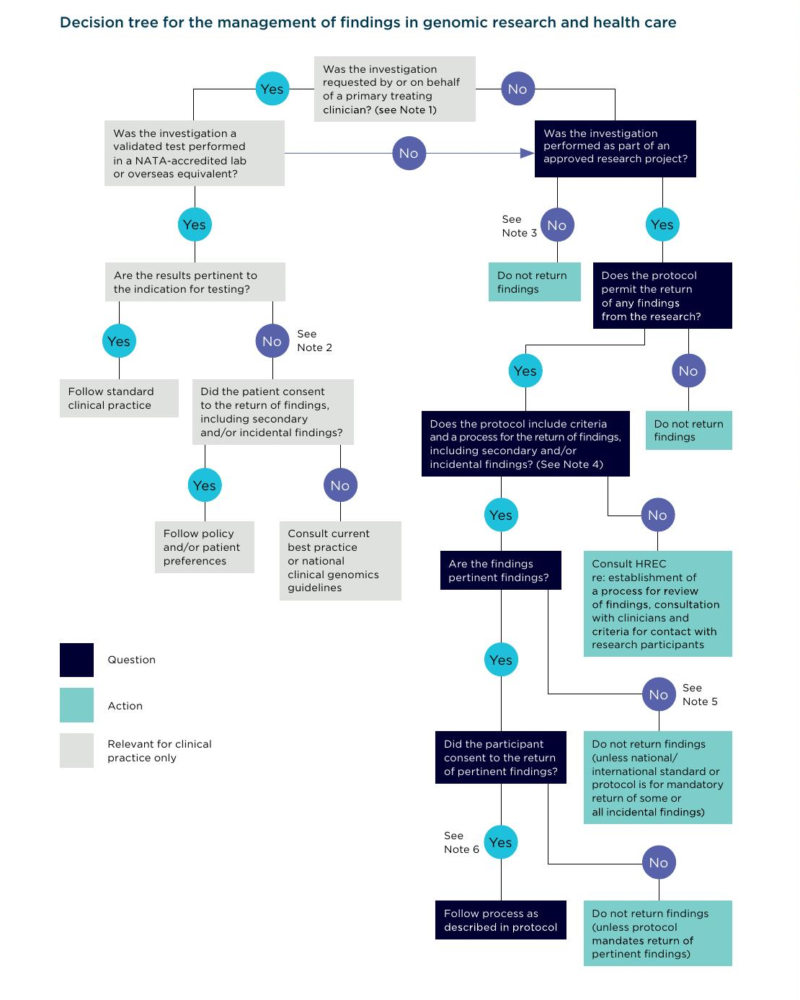

# National Statement on Ethical Conduct in Human Research (2025)
Australian Government
National Health and Medical Research Council
Australian Research Council

Universaities Australia

NHMRC

Building a healthy Australia
# Publication details
Publication title: National Statement on Ethical Conduct in Human Research Published: 2025 Publisher: National Health and Medical Research Council NHMRC publication reference: E72D Online version: http://www.nhmrc.gov.au/about-us/publications/national-statement-
ethical-conduct-human-research-2025
ISBN print: 978-0-6484644-2-6 ISBN online: 978-0-6484644-3-3 Suggested citation: National Health and Medical Research Council, Australian Research
Council and Universities Australia (2025). National Statement on Ethical Conduct in Human Research. Canberra: National Health and Medical Research Council.
Cover image: iStock image Design Whalen Image Solutions Printing Instant Colour Press
COPYRIGHT © Commonwealth of Australia 2025
All material presented in this publication is provided under a Creative Commons Attribution 4.0 International licence (www.creativecommons.org.au), with the exception of the Commonwealth Coat of Arms, NHMRC logo and any content identified as being owned by third parties. The details of the relevant licence conditions are available on the Creative Commons website (www.creativecommons.org.au), as is the full legal code for the CC BY 4.0 International licence.
## ATTRIBUTION
Creative Commons Attribution 4.0 International Licence is a standard form licence agreement that allows you to copy, distribute, transmit and adapt this publication provided that you attribute the work. The NHMRC’s preference is that you attribute this publication (and any material sourced from it) using the following wording: Source: National Health and Medical Research Council.
## USE OF IMAGES
Unless otherwise stated, all images (including background images, icons and illustrations) are copyrighted by their original owners.
CONTACT US To obtain information regarding NHMRC publications or submit a copyright request, contact: E: communications@nhmrc.gov.au P: +61 2 6217 9000

# CONTENTS

**THE NATIONAL STATEMENT: A USER GUIDE** 2
**PREAMBLE** 4
**PURPOSE, SCOPE AND LIMITS OF THIS DOCUMENT** 7

- **Section 1 Values and principles of ethical conduct** 10

- **Section 2 Themes in research ethics: risk and benefit, consent** 13
  - Chapter 2.1 Risk and benefit 13
  - Chapter 2.2 General requirements for consent 17
  - Chapter 2.3 Qualifying or waiving conditions for consent 20

- **Section 3 Ethical considerations in the design, development, review and conduct of research** 24
  - Chapter 3.1 The elements of research 26
  - Chapter 3.2 Human biospecimens in laboratory based research 43
  - Chapter 3.3 Genomic research 48
  - Chapter 3.4 Animal-to-human xenotransplantation 59

- **Section 4 Ethical considerations specific to participants in research** 64
  - Chapter 4.1 Ethical issues in recruitment and involvement of research participants who may experience increased risk 66
  - Chapter 4.2 Pregnancy, the human fetus and human fetal tissue 71
  - Chapter 4.3 Children and young people 75
  - Chapter 4.4 People in dependent or unequal relationships 81
  - Chapter 4.5 People experiencing physical or mental ill-health or disability 83
  - Chapter 4.6 Research conducted in other countries 90
  - Chapter 4.7 Research with Aboriginal and Torres Strait Islander people and communities 93
  - Chapter 4.8 Research conducted during natural disasters, public health emergencies or other crises 97
  - Chapter 4.9 Research that may discover illegal activity 100

- **Section 5 Research governance and ethics review** 102
  - Chapter 5.1 Governance responsibilities of institutions 102
  - Chapter 5.2 Responsibilities of HRECs and other ethics review bodies 110
  - Chapter 5.3 Responsibilities of researchers 115
  - Chapter 5.4 Monitoring 117
  - Chapter 5.5 Minimising duplication of ethics review 121
  - Chapter 5.6 Disclosure of interests and management of conflicts of interest 123
  - Chapter 5.7 Complaints 125
  - Chapter 5.8 Accountability 126

  **TERMS USED IN THIS DOCUMENT** 128

# THE NATIONAL STATEMENT: A USER GUIDE
The National Statement on Ethical Conduct in Human Research (the National Statement) is intended for use by:
- any researcher conducting research with human participants
- any member of an ethics review body reviewing that research
- those involved in research governance
- potential research participants.
  This brief guide describes the structure of the document and suggests how each of these groups might use it. Note that ‘review body’ refers both to Human Research Ethics Committees (HRECs) and to non-HREC review bodies.
  The Preamble sets out the historical context of the National Statement. This is followed by a brief explanation of its purpose, scope and limits. The document then has five sections, with multiple chapters in Sections 2 to 5.
- Section 1: Values and principles of ethical conduct sets out values and principles that apply to all human research. It is essential that researchers and review bodies consider these values and principles and be satisfied that the research proposal addresses and reflects them.
- Section 2: Themes in research ethics: risk and benefit, consent discusses the concept of risk in research and the role of participants’ consent — themes in all human research — and is again essential for all users.
  - Chapter 2.1 will help researchers and reviewers to understand and describe the level of risk involved in the planned research and how to minimise and manage that risk, and (with reference to Chapter 5.1) what level of ethics review is suitable.
  - Chapters 2.2 and 2.3 will help to identify the information that needs to be disclosed to participants. It will help researchers to draft information for participants and plan the consent process (or develop a proposal for a waiver of the requirement for consent), and it will help reviewers to assess the suitability of the proposed consent process or any alternatives to consent.
  - All of Section 2 will help participants understand what information they are entitled to receive and what their participation in research will characteristically involve.
* Section 3: Ethical considerations in the design, development, review and conduct of research will help researchers and reviewers to identify ethical matters specific to the research methods proposed.
- Section 4: Ethical considerations specific to participants in research will help researchers and reviewers to identify ethical matters relating to specific groups of research participants. Participants will also find this section valuable.
- Section 5: Research governance and ethics review will help those involved in research governance to understand their responsibilities and accountability for ethics review, ethical conduct and monitoring of human research.
  The National Statement does not exhaust the ethical discussion of human research. Even a single research field covers a multitude of different situations about which the National Statement will not always offer specific guidance, or to which its application may be uncertain. Where other guidelines and codes of practice in particular research fields are consistent with the National Statement, researchers and members of ethics review bodies should draw on them when necessary to clarify researchers’ ethical obligations in particular contexts.

# PREAMBLE
## Background
All human interaction, including the interaction involved in human research, has ethical dimensions. However, ethical conduct is more than simply doing the right thing. It involves acting in the right spirit, out of an abiding respect and concern for one’s fellow creatures. This National Statement on ethical conduct in human research is therefore oriented to something more fundamental than ethical ‘do’s and don’ts’ – namely, an ethos that should permeate the way those engaged in human research approach all that they do in their research.
Human research is research conducted with or about people, or their data or their biospecimens.[^1] It has contributed enormously to human good. Much human research carries little risk, and in Australia the vast majority of human research has been carried out in a safe and ethically responsible manner. But human research can involve significant risks and it is possible for things to go wrong. Sometimes risks are realised despite the best intentions and care in planning and practice. Sometimes they are realised because of technical error or ethical insensitivity, neglect or disregard. On rare occasions the practice of research has even involved the deliberate and appalling violation of human beings – notoriously, the Second World War experiments in detention and concentration camps.
In Australia, the history of the relationship between Aboriginal and Torres Strait Islander people and communities and the conduct of research provides an important context to acknowledge harms done by poor research practices. These harms continue to have an impact on issues around trust, altruism, and power dynamics with Aboriginal and Torres Strait Islander research.
From the earliest periods of colonisation, views about Aboriginal and Torres Strait Islander cultures, values and social organisation were based on damaging perceptions entrenched in racism and colonialism, and ignorant assumptions about Aboriginal and Torres Strait Islander worldviews and harmful comparisons to the perspectives of European colonisers. The substantial errors of judgement and the harmful misconceptions that followed have had significant adverse impacts on Aboriginal and Torres Strait Islander people and communities ever since.
Human research can give rise to important and sometimes difficult ethical questions. Two considerations give further weight to those questions. Firstly, research participants may enter into a relationship with researchers whom they may not know but need to trust. This trust adds to the ethical responsibility borne by those in whom it is placed. Secondly, many who contribute as participants in human research do so altruistically, for the common good, without thought of recompense for their time and effort. This underscores the importance of protecting research participants.
Since earliest times, human societies have pondered the nature of ethics and its requirements and have sought illumination on ethical questions in the writings of philosophers, novelists, poets and sages; in the teaching of religions; and in people’s values and sensibilities. Reflection on the ethical dimensions of medical research, in particular, has a long history, reaching back to classical Greece and beyond. Practitioners of human research in many other fields have also long reflected upon the ethical questions raised by what they do. However, there has been increased attention to ethical reflection about human research since the Second World War. The judgement of the Nuremberg military tribunal included ten principles for permissible medical experiments, since referred to as the Nuremberg Code. Discussion of these principles led the World Medical Assembly in 1964 to adopt what came to be known as the Helsinki Declaration, revised several times since then. The various international human rights instruments that have emerged since the Second World War emphasise the importance of protecting human beings in many spheres of community life. During this period, ethics guidelines have also been generated in many areas of research practice as an expression of professional responsibility.

[^1]:The term ‘biospecimens’ is defined in Chapter 3.2: Human biospecimens in laboratory based research.

Research often involves public interaction between people that serves a public good. Therefore, there is a public responsibility to see that these interactions are ethically acceptable to the Australian community. That responsibility is acknowledged and given effect in the wide-reaching authority of the National Statement, which sets out national standards for the ethical design, review and conduct of human research. Its content reflects the outcome of broad consultation with Australian communities who participate in, design, conduct, fund, manage and publish human research.

## Research governance
The National Statement should be seen in the broader context of overall governance of research. It not only provides guidelines for researchers, Human Research Ethics Committees (HRECs) and others conducting ethics review of research, but also emphasises institutions’ responsibilities for the quality, safety and ethical acceptability of research that they sponsor or permit to be carried out under their auspices.
Responsibility for the ethical design, review and conduct of human research is exercised at many levels by:
- researchers (and, where relevant, their supervisors)
- HRECs and others conducting ethics review of research
- institutions that set up the processes of ethics review, and whose employees, resources and facilities are involved in research
- funding organisations
- agencies that set standards
- governments.

  While the integrity of processes of ethics review is critical, individual researchers and the institutions within which they work hold primary responsibility for seeing that their research is ethically acceptable.
  In addition to this National Statement, the Australian Code for the Responsible Conduct of Research (the Code) has an essential role in promoting good research governance. The Code sets down the broad principles of responsible and accountable research practice and identifies the responsibilities of institutions and researchers in areas such as data and record management, publication of findings, authorship, conflict of interest, supervision of students and research trainees, and the handling of allegations of breaches of the Code.

## Authors of the National Statement
This National Statement has been jointly developed by the National Health and Medical Research Council (NHMRC), the Australian Research Council (ARC) and Universities Australia. This joint undertaking reflects a widely shared conviction that there is a need for ethics guidelines that are genuinely applicable to all human research and it gives expression to the shared responsibility for ethically good research described above.
The National Health and Medical Research Council Act 1992 (Cth) (NHMRC Act) establishes NHMRC as a statutory body and sets out its functions, powers and obligations. Section 10(1) of the NHMRC Act requires the Chief Executive Officer (CEO) to issue human research guidelines precisely as developed by the Australian Health Ethics Committee (AHEC) and provided to the CEO by the Council. AHEC is established by the NHMRC Act as a Principal Committee of NHMRC. All the guidelines in this National Statement that are applicable to the conduct of research involving humans are issued by NHMRC in fulfilment of this statutory obligation.

The ARC is established under the Australian Research Council Act 2001 (Cth), located within the Australian Government’s Education portfolio, and reporting to the Minister for Education. The ARC helps shape the Australian research system for the benefit of the nation by enabling world-leading research, fostering research quality, translation and impact, and safeguarding research integrity.
Universities Australia is the peak body representing Australia’s comprehensive universities. Its primary role is to advocate for regulatory, policy and fiscal settings conducive to a world-class university system.

# PURPOSE, SCOPE AND LIMITS OF THIS DOCUMENT
The purpose of this National Statement is to promote ethically good human research. Fulfilment of this purpose requires that participants be accorded the respect and protection that is due to them. It also involves the fostering of research that benefits the community.
The National Statement is therefore designed to clarify the responsibilities of:
- institutions and researchers for the ethical design, conduct and dissemination of outputs and outcomes of human research
- review bodies in the ethics review of research.
  The National Statement will help them to meet their responsibilities: to identify ethical issues that arise in the design, review and conduct of human research, to deliberate about those ethical issues, and to justify decisions about them.
## Use of the National Statement
The National Statement must be used to inform the design, ethics review and conduct of human research that is funded by, or takes place under the auspices of, any of the bodies that have developed the National Statement (NHMRC, the Australian Research Council and Universities Australia).
In addition, the National Statement sets national standards for use by any individual, institution or organisation conducting human research. This includes human research undertaken by governments, industry, private individuals, organisations or networks of organisations.
## What is research?
There is no generally agreed definition of research; however, it is widely understood to include at least investigation undertaken to gain knowledge and understanding or to train researchers. The Australian Research Council’s definition of research is somewhat wider:
> Research is defined as the creation of new knowledge and/or the use of existing knowledge in a new and creative way so as to generate new concepts, methodologies, inventions and understandings. This could include synthesis and analysis of previous research to the extent that it is new and creative.[^2]

For the purposes of the National Statement, two further questions are more important than any definition of research:
- What is human research?
- When and by what means does human research, or other activities such as quality assurance or improvement, audit or evaluation, need ethics review? (See Ethical Considerations in Quality Assurance and Evaluation Activities, NHMRC 2014 or as updated).

[^2]: Australian Research Council, State of Australian University Research 2015–2016, Vol 1 ERA National Report, https://www.arc.gov.au/sites/default/files/minisite/static/4551/ERA2015/intro-3_define-research.html

## What is human research?
Human research is conducted with or about people, or their data or biospecimens. Human participation in research is therefore to be understood broadly to include the involvement of human beings through:
- taking part in surveys, interviews or focus groups
- undergoing psychological, physiological or medical testing or treatment
- being observed by researchers
- researchers having access to their personal documents or other materials
- the collection and use of their biological material as defined in Chapter 3.2
- access to their individual information in identifiable or potentially re-identifiable form as

included in an unpublished source or database that is used for human research.
The term ‘participants’ is therefore used very broadly in the National Statement to include those who may not even know they are participating in research; for example, where the need for their consent for the use of their biospecimens or data has been waived by an ethics review body.
As also discussed in Sections 3 and 4, consultation and engagement with potential participants, co-researchers and community representatives that precedes the development, design or conduct of the research is not itself human research and typically does not require ethics review (see Chapter 4.1 Introduction).
Other activities that are not human research and do not, as independent activities, require ethics review include:
- literature review that supports the development or design of a research project
- research using public data (e.g. information that has been published, or information that has entered the public domain with the consent of the person(s) with whom the information is associated)
- research using aggregate data.

## When is ethics review needed?
Institutions are responsible for establishing procedures for the ethics review of human research. That review can be undertaken at various levels, according to the degree of risk involved in the research (see Chapters 2.1 and 5.1). Research with a greater than low level of risk (as defined in Chapter 2.1) must be reviewed by a Human Research Ethics Committee (HREC). Research involving no more than low risk may be reviewed under other processes described in paragraphs 5.1.10 to 5.1.14. Institutions may also determine that some human research is exempt from ethics review (see 5.1.15 to 5.1.18).
The involvement of Australian researchers, participants (or their biospecimens or data) and/or research resources, whether in Australia or overseas, raises the question of whether ethics approval by an Australian ethics review body is required. This is because an Australian institution may have governance responsibilities arising from the involvement of their employees, affiliated personnel (e.g. contractors, students), patients, clients or the use of their funds in the research.
In these instances, the Australian researchers should notify their institution that the research will be taking place. The Australian institution/HREC must then determine whether its ethics approval is or is not needed. As outlined in Chapters 5.1 and 5.5, institutions may decide to accept an ethics approval from another Australian HREC or a research ethics committee in another country or determine that the research is of a sufficiently lower risk level that ethics approval from an HREC is not required (noting that, in these circumstances, there may be a lower risk review process that it is necessary to engage with).
A judgement that a human research proposal meets the requirements of the National Statement and is ethically acceptable must be made before research can begin and before full funding for the proposal is released.
Research or other investigative activity that is not human research, as defined above, does not require human ethics review.
## Ethics and law in human research
Human research is governed by Australian law that establishes rights for participants and imposes general and specific responsibilities on researchers and institutions. Australian common law obligations arise from the relationships between institutions, researchers and participants. Contractual arrangements may impose obligations on research funders and institutions.
Some human research is subject to specific statutory regulation, at Commonwealth and/or state and territory levels. The National Statement identifies some specific Commonwealth legislation that refers to the National Statement. The National Statement does not identify specific state and territory laws that may be relevant to human research, such as those relating to use of information held by state or territory authorities, use of human biospecimens, guardianship, and illegal and unprofessional conduct. It is the responsibility of institutions and researchers to be aware of both general and specific legal requirements, wherever relevant.
The responsibilities set out in the National Statement are intended to be consistent with the international human rights instruments that Australia has ratified.

# Section 1: Values and principles of ethical conduct
## Introduction
The relationship between researchers and research participants is the ground on which human research is conducted. The values set out in this section – respect for human beings, research merit and integrity, justice, and beneficence – help to shape that relationship as one of trust, respect, mutual responsibility and equity. For this reason, the National Statement speaks of research participants rather than ‘subjects’.
While these values have a long history, they are not the only values that could inform a document of this kind. Others include altruism, contributing to societal or community goals, and respect for cultural diversity, along with the values that inform NHMRC’s Ethical Conduct in Research With Aboriginal and Torres Strait Islander Peoples and Communities: Guidelines for Researchers and Stakeholders. These values include spirit and integrity, cultural continuity, equity, reciprocity, respect and responsibility. However, the values of respect, research merit and integrity, justice and beneficence have become prominent in the ethics of human research in the past six decades, and they provide a substantial and flexible framework for principles to guide the design, review and conduct of such research. Reference to these values throughout the National Statement serves as a constant reminder that, at all stages, human research requires ethical reflection that is informed by them. The order in which they are considered below reflects the order in which ethical considerations commonly arise in human research. Research merit and integrity are discussed first. Unless proposed research has merit and the researchers who are to carry out the research have integrity, the involvement of human participants in the research cannot be ethically justifiable. Human beings should be treated in accordance with both distributive and procedural justice. In the research context, distributive justice will be expressed in the fair distribution of the benefits and burdens of research, and procedural justice in ‘fair treatment’ in the recruitment of participants and the review of research. While benefit to humankind is an important outcome of research, it also matters that benefits of research are achieved through just means, are distributed fairly and involve no unjust burdens.
Researchers exercise beneficence in several ways: in assessing and taking account of the risks of harm and the potential benefits of research to participants and to the wider community; in being sensitive to the welfare and interests of people involved in their research; and in reflecting on the social and cultural implications of their work. What constitutes potential benefit and whether it justifies research often requires consultation with the relevant communities.
Respect for human beings is the common thread through all the discussions of ethical values. Respect involves recognising that each human being has intrinsic worth and that this must inform all interaction between people. Such respect includes recognising the value of human autonomy – the capacity to determine one’s own life and make one’s own decisions. But respect goes further than this. It also involves protecting and helping people wherever it would be wrong not to do so, including those with diminished or no autonomy, as well as empowering them wherever possible.
The design, review and conduct of research must reflect each of these values.
## Guidelines
### Research merit and integrity
- 1.1 Research that has merit is:
  - (a) Justifiable by its potential benefit, which may include its contribution to knowledge and understanding, to improved social welfare and individual wellbeing, and to the skill and expertise of researchers. What constitutes potential benefit and whether it justifies research often requires consultation with the relevant communities with whom the research takes place and/or that may be impacted by the research.
  - (b) Designed or developed using methods appropriate for achieving the aims of the proposal.
  - (c) Based on a thorough study of the current literature, as well as previous studies (noting that this does not exclude the possibility of novel research for which there is little or no literature available, or research requiring a quick response to an unforeseen situation).
  - (d) Designed to ensure that respect for the participants is not compromised by the aims of the research, by the way it is carried out or by the results.
  - (e) Conducted or supervised by people or teams with experience, qualifications and competence that are appropriate for the research.
  - (f) Conducted using facilities and resources appropriate for the research.

- 1.2 Where high quality peer review has determined that a project has research merit, this should be factored into any subsequent scientific and ethics review of the research.
- 1.3 Research that is conducted with integrity is carried out by researchers with a commitment to:
  - (a) searching for knowledge and understanding
  - (b) following recognised principles of research conduct
  - (c) conducting research honestly
  - (d) interacting with participants and others respectfully, honestly and fairly
  - (e) disseminating, communicating and translating results, whether favourable or unfavourable, in ways that permit scrutiny and contribute to public knowledge and understanding.

### Justice
- 1.4 In research that is just:
  - (a) taking into account the scope and objectives of the proposed research, the selection, exclusion and inclusion of categories of research participants are fair and are accurately described in the results of the research
  - (b) the process of recruiting participants is fair
  - (c) there is no unfair burden of participation in research on particular groups
  - (d) there is fair distribution of the benefits of participation in research
  - (e) there is no exploitation of participants in the conduct of research
  - (f) there is fair access to the benefits of research.

- 1.5 Research outcomes should be made accessible to research participants in a way that is timely and clear.

### Beneficence
- 1.6 The likely benefit of the research must justify any risks of harm or discomfort to participants. The likely benefit may be to the participants, to the wider community or to both.
- 1.7 Researchers are responsible for:
  - (a) designing the research to minimise the risks of harm or discomfort to participants
  - (b) clarifying to participants the potential benefits and risks of the research
  - (c) ensuring the welfare of the participants in the research context.

- 1.8 Where there are no likely benefits to participants, the risk to participants should be lower than would be ethically acceptable where there are such likely benefits.
- 1.9 Where the risks to participants are no longer justified by the potential benefits of the research, the research must be suspended to allow time to consider whether it should be modified or discontinued. This decision may require consultation between researchers, participants, the relevant ethics review body and the institution. The review body must be notified promptly of such suspension and of any decisions following it (see 5.4.16 to 5.4.19).

### Respect
- 1.10 Respect for human beings is a recognition of their intrinsic value. In human research, this recognition includes abiding by the values of research merit and integrity, justice and beneficence. Respect also requires having due regard for the welfare, beliefs, perceptions, customs and cultural heritage, both individual and collective, of those involved in research.
- 1.11 Researchers and their institutions should respect the privacy, confidentiality and cultural sensitivities of the participants and, where relevant, of their communities. Any specific agreements made with the participants or the community should be fulfilled.
- 1.12 Respect for human beings involves giving due scope, throughout the research process, to the capacity of human beings to make their own decisions.
- 1.13 Where participants are unable to make their own decisions or have diminished capacity to do so, respect for them involves empowering them where possible and providing for their protection as necessary.

### Application of these values and principles
Research, like everyday life, sometimes generates ethical dilemmas in which it may be impossible to find agreement on what is right or wrong. In such circumstances, it is important that all those involved in research and its review bring a heightened ethical awareness to their thinking and decision-making. The National Statement is intended to contribute to the development of such awareness.
This National Statement does not exhaust the ethical discussion of human research. There are, for example, many other specialised ethics guidelines and codes of practice for specific areas of research. Where these are consistent with this National Statement, they should be used to supplement it when this is necessary for the ethics review of a research proposal.
These ethics guidelines are not simply a set of rules. Their application should not be mechanical. Research always requires, from each researcher, deliberation on the values and principles, exercise of judgement and an appreciation of context.

# Section 2: Themes in research ethics: risk and benefit, consent
Two themes must always be considered in human research: the risks and benefits of research, and participants’ consent. For this reason, the two themes are brought together in this section, before discussion in the following sections of ethical considerations specific to the elements of research and ethical considerations specific to participants in research.

## Chapter 2.1: Risk and benefit
### Introduction
Application of the values in Section 1, in particular the value of beneficence, requires that the risk and benefit of research be assessed and that any risks are effectively minimised, mitigated or managed. While this chapter provides guidance on the assessment of risk, such assessment inevitably involves the exercise of judgement.
A risk is a potential for harm or discomfort (discussed below). It involves:
- the likelihood that a harm or discomfort will occur
- the severity or magnitude of the harm or discomfort, including their consequences.

While discussion of the risk of harm or discomfort in this chapter applies to risk to an individual research participant, it can also apply to groups or communities as well as to non-participants such as family members.[^3] Risk can be associated with the conduct of research or the proposed outcomes of the research.[^4]
Risk in research exists on a continuum with the risk profile of an individual research project falling somewhere along this continuum. In order to determine the proportionate level of review and oversight for each project, the use of risk categories is useful. These categories are described in Figure 1.

**Figure 1: Risk profiles of research**
|Lower risk| |Higher risk (Individual, group, community, societal or global)| |
|---|---|---|---|
|Minimal|Low|Greater than low|High|
|No risk of harm or discomfort; potential for minor burden or inconvenience*|No risk of harm; risk of discomfort (+/- foreseeable burden)|Risk of harm (+/- foreseeable burden)|Risk of significant harm (+/- foreseeable burden)|

* Burden and inconvenience are discussed below.

[^3]: Assessing and managing risks of research to researchers and other research personnel is an important consideration, but is the responsibility of the research team, supervisors and the institution with oversight of the research.
[^4]: Risk of harm that may arise from research misconduct or fraud, and harm to members of research teams from other forms of misconduct are addressed in the Australian Code for the Responsible Conduct of Research and in institutional policy.

Requirements for the ethics review of lower risk research and the criteria for granting an exemption from ethics review are set out in paragraphs 5.1.12 to 5.1.18.
Low risk research describes research, including some types of clinical trials, in which the only foreseeable risk is no greater than discomfort. Research in which the risk for participants or others is greater than discomfort is not low risk research. Research in this category carries risk of harm and is therefore considered higher risk research that requires review by a Human Research Ethics Committee (HREC) (see 5.1.11).
Institutions may choose to differentiate between levels of lower risk or between levels of higher risk for review or monitoring purposes. They may choose to develop review processes to accommodate these differentiations in level of risk, taking care to respect the principle of proportionate review when establishing any such review processes.

### Risk of harm or discomfort
While no list of harms can be exhaustive, one helpful classification identifies the following types of potential harms in or from research:[^5]
- physical harm: including injury, illness, pain or death
- psychological harm: including feelings of worthlessness, distress, guilt, anger, fear or anxiety related, for example, to disclosure of sensitive information, an experience of re-traumatisation, or learning about a genetic possibility of developing an untreatable disease
- devaluation of personal worth: including being humiliated, manipulated or in other ways treated disrespectfully or unjustly
- cultural harm: including misunderstanding, misrepresenting or misappropriating cultural beliefs, customs or practices
- social harm: including damage to social networks or relationships with others; discrimination in access to benefits, services, employment or insurance; social stigmatisation; and unauthorised disclosure of personal information
- economic harm: including the imposition of direct or indirect costs on participants
- legal harm: including discovery and prosecution of criminal conduct.
  Any of these types of harm can be experienced individually or collectively.
  Discomfort is considered less serious than harm. It can involve physical or psychological impacts; for example, minor side effects of medication, discomfort related to non-invasive examinations or tests (such as measuring blood pressure), and mild anxiety associated with an interview. However, where a person’s reactions might exceed discomfort and become distress, this should be viewed as potential for harm.
  Some participants may be at higher risk of harm or discomfort arising from research than other participants in the same research project. The increased risk of harm or discomfort can express itself in different ways at different times and to different degrees and can arise from:
  - (a) the nature, design or other contextual factors of the research, such as the setting in which the research will be conducted, the social or political implications of doing the research and cultural factors, or some combination of these factors
  - (b) specific attributes or characteristics of individual participants or of groups to which they belong
  - (c) interaction between (a) and (b).

[^5]: Adapted from National Bioethics Advisory Commission, Ethical and Policy Issues in Research Involving Human Participants, Bethesda, 2001, pp 71-72.

Harm and discomfort to non-participants may also be relevant to assessment of the risks of a research project. Examples of risks to non-participants from research include the risk of distress for a participant’s family member identified as having a serious genetic disorder, the possible impact of information in published research on family or friends, or the risks of biological research to the community. Some social research may carry wider social or economic risks; for example, research in a small community into attitudes to specific subpopulations may lead to unfair discrimination or have effects on social cohesion, property values or business investment. Research into the impact of public health policy on community wellbeing or into social determinants of health may also carry a risk of harm to participants or their communities.

### Burden and inconvenience
In addition to risk of harm or discomfort, participation in research can also impose burdens or inconvenience on those involved in research. Neither burden nor inconvenience should be considered a type of harm or discomfort and therefore should not be viewed as a risk. Nevertheless, in designing, reviewing and conducting research, researchers and ethics review bodies should consider the impact of any burdens or inconvenience on participants and determine whether they are justified by the potential benefits of the research.
Examples of burden and inconvenience may include the time that will need to be given up to participate in the research, filling in forms and costs related to travel.

### Assessing risk
The risks of a research project must be identified and assessed in order to minimise, mitigate or manage them. Researchers, institutions and ethics review bodies all engage in risk assessment as part of their role in the development of research or the ethics review process. In assessing the risks of a research project, researchers, institutions and ethics review bodies should only consider the risks that may result from the research, as distinguished from the risks participants would be exposed to if they were not participating in the research (see 3.1.6).
Assessment of risk informs the determination of the appropriate level of review for a research project by the institution and reviewers’ judgements about whether risks are justified by potential benefits. These judgements should be based on the available evidence. The evidence may be quantitative, qualitative or both. In any case, the process of assessing risk needs to be transparent and defensible.
Strategies to minimise or mitigate the risk of research may be required and subjected to assessment by reviewers of research. These should include strategies to ensure that participants are not unfairly excluded from research because of the risk to them of participating in the research (see 1.4).
For research using large collections of data or information, researchers and reviewers should review Chapter 3.1, Element 4. They should also review and consider applying best practice frameworks for assessing the risks of accessing and using such data and the corresponding safeguards.
For those assessing the likelihood and severity or magnitude of potential harms in research, the choices, experience, perceptions, values and vulnerabilities of individual participants or different groups of participants will be relevant.

### Do the benefits justify the risks?
Research is ethically acceptable only when its potential benefits justify any risks involved in the research.
Benefits of research may include, for example, gains in knowledge, insight and understanding; improved social welfare and individual wellbeing; gains in skill or expertise for individual researchers, teams or institutions; or evidence-based responses to public health emergencies.
Some research may offer direct benefits to the research participants, their families, or particular group(s) with whom they identify. Where this is the case, participants may be willing to take on a higher degree of risk than they might otherwise take on. For example, people with serious illness may be willing to accept research risks (such as treatment side effects) that would be unacceptable to people who are not seriously ill. Those conducting ethics review of research should take such willingness into account in deciding whether the potential benefits of the research justify the risks involved.
For ethics review bodies, there can be a profound tension between the obligations to both provide participants with the scope to accept risk and see that research is conducted in a way that is of possible benefit and minimises harm.
In describing and assessing the potential benefits and assessing the risks of research, researchers and reviewers should exercise care not to overemphasise either.

### Guidelines
- **2.1.1** A judgement that research is ethically acceptable requires:
  - (a) identifying the risks and burdens potentially arising from the research, if any, and which participants or others might be at risk of harm or experience discomfort or burden
  - (b) assessing the likelihood and severity or magnitude of the risks
  - (c) considering and describing actions or strategies that could effectively minimise, mitigate and/or manage each risk, including modifications to the research design
  - (d) identifying the potential benefits and to whom any benefits are likely to accrue
  - (e) determining that any risks and burdens are justified by the potential benefits.
- **2.1.2** In identifying the potential benefits and the existence, likelihood and severity or magnitude of risks, researchers and those reviewing the research should base their assessments on the available evidence and should consider whether to seek advice from others who have experience with a similar methodology, population and/or research domain.
- **2.1.3** To determine whether the potential benefits justify the risks, researchers and reviewers must assess the research aims and the various methods by which they can be achieved in order to minimise or mitigate any risks.
- **2.1.4** The greater the risks in any research for which ethical approval is given, the more certain reviewers must be that the risks will be managed as effectively as possible and that the participants clearly understand the risks they are assuming.
- **2.1.5** In considering whether the potential benefits of the research justify the risks and burdens involved, those reviewing research should take into account any willingness by participant populations to assume greater risks or burdens because of their perception of the potential benefits to them, their families, or groups or communities to which they belong.

## Chapter 2.2: General requirements for consent
### Introduction
Respect for human beings involves giving due scope to people’s capacity to make their own decisions. In the research context, this normally requires that participation be the result of a choice made by participants — commonly known as ‘the requirement for consent’. This requirement has the following conditions: consent should be a voluntary choice, and should be based on sufficient information and adequate understanding of both the proposed research and the implications of participation in it.
What is needed to satisfy these conditions depends on the nature of the project and may be affected by the requirements of the codes, laws, ethics and cultural sensitivities of the community in which the research is to be conducted.
Variations of these conditions may be ethically justified for some research. However, respect for human beings must always be shown in any alternative arrangements for deciding whether potential participants are to enter the research.
It should be noted that a person’s consent to participate in research may not be sufficient to justify their participation.

This chapter provides guidelines on the requirement for consent. Chapter 2.3 then discusses and provides guidelines on conditions under which the requirement may be qualified or waived.

### Guidelines
- **2.2.1** The guiding principle for researchers is that a person’s decision to participate in research is to be voluntary, and based on sufficient information and adequate understanding of both the proposed research and the implications of participation in it. For qualifications of this principle, see Chapter 2.3.
- **2.2.2** Participation that is voluntary and based on sufficient information requires an adequate understanding of the purpose, methods, demands, risks and potential benefits of the research.
- **2.2.3** This information must be presented in ways suitable to each participant (see 5.3.6).
- **2.2.4** The process of communicating information to participants and seeking their consent should not be merely a matter of satisfying a formal requirement. The aim is mutual understanding between researchers and participants. This aim requires an opportunity for participants to ask questions and to discuss the information and their decision with others if they wish.
- **2.2.5** Consent may be expressed verbally, in writing or by some other means (e.g. return of a survey, or conduct implying consent), depending on:
  - (a) the nature, complexity and level of risk of the research
  - (b) the participant’s personal and cultural circumstances.
- **2.2.6** Information on the following matters should also be communicated to participants. Except where the information in (a) to (m) below is also deemed necessary for a person’s voluntary decision to participate, it should be kept distinct from the information described in paragraph 2.2.2:
  - (a) any alternatives to participation
  - (b) how the research will be monitored
  - (c) provision of services to participants adversely affected by the research
  - (d) contact details of a person to receive complaints
  - (e) contact details of the researchers
  - (f) how privacy and confidentiality will be protected
  - (g) the participant’s right to withdraw from further participation at any stage, along with any implications of withdrawal and whether it will   be possible to withdraw data
  - (h) the amounts and sources of funding for the research
  - (i) financial or other relevant declarations of interests of researchers, sponsors or institutions
  - (j) any payments to participants
  - (k) the likelihood and form of dissemination of the research results, including publication
  - (l) any expected benefits to the wider community
  - (m) any other relevant information, including research-specific information required under other chapters of the National Statement.
- **2.2.7** Whether or not participants will be identified, research should be designed so that each
    participant’s voluntary decision to participate will be clearly established.

### Renegotiating consent
- **2.2.8** In some research, consent may need to be renegotiated or confirmed from time to time, especially where projects are complex or long-running, or participants are at increased risk. Research participants should be told if there are changes to the terms to which they originally agreed and given the opportunity to continue their participation or withdraw (see 2.2.19 and 2.2.20).

### Coercion and pressure
- **2.2.9** No person should be subject to coercion or pressure in deciding whether to participate. Even where there is no overt coercion or pressure, consent might reflect deference to the researcher’s perceived position of power, or to someone else’s wishes. Here, as always, a person should be included as a participant only if their consent is voluntary.

### Reimbursing participants
- **2.2.10** It is generally appropriate to reimburse the costs to participants of taking part in research, including costs such as travel, accommodation and parking. Sometimes participants may also be paid for time involved. However, payment that is disproportionate to the time involved, or any other inducement that is likely to encourage participants to take risks, is ethically unacceptable.
- **2.2.11** Decisions about payment or reimbursement in kind, whether to participants or their community, should take into account the customs and practices of the community in which the research is to be conducted.

### Where others need to be involved in participation decisions
- **2.2.12** Where a potential participant lacks the capacity to consent, a person or appropriate statutory body exercising lawful authority for the potential participant should be provided with relevant information and decide whether they will participate. That decision must not be contrary to the person’s best interests. Researchers should bear in mind that the capacity to consent may fluctuate, and even without that capacity, people may have some understanding of the research and the benefits and burdens of their participation. For implications of these factors, see Chapters 4.3 and 4.5.
- **2.2.13** Within some communities, decisions about participation in research may involve not only individuals but also properly interested parties such as formally constituted bodies, institutions, families or community elders. Researchers need to engage with all properly interested parties in planning the research.

### Consent to future use of data and tissue in research
- **2.2.14** Consent may be:
  - (a) ‘specific’: limited to the specific project under consideration
  - (b) ‘extended’: given for the use of data or tissue in future research projects that are:
    - (i) an extension of, or closely related to, the original project or
    - (ii) in the same general area of research (e.g. genealogical, ethnographic, epidemiological or chronic illness research)
  - (c) ‘unspecified’: given for the use of data or tissue in any future research.
    The necessarily limited information and understanding about research for which extended or unspecified consent is given can still be sufficient and adequate for the purpose of consent (see 2.2.2).
- **2.2.15** Extended or unspecified consent may sometimes need to include permission to enter the original data or tissue into a data bank or tissue bank (see 3.1.44).
- **2.2.16** When unspecified consent is sought, its terms and wide-ranging implications should be clearly explained to potential participants. When such consent is given, its terms should be clearly recorded.
- **2.2.17** Subsequent reliance in a research proposal on existing unspecified consent should describe the terms of that unspecified consent.
- **2.2.18** Data or tissue additional to those covered by the original extended or unspecified consent will sometimes be needed for research. Consent for access to such additional data or tissue must be sought from potential participants unless the need for this consent is waived by an ethics review body.

### Declining to consent and withdrawing consent
- **2.2.19** People who elect not to participate in a research project need not give any reason for their decision. Researchers should do what they can to see that people who decline to participate will suffer no disadvantage as a result of their decision.
- **2.2.20** Participants are entitled to withdraw from the research at any stage. Before consenting to involvement in the research, participants should be informed about any consequences of such withdrawal.

## Chapter 2.3: Qualifying or waiving conditions for consent
### Introduction
Consent to participate in research must be voluntary and based on sufficient information and adequate understanding of both the proposed research and the implications of participation in it.
‘Limited disclosure’ to participants of the aims and/or methods of research may sometimes be justifiable. This is because in some human research (e.g. in the study of behaviour), the aims of the research cannot be achieved if those aims and/or the research method are fully disclosed to participants.
Research involving limited disclosure covers a spectrum, from simply not fully disclosing or describing the aims or methods of observational research in public contexts, all the way to actively concealing information and planning deception of participants. Examples along the spectrum include: observation in public spaces of everyday behaviour; covert observation (e.g. the handwashing behaviour of hospital employees); undisclosed role-playing by a researcher to investigate participants’ responses; telling participants the aim of the research is one thing when it is in fact quite different.
Depending upon the circumstances of an individual project it may be justifiable to employ an opt-out approach or a waiver of the requirement for consent, rather than seeking explicit consent.
A single research project may involve discrete elements or participant groups where different recruitment approaches can be used. For example, a project may involve some elements or participant groups where explicit consent must be sought and other elements where an opt-out approach may be considered or where a waiver of the requirement for consent may be applied.
The opt-out approach is a method used in the recruitment of participants into research where information is provided to the potential participant regarding the research and their involvement and where their participation is presumed unless they take action to decline to participate. While an opt-out approach makes it possible for people to make an informed choice about their participation, this choice can only be made if participants receive and read the information provided, and they understand that they are able to act on this information in order to decline to participate. Importantly, the opt-out approach is unlikely to constitute consent when applying Commonwealth privacy legislation to the handling of sensitive information, including health information. Therefore, where it is impracticable to obtain an individual’s explicit consent to the use of their information and the purpose of the research cannot be served by using non-identifiable information, researchers must comply with the Guidelines under Section 95 of the Privacy Act 1988 (s95 guidelines) or the Guidelines approved under Section 95A of the Privacy Act 1988 (s95A guidelines) (as applicable) to ensure that their handling of personal information does not breach the Privacy
Act 1988 (Cth). Where researchers need approval to use an opt-out approach for research to which the s95 or s95A guidelines apply, only a Human Research Ethics Committee (HREC) may grant this approval. Other review bodies may approve an opt-out approach for other research.
The Australian Privacy Principles Guidelines contain further information about consent and the handling of personal information.
When neither explicit consent nor an opt-out approach are appropriate, the requirement for consent may sometimes be justifiably waived. When an HREC or, where appropriate, another review body grants a waiver of the requirement for consent for research conducted prospectively or retrospectively, research participants will characteristically not know that they, or perhaps their tissue or data, are involved in the research.

## Guidelines
### Limited disclosure
- **2.3.1** Where limited disclosure does not involve active concealment or planned deception, ethics review bodies may approve research provided researchers can demonstrate that:
  - (a) there are no suitable alternatives involving fuller disclosure by which the aims of the research can be achieved
  - (b) the potential benefits of the research are sufficient to justify both the limited disclosure to participants and any risk to the community’s trust in research and researchers
- (c) the research involves no more than low risk to participants and the limited disclosure is unlikely to affect participants adversely
- (d) the precise extent of the limited disclosure is defined
- (e) whenever possible and appropriate, after their participation has ended, participants will be:
  - (i) provided with information about the aims of the research and an explanation of why the omission or alteration was necessary
  - (ii) offered the opportunity to withdraw any data or tissue that they have provided.

- **2.3.2** Where limited disclosure involves active concealment or explicit deception, and the research does not aim to expose illegal activity, researchers should in addition demonstrate that:

  - (a) participants will not be exposed to an increased risk of harm as a result of the concealment or deception
  - (b) a full explanation, both of the real aims and/or methods of the research, and also of why the concealment or deception was necessary, will subsequently be made available to participants
  - (c) there is no known or likely reason for thinking that participants would not have consented if they had been fully aware of what the research involved.

- **2.3.3** Where research involving limited disclosure aims to expose illegal activity (see 4.9.1), the adverse effects on those whose illegal activity is exposed must be justified by the value of the exposure.
- **2.3.4** Only an HREC can review and approve research that:
- (a) involves active concealment or planned deception or
- (b) aims to expose illegal activity.

### Opt-out approach
- **2.3.5** An opt-out approach to participant recruitment to research may be appropriate when it is feasible to contact some or all of the participants, but where the project is of such scale and significance that using explicit consent is neither practical nor feasible.
- **2.3.6** Before approving the use of an opt-out approach for research, an HREC or, where appropriate, another review body must be satisfied that:
  - (a) involvement in the research carries no more than low risk to participants (see Chapter 2.1)

- (b) the public interest in the proposed activity substantially outweighs the public interest in the protection of privacy
- (c) the research activity is likely to be compromised if the participation rate is not near complete, and the requirement for explicit consent would compromise the necessary level of participation
- (d) reasonable attempts are made to provide all prospective participants with appropriate plain language information explaining the nature of the information to be collected, the purpose of collecting it, and the procedure to decline participation or withdraw from the research
- (e) a reasonable time period is allowed between the provision of information to prospective participants and the use of their data so that an opportunity for them to decline to participate is provided before the research begins
- (f) a mechanism is provided for prospective participants to obtain further information and decline to participate
- (g) the data collected will be managed and maintained in accordance with relevant security standards
- (h) there is a governance process in place that delineates specific responsibility for the project and for the appropriate management of the data
- (i) the opt-out approach is not prohibited by state, federal, or international law.

- **2.3.7** For guidance on the use of an opt-out approach in activities other than research, such as quality assurance and evaluation, refer to Ethical Considerations in Quality Assurance and Evaluation Activities, NHMRC 2014 (or as updated).
- **2.3.8** When considering the provision of information to prospective participants and the mechanism by which individuals can decline participation, the ethics review body should consider the sensitivity and the risks, the potential participant pool, the context in which the research and opt-out approach will occur, and whether withdrawal from participation is feasible once identifiers have been removed from data.

### Waiver
- **2.3.9** Only an HREC may grant a waiver of the requirement for consent for research using personal information in medical research, or personal health information. Other review bodies may grant a waiver of the requirement for consent for other research.
- **2.3.10** Before deciding to waive the requirement for consent, an HREC or other review body must be satisfied that:

  - (a) involvement in the research carries no more than low risk to participants (see Chapter 2.1)

  - (b) the benefits from the research justify any risks of harm associated with not seeking consent
- (c) it is impracticable to obtain consent (e.g. due to the quantity, age or accessibility of records)

  - (d) there is no known or likely reason for thinking that participants would not have consented if they had been asked
- (e) there is sufficient protection of their privacy
- (f) there is an adequate plan to protect the confidentiality of data

  - (g) in case the results have significance for the participants’ welfare there is, where practicable, a plan for making information arising from the research available to them (e.g. via a disease-specific website or regional news media)

  - (h) the possibility of commercial exploitation of derivatives of the data or tissue will not deprive the participants of any financial benefits to which they would be entitled
- (i) the waiver is not prohibited by state, federal or international law.

- **2.3.11** Before deciding to waive the requirement for consent in the case of research aiming to expose illegal activity, an HREC must be satisfied that:

  - (a) the value of exposing the illegal activity justifies the adverse effects on the people exposed (see 4.9.1)

  - (b) there is sufficient protection of their privacy
- (c) there is sufficient protection of the confidentiality of data
- (d) the waiver is not otherwise prohibited by state, federal or international law.

- **2.3.12** Given the importance of maintaining public confidence in the research process, it is the responsibility of each institution to make publicly accessible (e.g. in annual reports) summary descriptions of all its research projects for which the requirement for consent has been waived under paragraphs 2.3.10 and 2.3.11. Waiver decisions under paragraph 2.3.11 should not be made publicly accessible until the research has been completed.

# Section 3: Ethical considerations in the design, development, review and conduct of research
## Introduction
The aim of this section is to provide guidance on the ethical considerations that are relevant to the way that research is designed, reviewed and conducted. This material should be read in conjunction with the Preamble, the Purpose, Scope and Limits of this Document, and Section 2.
This section aims to be compatible with and relevant for many different ways of doing human research. It requires those who conduct and approve human research to consider:
- how the research question/theme is identified or developed
- the alignment between the research aims and methods
- how the researchers and the participants will engage with one another
- how the research data or information are to be collected, stored and used
- how the results or outcomes will be communicated
- what will happen to the data and information after the project is completed.

The guidance in this section identifies common ethical issues that arise in the various phases of research. It is up to each researcher and Human Research Ethics Committee (HREC) to apply the guidance to each project, taking account of the four principles of research merit and integrity, justice, beneficence and respect. This guidance facilitates consideration of the risks and benefits of the research and the level of ethics oversight required.
The guidance in Chapter 3.1 is broadly applicable to all fields of research, including those types of research for which additional specific guidance is provided in Chapters 3.2, 3.3 and 3.4.
Chapter 3.1 is designed around seven elements that are common to most — if not all — forms of research. The chapter starts with considering the ethical issues associated with developing the research scope, aims, themes, questions and methods, and ends with ethical considerations that pertain after the project comes to an end.
The elements are:

- Element 1: Research scope, aims, themes, questions and methods
- Element 2: Recruitment
- Element 3: Consent
- Element 4: Collection, use and management of data and information
- Element 5: Communication of research findings or results to participants
- Element 6: Dissemination of research outputs and outcomes
- Element 7: After the project

Researchers who are designing a research project should read all of Chapter 3.1, noting which parts of the guidance are relevant for their project. In addition, if research involves biospecimens, genomics or xenotransplantation, they should also consult the specific chapters on these topics.

Each subsequent chapter in this section provides guidance on additional ethical considerations that may apply to:

- the use of human biospecimens in laboratory based research (Chapter 3.2)
- genomic research (Chapter 3.3)
- xenotransplantation research (Chapter 3.4).

This guidance applies to research, but sometimes the distinction between research and innovative clinical practice is unclear. For example, innovative clinical practice occurs on a spectrum from minor changes at the border of established practice that pose little change in risk to patient safety to novel interventions that should only be introduced as part of an ethically approved research protocol.
Whether an innovative clinical practice should be undertaken only as clinical research may depend on the extent to which the procedure departs from established practice. Importantly, even if the introduction of an innovative practice falls within existing clinical guidance, its implementation and the associated collection of data for monitoring and reporting may require notification to the institution(s) where the practice is taking place.
When it is not clear whether an innovation should be implemented only as research, it may be necessary to seek advice from an HREC or other institutional review process on the review required for the new intervention.
Researchers planning to do any type of research with Aboriginal and Torres Strait Islander people and communities must consult and follow the advice in the most contemporary versions of NHMRC’s Ethical Conduct in Research with Aboriginal and Torres Strait Islander Peoples and Communities: Guidelines for Researchers and Stakeholders (2018) and Keeping Research on Track II (2018) as well as the AIATSIS Code of Ethics for Aboriginal and Torres Strait Islander Research
(2020) and A Guide to Applying the AIATSIS Code of Ethics for Aboriginal and Torres Strait Islander Research (2020) produced by the Australian Institute of Aboriginal and Torres Strait Islander Studies (AIATSIS). These guidelines embody the best standards of ethical research and human rights, and seek to ensure that research with and about Aboriginal and Torres Strait Islander people and communities follows a process of meaningful engagement and reciprocity between the researcher and the individuals and/or communities involved in the research.
Researchers should also consult the most contemporary version of NHMRC’s Statement on Consumer and Community Involvement in Health and Medical Research.

# Chapter 3.1: The elements of research
## Introduction
Human research projects must adhere to the core ethical principles described in Section 1 of the National Statement. These principles apply at all stages of a research project from inception to post-completion.
Human research can involve a wide range of methods and practices: it can be qualitative, quantitative or mixed; interventional, experimental or observational in nature; and involve various degrees of collaboration between researchers and participants. Each research project is shaped by the field to which the research question relates, the research question itself, the desired outcome and the context in which it is conducted.
Effective research ethics review incorporates appropriate expertise related to relevant methods or areas of practice. Reviewers should be aware of expectations and apply requirements that are relevant to the areas of practice or methods used in projects that they review. This requires becoming familiar with methods or areas of practice that are unfamiliar or novel.
A range of relationships between participants and researchers may develop as a result of the duration and nature of the research interaction. Some methodological approaches require careful boundaries to be maintained between researchers and research participants. In contrast, other research fields require data collection methods that involve the development of close personal relationships with participants, or degrees of collaboration that blur the lines between researcher and participant (e.g. co-researchers in action research).
Researchers may have an impact on research participants and vice versa, and this impact may compromise a researcher’s role or professionalism. If this is anticipated and/or occurs, it may become necessary to modify those relationships, or to modify or discontinue the research.
Additionally, a researcher may have other professional skills (e.g. counselling or clinical care) that become relevant to the relationship with a participant. In this event, it is important to consider whether it is ethically acceptable to exercise those skills or, alternatively, to refer that participant to another professional.
The guidance provided in Chapter 4.4 is relevant to the researcher’s duty to inform participants that they are acting in a professional role other than the research role.
Research may involve risks to participants. To the extent that it is appropriate, the development of clear protocols for managing any distress that might be experienced by participants during the process of data collection or conduct of research procedures is an important component of planning research. Predicting what topics are likely to lead to distress and how to manage this distress will not always be easy. Access to sufficient training to help researchers and reviewers in making such predictions is valuable. Refer to Chapter 2.1 for a further discussion about the identification and handling of risk in research.
This chapter discusses the manner in which the core principles of the National Statement should be reflected in the elements of research project design. The chapter should be considered as a whole; however, the order in which these elements are discussed does not imply a hierarchy or a sequence, or that all of these elements will have equal relevance in every design. The elements are:
- Element 1: Research scope, aims, themes, questions and methods
- Element 2: Recruitment
- Element 3: Consent
- Element 4: Collection, use and management of data and information
- Element 5: Communication of research findings or results to participants
- Element 6: Dissemination of research outputs and outcomes
- Element 7: After the project

- Chapter 3.1 should be read in conjunction with other sections of the National Statement and is supplemented by the guidance in Chapters 3.2, 3.3 and 3.4.
Researchers conducting clinical interventional research should also refer to additional guidance in Chapters 5.3 and 5.4.

## Guidelines
### Element 1: Research scope, aims, themes, questions and methods
A critical feature of good research is clarity regarding how the research project will meet the ethical requirement that research has merit, as described in paragraph 1.1 of the National Statement. This Element of Chapter 3.1 offers advice and guidance about meeting this obligation.
Key questions include:
- What is the research theme or question that this project is designed to explore?
- Why is the exploration of this theme or answer to this question worth pursuing?
- How will the planned methods explore the theme or achieve the aims of the research?
- **3.1.1** In an application for review of their research, researchers should determine and state in plain language:

  - (a) the research question or questions that the project is intended to explore
  - (b) the potential benefit of exploring the question or questions including:
    - (i) to whom that potential benefit is likely to flow
    - (ii) whether that benefit is a contribution to knowledge or understanding, improved social or individual wellbeing, or the skill and expertise of researchers
  - (c) the basis for that potential benefit as described in either relevant literature or a review of prior research unless, due to the novelty of the question, there is scarce literature or prior research
  - (d) how the design and methods of the project will enable adequate exploration of the research questions and achieve the aims of the research
  - (e) how the design of the project will maintain respect for the participants
  - (f) where relevant, that the research meets the requirements of any relevant regulations or guidelines authorised by law (such as those related to privacy and reporting requirements for disclosure of child abuse)
  - (g) whether or not the project has been reviewed by a formally constituted academic, scientific or professional review process, and, if so, the outcome of that review.
- **3.1.2** The merit and integrity of research should be assessed by criteria and standards relevant to the research field(s) and methodology(ies), such as:
  - (a) the objectives and conceptual basis of the research
  - (b) the quality and credibility of data collection and analysis
  - (c) how to assure validity and reliability of results, taking account of relevant statistical, thematic and other forms of generalisability.
- **3.1.3** Reviewers should be aware that some research designs will be informed and shaped by the experience, insights and/or needs of participants. Such designs can be a valid and powerful way to collect qualitative information and to inform practice.
- **3.1.4** For interventional research conducted in the context of health care or public health, researchers should additionally determine and state:
  - (a) whether the project involves the systematic investigation of the safety, efficacy and/or effectiveness of an intervention
  - (b) if the research involves exposure to an intervention for which the safety or efficacy, or both, is not well understood:
    - (i) whether it is likely or possible that the intervention will be of therapeutic benefit
    - (ii) whether there is a realistic possibility that the intervention being studied will be at least as beneficial overall as standard treatment, taking into account effectiveness, burden, costs and risks
  - (c) where patient care is combined with intent to contribute to knowledge, that any risks of participation should be justified by potential benefits to which the participants attach significance. The prospect of benefit from research participation should not be exaggerated, either to justify to the reviewing body a higher risk than that involved in the participant’s current treatment or to persuade a participant to accept that higher risk
  - (d) whether the intervention or other research procedures are without likely benefit to participants. For such research to be ethically acceptable, any known or emerging risks to the participants must not be greater than the risks that would be associated with the health condition and its usual care.
- **3.1.5** Where current and available treatments are known or widely believed to be effective and/or there is known risk of significant harm in the absence of treatment, placebo or non-treatment groups are not ethically acceptable. Non-treatment (including placebo alone) groups may only be used:
  - (a) where the existing standard of care comprises or includes the absence of treatment (of the type being evaluated) or
  - (b) where there is evidence that the harms and/or burdens of an existing standard treatment exceed the benefits of the treatment.
- **3.1.6** In health research involving an intervention, the risks of an intervention should be evaluated by researchers and reviewers in the context of the risks of the health condition and the treatment or treatment options that would otherwise be provided as part of usual care.
- **3.1.7** For any research project that prospectively assigns human participants or groups of humans to one or more health-related interventions to evaluate the effects on health outcomes, researchers must register the project as a clinical trial on a publicly accessible register complying with international standards (see information on the International Clinical Trials Registry Platform (ICTRP) on the World Health Organization website) before the recruitment of the first participant.
- **3.1.8** Where the total project cannot be described in advance because the design and detail of successive stages will be informed by preceding stages, researchers should provide a description of the stages that are foreseen and how they intend to seek ethics approval for each stage.
- **3.1.9** Researchers should confirm and reviewers should be satisfied that:
  - (a) a plan is in place to ensure that resources are sufficient to conduct and complete the research as designed
  - (b) the facilities, expertise and experience available are appropriately allocated and sufficient for the research to be completed safely.
- **3.1.10** Researchers should provide assurance that any proposed payment in money or kind, whether to institutions, researchers or participants, will not adversely influence the design, conduct, findings or publication of the research.
- **3.1.11** Researchers seeking approval for a program of research (i.e. a series of related research projects), or to establish infrastructure for research such as a database or a biobank, should adequately describe their plans to reviewers.

### Element 2: Recruitment
When research will involve the direct participation of people (e.g. testing, surveys, interviews, focus groups, observation and health or behavioural interventions) the recruitment phase of a project is fundamental to the success of the research. Depending upon the design of a project, this element can include such matters as identifying individuals as potential participants, contact between the research team and potential participants, screening or exclusion of some individuals, and preparing to seek consent from the potential participants.
A single project may employ more than one recruitment strategy, especially where discrete cohorts are required to meet the objectives of the research. For some research designs, the recruitment and consent strategies occur concurrently; for others, they are separate. It is essential that recruitment strategies adhere to the ethical principles of justice and respect.
Key questions include:
- Who will be recruited?
- How will participants be identified and recruited?
- Will the potential participants be screened?
- What is the impact of any relationship between researchers and potential participants on recruitment?
- How will the recruitment strategy facilitate obtaining the consent of participants?
- How will the recruitment strategy ensure that participants can make an informed decision about participation?
- Are there any risks associated with the recruitment strategy for potential participants or for the viability of the project?

  Research proposals should clearly describe the recruitment strategy and the criteria for the selection of potential participants.

- **3.1.12** The recruitment strategy for a project should be relevant to the research methodology, topic/subject matter, the potential participants and the context.
- **3.1.13** The criteria for the selection of potential participants for a project and the cohort that is recruited should align with both the objectives and theoretical basis of the research.
- **3.1.14** The inclusion/exclusion criteria for the potential participants in a project must be justifiable and should be fair. The exclusion of some groups may amount to unfair discrimination, and/or exclude individuals and groups from the potential benefits of research. Researchers should consider the degree to which including/excluding groups may limit (or compromise) the value of the results of a project, with consequent impact on the merit of the project.
- **3.1.15** Researchers and reviewers should consider the degree to which potential participant populations might be over-researched or may require special consideration or protection and the degree to which the flow of benefits to that population (or to individual participants) justify the burdens. Equally, people should not be denied the opportunity to exercise self-determination or obtain the potential benefits of research solely because they are a member of a population that might be over-researched or may require special consideration or protection, such as Aboriginal and Torres Strait Islander people and communities.
- **3.1.16** The recruitment strategy must be respectful of potential participants and their culture, traditions and beliefs, and facilitate their voluntary participation.
- **3.1.17** In developing and implementing their recruitment strategy, researchers should consider:
  - (a) the potential for coercion or exploitation
  - (b) any risks to participants related to recruitment (see Chapter 2.1) and how the pattern of recruitment might be structured to mitigate any risks to participants
  - (c) any privacy matters relating to the recruitment of participants
  - (d) the potential impact of existing relationships on recruitment (including, but not limited to, hierarchical relationships that may generate an unequal or dependent relationship, such as teacher and student, manager and employee, supervisor and team member or treating health care professional and patient)
  - (e) the potential impact of participation on existing relationships
  - (f) whether participants will be recruited by co-researchers or other members of the project team who are unfamiliar with the guidance provided by the National Statement
  - (g) whether the research requires community engagement or agreements related to the research to be in place prior to individual recruitment.
- **3.1.18** Researchers should describe and justify their approach to potential participants (i.e. how do they find out about the possibility of participating, or not, in the research). The level of detail that is required by reviewers should be proportional to the foreseeable risks and appropriate to the methodology selected.
- **3.1.19** For many research projects, researchers should provide reviewers with proposed recruitment materials (e.g. notices, flyers, advertisements and social media posts) prior to use, including those materials that are developed subsequent to the initial review of the research proposal. However, for some research designs or where recruitment material needs to be ad lib, adapted or tailored to the context (such as some social media, radio or other oral communication), a description of the strategy and broad messages is sufficient.
- **3.1.20** Researchers and reviewers should consider the potential impact of the recruitment strategy upon the consent process (e.g. the degree to which the recruitment strategy might undermine the voluntary nature of the consent of individual potential participants).
- **3.1.21** Researchers and reviewers should consider the degree to which any payment in money or incentives of any kind, whether to researchers, participants or others involved in recruitment, could result in pressure on individuals to consent to participate (see 2.2.10 and 2.2.11). This is especially important with respect to research that involves more than a lower risk of harm.

### Element 3: Consent
Well-designed consent strategies are appropriately tailored to the potential participants, the research design, the topic and the context. Obtaining consent in a manner that shows respect for participants facilitates valid consent. This may involve obtaining consent as part of an ongoing process. Obtaining consent may be a component of broader processes of consultation, engagement and negotiation, such as in the context of research with Aboriginal and Torres Strait Islander people and communities (see Chapter 4.7).
The guidance in Element 3 should be considered in the context of the guidance provided in Chapters 2.2 and 2.3. These chapters provide essential guidance on the selection and framing of a consent strategy or alternatives to consent, such as an opt-out approach or a waiver of the requirement for consent.
The guidance in Chapters 2.2, 2.3 and this Element should be considered in applying the guidance on consent included in Chapters 3.2, 3.3 and 3.4.
Key questions include:
- What strategy(ies) for obtaining consent, or alternatives to consent, are appropriate for the specific project?
- Does the nature of the project design, the participants or the context necessitate the use of more than one strategy?
- Do the proposed strategy(ies) satisfy the relevant requirements of Chapters 2.2 and 2.3?
- Are there any project-specific matters that warrant specific attention (e.g. whether the research could generate results of significance to participants, whether the data will be added to an open or mediated access repository or whether the data or materials will be used for any other purpose)?
- **3.1.22** Researchers should ensure that any proposed consent strategy:
  - (a) provides all of the required information and assurances as set out in Chapters 2.2 and 2.3, as relevant to the proposed research
  - (b) uses tools and language that are appropriate, respectful and relevant to the research design, objectives, potential participants and context, including relevant cultural sensibilities.
- **3.1.23** Researchers and reviewers should recognise that research involving multiple methods or different groups of potential participants may require more than one consent strategy or may require consent to be revisited and renegotiated over time.
- **3.1.24** There is a range of strategies that may be appropriate for obtaining consent. While these may include the provision of a written information and consent document, other strategies may be more appropriate. It is not a requirement of the National Statement that participants’ consent must, routinely, be witnessed.
- **3.1.25** An information and consent document or other consent strategy should be appropriate to the needs of the participants and proportional to the project’s risks and ethical sensitivity. Specifically:
  - (a) information provided in any format should not be unnecessarily long or detailed, even for complex interventional research
  - (b) strategies such as the use of staged or tiered information should be considered in order to address variations in the needs or characteristics of potential participants
  - (c) adequate time should be allowed for prospective participants to understand and consider what is proposed and for their questions and expression of concerns to be addressed by those obtaining their consent (see 2.2.2 to 2.2.6).
- **3.1.26** Researchers should ensure that participants understand whether or not third parties (including supervisors of participants) will know who has been approached about participating, who has been selected from the participant pool, and which individuals have chosen to participate.
- **3.1.27** In circumstances where there may be significant risks if the participatory status of individuals becomes known, researchers must select a consent strategy that masks the identity of participants.
- **3.1.28** When those who are recruiting participants will receive some form of payment per recruited individual or other benefit, this must be disclosed to potential participants during the consent process.
- **3.1.29** Researchers should explain to potential participants that their access to any services or supports normally provided by the person trying to recruit them will not be affected by their decision to accept or decline research participation.
- **3.1.30** In any information provided to potential participants during the consent process, researchers should include information on data management and storage and any relevant intellectual property and copyright arrangements.
- **3.1.31** Researchers should describe to potential participants any limitations on/consequences of withdrawing consent and whether or not it will be possible to withdraw their data or information.
- **3.1.32** Where research may yield findings that are potentially significant for individuals, the consent strategy should clarify whether participants will be provided with these findings or whether individuals will have a choice about receiving the findings.
- **3.1.33** Researchers should disclose to potential participants whether, and under what circumstances, research results or information that has been collected may be reported to relevant authorities.
- **3.1.34** During the consent process, researchers should advise participants whether, and if so in what form, they will receive or can obtain access to a summary of the outcomes of the research.
- **3.1.35** If researchers are planning to add data obtained in a research project to an open or mediated access repository or make the data or materials available for re-use, any implications of these plans should be provided to participants. The use of ‘extended consent’ or ‘unspecified consent’ (see 2.2.14 to 2.2.16) may be appropriate for this purpose.
- **3.1.36** When researchers seek consent to collect information that is considered to be of historical, cultural or other long-term value, they should obtain consent for its perpetual retention, including any planned re-use and sharing with others.
- **3.1.37** When a project relates to a health intervention or treatment, researchers must make it clear to potential participants, if relevant:
  - (a) that it is a novel intervention that has not yet been approved for any health condition, or an intervention that is not used in the usual care of the relevant health condition, or an intervention that is being investigated for use in a new health condition or in a new or modified setting
  - (b) whether there is likely to be any therapeutic benefit to them from the intervention and whether access to the intervention is available only through participation in the research
  - (c) whether they will have access after completion of the project or active treatment phase of the project to the intervention, treatment or information that they have received, and, if so, with what limitations, if any.
- **3.1.38** For research that is not explicitly or primarily genomic, but that may, during recruitment or data collection, generate information with hereditary implications, consent processes should be designed to take account of this potential (see Chapter 3.3).

### Element 4: Collection, use and management of data and information
This section addresses ethical issues related to generation, collection, access, use, analysis, disclosure, storage, retention, disposal, sharing and re-use of data or information.
Human research projects incorporate one or more methods to generate, collect, or access data or information so as to achieve the objectives of the research. Collection, use and management of data and information must be in accordance with the ethical principles discussed in Section 1 of the National Statement.
Research may involve access to large volumes of data or information not explicitly generated for research purposes. The size and accessibility of such sources make them attractive for some research designs, the use of which may raise difficult privacy and consent questions. However, because research using population-wide data sets is inclusive of all members of the population in question, it promotes the core principle of justice. In addition, benefits and burdens may be spread more evenly than research based on selected participants.
The increased ability to link data in ways that preserve privacy has greatly enhanced the contribution that collections of data can make to generating knowledge, as it enables researchers to match individuals in different data sets without explicitly identifying them.
Key questions include:
- What data or information are required to achieve the objectives of the project?
- How and by whom will the data or information be generated, collected and/or accessed?
- How and by whom will the data or information be used and analysed?
- Will the data or information be disclosed or shared and, if so, with whom?
- How will the data or information be stored and disposed of?
- What are the risks associated with the collection, use and management of data or information and how can they be minimised?
- What is the likelihood and severity of any harm(s) that might result?
- How will the collection and management of the data or information adhere to the ethical principles in Section 1 of the National Statement?

#### What is data and what is information?
The terms ‘data’ and ‘information’ are often used interchangeably. Data can refer to raw data, cleaned data, transformed data, summary data and metadata (data about data). It can also refer to research outputs and outcomes. Likewise, information takes many different forms. Where information is in a form that can identify individuals, protecting their privacy becomes a consideration.
For the purposes of the National Statement, ‘data’ is intended to refer to bits of information in their raw form, whereas ‘information’ generally refers to data that have been interpreted, analysed or contextualised.
Data and information may include, but are not limited to:
- what people say in interviews, focus groups, questionnaires/surveys, personal histories and biographies
- images, audio recordings and other audio-visual materials
- records generated for administrative purposes (e.g. billing, service provision) or as required by legislation (e.g. disease notification)
- digital information generated directly by the population through their use of mobile devices and the internet
- physical specimens or artefacts
- information generated by analysis of existing personal information (from clinical, organisational, social, observational or other sources)
- observations
- results from experimental testing and investigations
- information derived from human biospecimens such as blood, bone, muscle and urine.

#### Identifiability of information
Researchers and reviewers must consider the identifiability[^6] of data and information in order to assess the risk of harm or discomfort to research participants or others who may be at risk.
The risks related to identifiability of data and information in research are greatest where the identity of a specific individual can reasonably be ascertained by reference to an identifier or a combination of identifiers (examples of identifiers include the individual’s name, image, date of birth or address, attribute or group affiliation). Risk may also arise where identifiers have been removed from the data or information and replaced by a code, but where it remains possible to re-identify a specific individual (e.g. by unlocking the code or linking to other data sets that contain identifiers). Due to technological advances, risks may arise in relation to data and/or information that has never been labelled with individual identifiers or from which identifiers have been permanently removed.
The identifiability of information is a characteristic that exists on a continuum. This continuum is affected by contextual factors, such as who has access to the information and other potentially related information, and by technical factors that have the potential to convert information that has been collected, used or stored in a form that is intended to protect the anonymity of individuals into information that can identify individuals. Additionally, contextual and technical factors can have a compound effect and can increase the likelihood of re-identifiability and the risk of negative consequences from this in ways that are difficult to fully anticipate and that may increase over time.

[^6]: The National Statement does not use the terms ‘identifiable’, ‘potentially identifiable’, ‘re-identifiable’, ‘non-identifiable’ or ‘de-identified’ as descriptive categories for data or information due to ambiguities in their meanings. Re-identification and de-identification are best understood as processes that change the character of information and are only used with this meaning.

Furthermore, the identifiability of information may change during the life of a research project; for example, data or information might initially be collected in a form that could identify individuals, then coded for analysis and correlation to other collected data or information, and, finally, once all the data or information has been collected, the code key might be destroyed, rendering the data or information anonymous. Therefore, it is important for researchers and reviewers to focus on the risk of harm to affected individuals if their identity is ascertained and the effort that would be required to achieve this at each stage of a research project.
Factors that should be taken into consideration when determining the degree of identifiability of information and when evaluating the associated risks include the type and quantity of the information, any other information held by the individual who receives the information and the capacity (skills and technology) available to the individual who receives it. Identifiability of information is also conditioned by contextual factors, such as whether only the person(s) who collected the information could use it to identify (an) individual(s), or whether those to whom it is disclosed or with whom it is shared for research purposes could also use it for this purpose. Identifiability may also reflect features of the project such as the nature of the participant cohort: for example, whether it includes high-profile individuals or members of small communities versus larger populations.
Data and information that are contained in data sets, such as those held in government databases and by social media organisations, may be used (in sum or in part) to identify individuals. This potential is due to the impact of predictive analytics, machine learning, increased commercial accessibility, proliferation of data sets, data breaches or degradation of privacy protections and other developments on access to and use of data and information. In this increasingly complex environment, researchers are encouraged to consult guidance promulgated by expert bodies such as the Office of the Australian Information Commissioner and its state and territory equivalents, the Australian Bureau of Statistics and the Australian Research Data Commons in addition to the National Statement.
- **3.1.39** The removal of personal identifiers may or may not be ethically required. Some research projects may legitimately require the retention of personal identifiers; for example, to link information or data from a number of different sources or to return results to participants. In addition, some research populations (e.g. academics, activists and some public figures) are amongst those who may prefer to be identified in the collection, use, and reporting of research data. Where participants choose to be identified, researchers and participants should collaboratively determine and agree upon whether all research data or information collected from them will be identified, or only certain components of the collected data or information.
- **3.1.40** Researchers should adopt methods to reduce the risk of identification during collection, analysis and storage of data and information. Methods to reduce identifiability and the consequent risks may include:
  - (a) minimising the number of variables collected for each individual
  - (b) separation and separate storage of identifiers and content information
  - (c) separating the roles of those responsible for management of identifiers and those responsible for analysing content.
- **3.1.41** In any publications, researchers should ensure that the identity of participants cannot be reasonably ascertained from the data or information that they use or report, unless they have agreed to be identified. This may require minimising, obscuring, or changing identifiers, either in the collection process or when presenting and publishing the research results.
- **3.1.42** Where research involves linkage of data sets with the consent of participants, researchers should advise participants that use of data or information that could be used to identify them may be required to ensure that the linkage is accurate. They should also be given information about the security measures that will be adopted, for example the removal of identifiers once linkage is completed.
### Data management
- **3.1.43** When multiple researchers are collaborating on collection, storage and/or analysis of data or information, they should agree to the arrangements for custodianship, storage, retention and destruction of those materials, as well as to rights of access, rights to analyse/use and re-use the data or information and the right to produce research outputs based upon them. Researchers should consider whether any intellectual property will be generated by the project and agree on the ownership of any intellectual property created. Agreements on such arrangements and ownership need not necessarily be in the form of a contractual document, but should facilitate a clear resolution of these issues.
- **3.1.44** For all research, researchers should develop a data management plan that addresses their intentions related to generation, collection, access, use, analysis, disclosure, storage, retention, disposal, sharing and re-use of data and information, the risks associated with these activities and any strategies for minimising those risks. The plan should be developed as early as possible in the research process and should include, but not be limited to, details regarding:
  - (a) physical, network and system security and any other technological security measures
  - (b) policies and procedures
  - (c) contractual and licensing arrangements and confidentiality agreements
  - (d) training for members of the project team and others, as appropriate
  - (e) the form in which the data or information will be stored
  - (f) the purposes for which the data or information will be used and/or disclosed
  - (g) the conditions under which access to the data or information may be granted to others
  - (h) what information from the data management plan, if any, needs to be communicated to potential participants.
  Researchers should also clarify whether they will seek:
  - (i) extended or unspecified consent for future research (see 2.2.14 to 2.2.16) or
  - (j) permission from a review body to waive the requirement for consent (see 2.3.9 and 2.3.10).
- **3.1.45** The security arrangements specified in the data management plan should be proportional to the risks of the research project and the sensitivity of the information.
- **3.1.46** Researchers must comply with all relevant legal and regulatory requirements that pertain to the data or information collected, used or disclosed as well as the conditions of the consent provided by participants.
- **3.1.47** In relevant research, particularly that which involves the use of materials of biological origin, records should be preserved for long enough to enable participants to be traced in the event that evidence emerges of late or long-term health-related effects, taking into account the conditions of consent that apply.

- **3.1.48** Data, information and biospecimens used in research should be disposed of in a manner that is safe and secure, consistent with the consent obtained and any legal requirements, and appropriate to the design of the research.
- **3.1.49** In the absence of justifiable ethical reasons (such as respect for cultural ownership or unmanageable risks to the privacy of research participants) and to promote access to the benefits of research, researchers should collect and store data or information generated by research projects in such a way that they can be used in future research projects. Where a researcher believes there are valid reasons for not making data or information accessible, this must be justified.

#### Secondary use of data or information
Research may involve access to and use of data or information that was originally generated or collected for previous research or for non-research purposes, including routinely collected data or information. This is commonly called ‘secondary use of data or information’. The main ethical issue arising from this use is the scope of consent provided or, alternatively, the impracticability of obtaining consent.
Administrative data or information is data or information routinely collected during the delivery of a service (e.g. by a government department or private service provider) and may involve collections of data or information from large numbers of people or whole populations. It is usually impractical to obtain consent from individuals for secondary use of this data or information. In these circumstances, respect for participants can be demonstrated in other ways including, but not limited to, community consultation, ensuring that the research results are translated into improvements in services and practices, acknowledging the source of the data or information in publications and/or publishing the research results in a location and language suitable for the general community. In particular, using data or information without consent may undermine public trust in the confidentiality of their information.
Privacy concerns arise when the proposed access to or use of the data or information does not match the expectations of the individuals from whom this data or information was obtained or to whom it relates. These issues are especially complex in the context of the access to or use of information relating to individuals that is available on the internet, including social media posts, tweets, self-generated ‘lifelogging’ data emitted from mobile phones and other ‘smart’ appliances, and data or information generated through applications and devices related to personal pursuits, such as fitness activity, gambling, dating and web-based gaming.
Data or information available on the internet can range from information that is fully in the public domain (such as books, newspapers and journal articles), to information that is public, but where individuals who have made it public may consider it to be private, to information that is fully private in character. The guiding principle for researchers is that, although data or information may be publicly available, this does not automatically mean that the individuals with whom this data or information is associated have necessarily granted permission for its use in research. Therefore, use of such information will need to be considered in the context of the need for consent or the waiver of the requirement for consent by a reviewing body and the risks associated with the use of this information.
- **3.1.50** For research involving the secondary use of data or information, researchers should make study designs publicly available, including information about:
  - (a) the form in which the data or information will be stored (i.e. whether it can identify individuals)
  - (b) the purposes for which the data or information will be used.
- **3.1.51** Unless a waiver of the requirement for consent is obtained, any research access to or use of publicly available data or information must be in accordance with the consent obtained from the person to whom the data or information relates.
- **3.1.52** Researchers should understand the context in which data or information was collected or disclosed, including the existence of any relationship of confidence or, if available on the internet, the privacy settings that apply. This includes avoiding the use or disclosure of information that was obtained unethically or illegally.
- **3.1.53** Researchers should take account of any terms and conditions applicable to social media platforms when using data or information from these sources or platforms and other web-based communities that do not permit the removal of the name of the author of a post or any changes to the wording of a post.

#### Sharing of data or information
While data or information may be collected, aggregated and stored for an initial purpose or activity, it is common for researchers to ‘bank’ their data or information for possible use in future research projects or to otherwise share it with other researchers. It is also increasingly common for funding agencies to require the sharing of research data either via open access arrangements or via forms of mediated access controlled by licences.
To this end, data or information may be deposited in an open or mediated access repository or data warehouse, similar to an archive or library, and aggregated over time. Archived data or information can then be made available for later analysis, unless access is constrained by restrictions imposed by the depositor(s), the original data custodian(s) or the ethics review body.
- **3.1.54** All data collections should have an identified custodian to enable access by researchers or participants to the data while maintaining it in a protected form. The custodian of the data may be the individual researcher or agency who collected the information, or an intermediary that manages data coming from a number of sources.
- **3.1.55** When planning to share data or information with other researchers or to establish or add them to a data bank, researchers must develop data management plans in accordance with the guidance provided in paragraph 3.1.44. This plan should enable the sharing of data and information and propose appropriate conditions on the sharing of data and information.
- **3.1.56** Researchers must make data custodians aware of the data management plans for banking or sharing of the data or information, and, in particular, of any confidentiality agreements or other conditions on the identifiability or re-use of the data or information.
- **3.1.57** Any sharing of data or information between research collaborators and research sites must be secure and proportional to the risks associated with and the ethical sensitivity of the information.
- **3.1.58** In any proposals to share or disclose research data or information, researchers should distinguish between disclosure to specific third parties, sharing with other researchers and disclosure to the public, and clarify whether the sharing or disclosure of data or information is subject to participant consent, other voluntary agreements or mandatory requirements.
- **3.1.59** Researchers should be aware of expectations and policies regarding the sharing or re-use of participant data or information in any form and should consider the value of the data or information for future research. At the time of initial consent, participants should be informed of these expectations and given appropriate options, including the potential to provide extended or unspecified consent (see 2.2.14 to 2.2.16). If consent to future use was not obtained at the time of collection, then reviewers considering the proposed re-use of this data or information in further research may consider a waiver of the requirement for consent or whether it is appropriate to seek additional consent for the sharing or re-use of the data or information. Whether there is an ongoing relationship with the participants and the burden on the participants of re-contact should be considered in this decision.
- **3.1.60** Before publishing data or information, or adding data or information to a repository, researchers should consider the degree to which it may be possible for the data or information to enable participants to be identified through efforts made by other researchers or third parties.
- **3.1.61** Shared or banked data or information that is stored in a form that can identify individuals can sometimes be used in research that qualifies as lower risk research; however, it cannot be used in research that is exempt from ethics review (see 5.1.16).

### Element 5: Communication of research findings or results to participants
Research across a range of fields and methodologies can generate findings or results of significance to participants and others. Some research (e.g. analysis of human biospecimens) can generate findings or results of significance to the health of individual participants and, potentially, their relatives and other family members.
Providing research findings or results to participants can be a benefit, but it can also be a source of risk (e.g. psychological, social, legal). The approach taken to communicating findings and results should reflect principles of good science and adhere to the ethical principles of justice, respect and beneficence discussed in Section 1, including consideration of the values and preferences of traditional custodians, such as Aboriginal and Torres Strait Islander people and communities.
Communicating findings or results may be required or optional, appropriate or inappropriate, and/or intentional or unintentional depending on the nature of the research and other circumstances.
Key questions include:
- Could the research generate findings or results of interest to participants?
- Could the findings or results be of significance to the current or future welfare
  or wellbeing of participants or others?
- Are potential participants in the research forewarned of this possibility?
- Will the consent of participants be obtained to enable any planned or
  necessary disclosure of findings or results?
- Who will communicate the findings or results and how?
- Will the findings or results be disclosed to third parties and/or the public?
- **3.1.62** In considering whether to return results of research, researchers should distinguish between individual research results and overall research results, and if individual and/or overall results will be provided to participants:
  - (a) how these results will be provided to participants
  - (b) how the process of returning results will be managed
  - (c) the risks of the return of individual research results and overall research results.

- **3.1.63** Where information could be of significance to the health of participants, relatives or other family members, researchers should prepare and follow an ethically defensible plan to disclose or withhold findings or results of research (see Chapters 3.2 and 3.3). Ethically defensible plans may be required for other types of research addressing, for example, any significant social, economic or psychological implications of the research.
- **3.1.64** An ethically defensible plan for research other than that described in Chapters 3.2 and 3.3 should:
  - (a) indicate whether the research will be likely to generate findings or results of significance to participants or others
  - (b) clarify whether the researchers intend to disclose any findings or results to participants directly and which types of findings or results, if any, are returnable to participants or others (e.g. clinicians or relatives)
  - (c) confirm that participants will be advised in advance whether they will be offered the option to receive their findings or results
  - (d) if applicable, enable participants to decide whether they wish to receive the findings or results and who else may be given the findings or results
  - (e) in appropriate circumstances, set out a process for finding out whether family members wish to receive the information
  - (f) outline how the findings or results will be provided in a manner that is appropriate and accessible
  - (g) include the relevant expertise of the person who may be communicating the findings or results
  - (h) include measures to protect the level of privacy desired by participants.

#### Disclosure to third parties of findings or results
There can be situations where researchers have legal, contractual or professional obligations to disclose findings or results to third parties. Additionally, researchers may believe that they have a moral obligation to disclose findings or results to third parties.
- **3.1.65** Where the potential disclosure of findings or results to third parties can be anticipated, researchers should identify:
  - (a) whether, to whom and under what circumstances the findings or results will be disclosed
  - (b) whether potential participants will be forewarned that there may be such a disclosure
  - (c) the risks associated with such a disclosure and how they will be managed
  - (d) the rationale for communicating and/or withholding the findings or results and the benefits and/or risks to participants of disclosure/non-disclosure.
- **3.1.66** Researchers should be aware of situations where a court, law enforcement agency or regulator may seek to compel the release of findings or results. In such circumstances, researchers should: (a) have a strategy in place to address this possibility (b) advise reviewers of the potential for this to occur.
- **3.1.67** In circumstances where the imperative to disclose findings or results emerges after the research has commenced, researchers must develop a strategy for addressing this and promptly advise and seek advice from reviewers.

### Element 6: Dissemination of project outputs and outcomes
It is consistent with the ethical principles of respect, beneficence and justice to make the outputs or outcomes of research publicly available. Doing so is also a requirement for research merit and integrity. A principal goal of dissemination of outputs/outcomes is to make a contribution to knowledge or practice or to serve a public good. Common mechanisms for achieving this objective include publication in peer-reviewed journals or books, conference presentations, commissioned reviews for public bodies, or dissemination via other forms of media such as creative works and performances. The form of the disseminated outputs (e.g. a conference paper) will be shaped by the research field, the topic, the research design, researcher preference and experience. Publication of outcomes should not be withheld on the basis that they are negative or inconclusive. However, there may be justifiable reasons to delay or restrict the dissemination of the outputs or outcomes out of consideration for the privacy of the participants or other risk factors.
Key questions include:
- What is the plan for reporting, publishing or otherwise disseminating the outputs/outcomes of
  the research?
- Will participants in the research be offered a timely and appropriate summary of the
  project outputs/outcomes?
- How will the planned dissemination of the outputs/outcomes contribute to knowledge or practice or serve the public?
- **3.1.68** Researchers should consider and advise reviewers as to whether:
  - (a) they intend to disseminate the outputs or outcomes widely in order to contribute to scientific, academic, professional or general knowledge or practice
  - (b) there are any risk factors or commercial interests that might legitimately delay or restrict the dissemination of the outputs or outcomes
  - (c) the risks of dissemination of the outputs or outcomes are justified by the benefits of dissemination (e.g. the public interest).
- **3.1.69** Researchers should ensure that reports of their research outputs or outcomes adhere to prevailing standards for ethical reporting, referencing and authorship (e.g. the Australian Code for the Responsible Conduct of Research).
- **3.1.70** Researchers should advise participants on the format and medium or media that will be used to disseminate outputs or outcomes of research to them (such as a lay summary, a research manuscript or a published paper) and, to the extent known, when such information about the outcomes will be made available to them. Dissemination of outputs or outcomes of research should occur in a timely fashion.
- **3.1.71** Researchers should ensure that any outputs or outcomes disseminated to participants are provided in language that is clear and understandable to participants.

### Element 7: After the project
Researchers continue to have ethical responsibilities after projects are completed. These responsibilities relate to disposal or retention of data and information, potential secondary (future) use of data or information and any necessary follow up or long-term monitoring of research participants.
Key questions include:
- Will the data or information be retained only for the minimum period required by relevant policy?
- Do the data or information have cultural, historical or other significance that could warrant longer or perpetual retention?
- Are the arrangements regarding intellectual property (individual, community, organisational, commercial) and copyright related to the outputs of the research clearly understood and communicated?
- Will the data or information be banked or added to a repository, such as an open or
  mediated access facility, for future use?
- Is any follow up or monitoring of research participants required and is this clear in the research plan and consent information?
- **3.1.72** With respect to the retention, storage and subsequent disposal of the data and information, researchers:
  - (a) must adhere to the ethical principle of respect for persons (e.g. with regard to culture and beliefs of the participants)
  - (b) should maintain the confidentiality of individuals in accordance with any assurances made to them (e.g. during the consent process)
  - (c) should be aware of and adhere to applicable national and/or state or territory codes and legislation, as well as to relevant international guidelines and regulation.
- **3.1.73** Data and information may be of cultural, historical or other significance such that they should be retained beyond the minimum retention period. Disposing of these data or information without consideration of these factors violates the ethical principle of respect. These matters should be appropriately addressed in the research plan and in consent processes and documentation.

# Chapter 3.2: Human biospecimens in laboratory based research
## Introduction
‘Human biospecimens’ is a broad term that, for the purposes of this chapter, refers to any biological material obtained from a person including tissue, blood, urine and sputum; it also includes any derivative of these, such as cell lines. It does not include non-human biological material such as micro-organisms that live on or in a person.
Research involving human biospecimens often involves special ethical consideration because of:
- the way that human biospecimens are obtained
- the information that may be derived from human biospecimens and the implications of
  that information for the individual donor, their relatives and their community
- the significance that may be attached to the human biospecimens by individual donors and/or communities.
- Chapter 3.2 should be read in conjunction with Chapter 3.1 and other parts of the National Statement.
Researchers and institutions must also meet any relevant legislative requirements that relate to the collection, retention, use and disposal of human biospecimens, including the general prohibition on trade in human tissue.

#### Specific considerations for human embryos, gametes and fetal tissue
Specific requirements for research involving fetal tissue are detailed in Chapter 4.2. Research involving human embryos and gametes, including the derivation of human embryonic stem cell lines, is separately governed by the Research Involving Human Embryos Act 2002 (Cth) and the Ethical Guidelines on the Use of Assisted Reproductive Technology in Clinical Practice and Research (ART guidelines), issued by NHMRC. Research involving the derivation of embryonic stem cell lines or other products from a human embryo must be considered by a Human Research Ethics Committee (HREC) as part of a licence application to the Embryo Research Licensing Committee (see Part C of the ART guidelines). The legislation and ART guidelines do not regulate the use of these products (when created under a general licence[^7]) after they have been derived.
Once human biospecimens have been derived from human embryos, gametes or fetuses, the requirements of this chapter apply for any subsequent use in research.

#### Conscientious objection
Those who conscientiously object to being involved in conducting research using human biospecimens derived from human embryos, gametes, fetuses or embryonic or fetal tissue should not be obligated to participate, nor should they be put at a disadvantage because of their objection.

### Element 1: Research scope, aims, themes, questions and methods
Ethical considerations related to laboratory based research involving human biospecimens vary according to whether the biospecimens are being collected prospectively for the research or whether the biospecimens to be used in the research are stored biospecimens that have been previously collected for research or non-research purposes.
[^7]: Any material created, developed or produced under a mitochondrial donation licence is regulated by the Research Involving Human Embryos Act 2002 (Cth) and the Embryo Research Licensing Committee.

#### Prospective collection of human biospecimens for research
- **3.2.1** For human biospecimens collected for research purposes (including biobanks), there should be ethics review and approval by an HREC of the proposed consent, collection, processing, storage and distribution or disposal.

#### Use of stored human biospecimens for research
- **3.2.2** In determining the level of ethics review appropriate for research involving the use of human biospecimens, the responsible institution and researcher should consider:
  - (a) whether the research involves any risks to the donors, their relatives or their community that are more serious than discomfort (see Chapter 2.1)
  - (b) whether the research may give rise to information that may be important for the health of the donors, their relatives or their community where the identity of the donors will be known to, or can reasonably be ascertained by, those conducting the research or with access to health or research data or information related to donors.

- **3.2.3** If the research involves only the use of stored biospecimens and involves no more than lower risk, then the provisions of paragraphs 5.1.10 to 5.1.14 for non-HREC levels of review may apply.

### Element 2: Recruitment
Sources of human biospecimens include voluntary donation, material taken for clinical purposes and material collected post-mortem (after death).
Human biospecimens are commonly collected, stored and distributed by researchers, biobanks, clinical pathology services, health care providers, research institutes and commercial entities, such as pharmaceutical and biotechnology companies.
For the purposes of this chapter, the concept of ‘recruitment’ includes the acquisition or collection of human biospecimens.
#### Prospective collection of human biospecimens for research
- **3.2.4** Those proposing to collect human biospecimens for research should:
  - (a) ensure that the burdens of the biospecimen collection on the donor(s) are justified by the potential benefits of the proposed research
  - (b) ensure that those involved in the collection of the biospecimens are suitably qualified or experienced, and follow current best practice
  - (c) ensure that suitable provisions, including financial and governance arrangements, have been made for the intended processing, storage, distribution and/or use, and disposal of the biospecimens.

#### Human biospecimens obtained after death for research
- **3.2.5** Any wish expressed by a person about the use of their biospecimens post-mortem should be respected. If no such wish is discovered, researchers seeking to obtain human biospecimens post-mortem should obtain consent from the person(s) authorised by relevant legislation.

#### Use of human biospecimens collected for clinical purposes
- **3.2.6** Where human biospecimens were obtained for clinical purposes and have been retained by an accredited clinical pathology service, the biospecimens may be used for research purposes if:
- (a) the identity of the donor is not necessary for the research or
- (b) where the identity of the donor is required for the purposes of the research, a waiver of the requirement for consent (see 3.2.14) has been obtained.

#### Importation and exportation of human biospecimens for research
- **3.2.7** Where it is intended that human biospecimens will be, or where the biospecimens have been, imported from another country for use in research in Australia, researchers must establish whether these human biospecimens were obtained in a manner consistent with the requirements of this chapter and relevant Australian legislation.
- **3.2.8** Where it cannot be established that the human biospecimens described in paragraph 3.2.7 were obtained in a manner consistent with the requirements described in this chapter and relevant Australian legislation, the biospecimens should not be used for research in Australia.
- **3.2.9** Human biospecimens obtained for research in Australia may be sent overseas for research in accordance with institutional policy, if:
- (a) evidence of ethics approval by an appropriate ethics review body for importation of the biospecimens is submitted or
- (b) the exportation of the biospecimens is consistent with the original consent and ethics approval is provided by an HREC.

#### Transition provisions for existing biospecimens
- **3.2.10** Where biospecimens were obtained domestically or via importation prior to December 2013, the biospecimens may continue to be used in Australia for approved research provided that the researcher’s institution ensures that:
  - (a) there is sufficient evidence that the samples were obtained in a manner consistent with any prior guidelines and/or the accepted ethical practice at the time of collection
  - (b) the proposed research for which the biospecimens will be used is within the scope of the consent provided by the donor(s).

### Element 3: Consent Prospective collection of human biospecimens for research
- **3.2.11** Those involved in the collection of human biospecimens specifically for research should obtain and record the consent of donor(s) in order to meet the requirements of Chapter 2.2.
- **3.2.12** Before potential participants consent to donation of their biospecimens, they should be given sufficient information about:

  - (a) the research for which their biospecimens are to be used and, where extended or unspecified consent is sought, sufficient information to meet the requirements of paragraphs 2.2.1 and 2.2.16
  - (b) how their biospecimens will be stored, used and disposed of, including any processes to be adopted to respect their personal or cultural sensitivities
  - (c) the extent to which their biospecimens will be reasonably identifiable, and how their privacy and confidentiality will be protected
  - (d) whether or not research using their biospecimens is likely to provide information that may be important to their health or to the health of their relatives or their community
  - (e) if information of the kind referred to in (d) is likely to be revealed, whether or not they will have the choice to receive this information, and how this will be managed (see 3.2.14)
  - (f) if information of the kind referred to in (d) is likely to be revealed, whether or not they will have the choice for it to be provided to their relatives or their community, and how this will be managed (see 3.2.14)
  - (g) whether their biospecimens and associated data may be distributed to other researchers, including those outside Australia (see 3.2.7 to 3.2.9)
  - (h) their right to withdraw consent for the continued use of their biospecimens or associated data in research (see 2.2.6(g)), and any limitations that may be relevant to their withdrawal of consent; for example, as a consequence of the removal of identifiers, or the prior distribution and/or use of their biospecimens
  - (i) any relevant financial or personal interests that those engaged in the collection, processing, storage and distribution and use of their biospecimens may have (see Chapter 5.6)
  - (j) any potential for commercial application of any outcomes of the research involving their biospecimens, how this will be managed and to whom the benefits, if any, will be distributed.

#### Use of stored human biospecimens for research
- **3.2.13** Reviewers of proposed research involving the use of human biospecimens must consider the circumstances in which the biospecimens were obtained and any known limitations the donor(s) placed on their use during the consent process.
- **3.2.14** Where it is contemplated that proposed research will involve the use of human biospecimens that have been obtained without specific consent for their use in research (e.g. where biospecimens were collected for clinical purposes), or where the proposed research is not consistent with the scope of the original consent, the biospecimens may be used only if an HREC is satisfied that the conditions for a waiver of the requirement for consent are met (see Chapter 2.3). In particular, reviewers should consider:
  - (a) whether there is a pathway to identify and re-contact the donor(s) in order to seek their informed consent to the use of their biospecimens in research
  - (b) whether there is a known or likely reason for thinking that the donor(s) would not have consented if they had been asked.

### Element 5: Communication of research findings or results to participants
- **3.2.15** Where proposed research involving the use of human biospecimens may reveal information that may be important for the health of the donor(s), their relatives or their community, whether anticipated or incidental to the scope of the research, researchers should prepare an ethically defensible plan to describe the management of any proposed disclosure or non-disclosure of that information. This plan must be approved by an HREC and, in reviewing this plan, the HREC should consider:
  - (a) the circumstances in which the biospecimens were obtained, including the type of consent provided (see 2.2.14) and the manner in which the consent was obtained
  - (b) the likelihood of the research generating information that may be important for the health of the donor(s), their relatives or their community
  - (c) whether a recognised intervention exists that can benefit or reduce the risk of harm to the donor(s), their relatives or their community from any health impact revealed by this information
  - (d) the resource requirements and infrastructure in place to support the return of information of the kind referred to in (b) and (c) in an ethically appropriate manner
  - (e) whether participants will be given a choice to receive such information
  - (f) whether there is a pathway to identify and re-contact the donor(s), their relatives or their community, taking into account the relationship between the researchers and the donor(s), if any
  - (g) the potential for sampling or coding errors that may compromise the certainty that the biospecimens came from a particular donor
  - (h) whether the findings of specific tests being undertaken as part of the research have been produced or validated in an accredited laboratory
  - (i) who will take responsibility for any subsequent care requirements.
  
# Chapter 3.3: Genomic research
## Introduction
This chapter is about generating, gathering, collecting, conveying or using genomic data or information that has hereditary implications and/or is predictive of future health in research involving participants, relatives and other family members. It applies irrespective of the nature of the source material for the research, such as data or biological materials such as germline/germ cells or somatic cells.
Genomic research is characterised by the original intention of the investigation and the potential hereditary and/or future health implications, if any, of the information that is collected or generated by the investigations. Genomic research is rapidly evolving and is not constrained by current methods or techniques for obtaining the information; however, a common element of genomic research is the sequencing of data or its use.
Genomic information can be predictive, unchanging, sensitive and familial. Genomic information has the unique character of being both specific to an individual and specific to relatives of that individual and, in some cases, of significance to human population groups such as groups that define themselves via their ancestral lineages.
Research results and information collected for genomic research may be significant for relatives of research participants. Relatives and other family members, such as partners and spouses, may have an interest in the participants’ genomic material, or in information the research generates, because testing that material or acquiring that information may create new options for life decisions, including those with the potential to improve their health or the health of their offspring. However, some family members may prefer not to be given such information, or even not to know of its existence.
Genomic research can reveal information about predispositions to disease. Although people with such a predisposition may not develop the disease, the information may have implications for their access to employment and education and to benefits or services, including financial services such as banking, insurance and superannuation. Genomic information can sometimes be misused to stigmatise people or to discriminate against them unfairly. The information may also have similar implications for close relatives. In addition, genomic research can reveal information about previously unknown or misattributed paternity or maternity or familial relationship.
Genomic research is frequently considered to be greater than low risk, especially in the context of research with Indigenous peoples. For this reason, relevant ongoing community consultation and active agreement on the part of communities and traditional owners is an essential component of the planning and conduct of this research.
This chapter is relevant to different types of genomic research (e.g. family studies, clinical research, population health research, health service research). Some research that falls within the broad description of genomic research does not involve information that is relevant to the future health of the individual participant and does not generate sensitivities for the individual, or their family or community. An example of this research is a population survey of preferences regarding disclosure of genomic information where identifiers related to survey results are not disclosed.
As a general principle, research including genomics will require review by a Human Research Ethics Committee (HREC); however, if no information that can identify an individual is used and no linkage of data is planned, the research may be determined to carry lower risk.
In genomic investigations, there may be a strong relationship between the research and clinical contexts such that there may be clinical implications of research results or findings. Nevertheless, differences between results that are associated with research and results that are associated with clinical investigations should be clear, especially when the researcher is also a clinician and where clinical care is ongoing. Where appropriate, researchers should refer to current clinical practice guidelines and applicable legislation.
- Chapter 3.3 should be read in conjunction with Chapter 3.1 and other parts of the National Statement.

## Guidelines
### Element 1: Research scope, aims, themes, questions and methods
- **3.3.1** Genomic research that uses sequenced information should be designed with attention to what information is necessary to achieve the aims of the research and to ensure that ethical issues that arise from activity outside the intended scope of the research are minimised by, for example, developing a list of genes that are excluded from analysis.
- **3.3.2** Genomic research should be designed to minimise the potential for misunderstanding and misuse of genomic information by those who may wish to use it for unrelated purposes.
- **3.3.3** Methods used in genomic research are not a static set, but are constantly evolving and, as they are developed and applied, may require ethical consideration on an ongoing basis. Therefore, the ethical principles and guidance in this chapter should be considered with reference to the new technologies as they are developed and applied.

### Element 2: Recruitment
- **3.3.4** In addition to participants in genomic research identified as index cases (probands), relatives of these individuals who provide information or biospecimens for genomic research become participants in the research in their own right. Therefore, researchers should be aware of the possibility of the involvement of relatives by virtue of association with a participant or other family member who has been recruited.
- **3.3.5** HRECs must consider the rationale for, and review the information to be used in, recruiting family members of a participant.
- **3.3.6** Where a potential research participant is not already known to the research team, it may be ethically preferable for the participant (rather than the researcher) to make the initial contact with a family member for purposes of recruitment into research.
- **3.3.7** Researchers should respect differences between and within families regarding the willingness to communicate health information, the relative importance of privacy versus sharing of health information and other matters that may reflect cultural values (whether shared within the family or not).
- **3.3.8** Where researchers propose to generate or collect genomic information from individuals who are chosen because of their membership of a particular community, they should consult with appropriate community representatives.
- **3.3.9** The recruitment process should avoid disclosure of genomic information to a potential research participant as an inadvertent consequence of that process.

### Element 3: Consent
- **3.3.10** In considering the appropriate form and scope of consent and the most appropriate process for obtaining consent, researchers should consider:
  - (a) what information will be generated by the research
  - (b) what may be discovered by the research
  - (c) what will be deliberately excluded from the scope of the research
  - (d) which, if any, of the findings of the research will be communicated to participants and, if so, how
  - (e) what the health implications are of the information for participants and their relatives
  - (f) whether there are any other implications for participants and their families of being given this information (e.g. insurance, employment, social stigma)
  - (g) the potential for the information generated by or used in the research to result in participants being re-identified
  - (h) whether information generated by the research will be shared with other research groups
  - (i) potential future use of information and biospecimens, including commercial applications.
- **3.3.11** Participants should be advised that information that they may be given about the likely impact of the genomic information may change over time as new knowledge/insight is gained and how to obtain updated information.
- **3.3.12** Participants should be advised that publication or funding requirements may require submission of data or information to controlled access repositories that meet international security and safety standards for sharing with researchers globally.
- **3.3.13** Participants should be advised of the practical limitations associated with a decision to withdraw from genomic research after analysis of data has been conducted or biospecimens have been shared with other researchers as well as any other consequences that may follow from their withdrawal from the research.
- **3.3.14** Consent specific to the research may not be required or a waiver of the requirement for consent may be considered by an HREC if any of the following apply:
  - (a) the data or information to be accessed or used was previously collected and either aggregated or had identifiers removed
  - (b) prior consent for the use of the data or information was provided under the scope of a research program that encompasses the proposed research project
  - (c) prior consent for the use of the data or information was provided in the clinical context for research that encompasses the proposed research project
  - (d) unspecified consent has been provided.
- **3.3.15** An opt-out approach (see 2.3.5) should not be used in genomic research.
- **3.3.16** Collection of information about family history for genomic research may involve the collection of information about family members who are not aware that information about them is being collected and it may not be practicable to obtain consent from all family members in a pedigree. Therefore, researchers should consider documenting who provided the family history and any presentation of research outcomes should acknowledge that self-reported information about individuals and their families may not be accurate or complete.
- **3.3.17** Researchers should not presume that the decision to participate in genomic research includes a decision to receive the results of that research. Where researchers consider that the results must be provided to participants, the project should be designed to include the mandatory return of results and this condition should be clear in any information materials.

### Element 4: Data collection and management
This section covers the access to and collection, use, analysis, disclosure, storage, retention, sharing and disposal of genomic data and information. The potential return of findings and results of genomic research is covered in paragraphs 3.3.26 to 3.3.35 below.
- **3.3.18** Researchers should recognise and account for the potentially predictive and sensitive nature of genomic information.
- **3.3.19** Researchers should be sensitive to the contextual factors that determine the identifiability of genomic information, in particular the impact of the rarity of a genetic disorder or mutation on whether individuals or families could be identified.
- **3.3.20** For the purposes of a specific research project, the identification of individuals or family members can be considered impracticable if:
  - (a) there is no plan in the research proposal to link or match the information in such a way as to permit re-identification
  - (b) storage of biospecimens and project information is secure.
- **3.3.21** If inclusion of information in databases is a necessary component of the research or if information is to be shared for other research, efforts should be made to minimise the potential for re-identification.
- **3.3.22** Researchers receiving genomic information should not undertake nor permit attempts to re-identify the material or information or otherwise reduce the protection of the privacy of the participants.
- **3.3.23** Information generated or collected through genomic research should not be disclosed by researchers for uses unrelated to research; however, statutory or contractual duties may require participants to disclose the results of genetic tests or analysis to third parties (e.g. insurance companies, employers, financial and educational institutions), particularly where results provide information about health prospects. Participants should be advised of these duties.
- **3.3.24** Researchers may share genomic data or information provided that:
  - (a) sharing information is consistent with the consent that has been obtained for the research project or for clinical purposes or
  - (b) an HREC has judged that the conditions for waiver of the requirement for consent have been met (see 2.3.9 and 2.3.10)
  and
  - (c) the HREC has approved the transfer in principle, subject to any transfer agreement that has been established for this purpose.
- **3.3.25** Subject to the requirements of good research practice, genomic information and related biospecimens should be stored or disposed of in accordance with the project-specific consent provided or the governance policies of the relevant biobank.

### Element 5: Communication of research findings or results to participants
- **3.3.26** In considering whether to return results of research, researchers should distinguish between individual research results and overall research results. Researchers should consider how these results will be provided to participants, how the process of returning results will be managed, and the risks of the return of individual research results and overall research results.
- **3.3.27** Return of findings and results relating to an individual participant depends on the contextual relevance of the findings; some genomic research findings must be returned, some findings may be returned and some findings should not be returned.
- **3.3.28** While participants may have a strong interest in their own information, researchers are not expected to return raw genomic data to participants.
- **3.3.29** Once there is sufficient evidence and agreement that a finding or result is clinically significant, participants should be advised that research results or findings that may be returned will first need to be confirmed according to applicable guidelines, for example at a laboratory accredited by the National Association of Testing Authorities (NATA).
- **3.3.30** When designing the research project and in considering whether to return findings to participants, researchers should refer to the Decision tree for the management of findings in genomic research and health care below for the principles/framework and then refer to the guidance in the section Guidance for the development and evaluation of an ethically defensible plan for the potential return of findings and individual results from genomic research that follows for developing an ethically defensible plan.
- **3.3.31** Any plan to return individual research results should include linkage with a clinical service and access to genetic counselling. The plan should specify any expertise to which the project team might require access.
- **3.3.32** The return of results or findings of significance for the health of the participant or relative is the responsibility of the appropriate clinical service or, where such a service is not available, the participant’s clinician in consultation with the research team.
- **3.3.33** Where a result or finding may be of relevance to one or more relatives, it is the remit of the appropriate clinical service or the participant’s clinician to discuss with the participant the appropriateness of communicating these results or findings to relatives.
- **3.3.34** Over time there may be a substantive change in the understanding of the significance of the research results or findings. For the duration of the research project, researchers have a responsibility to provide the research cohort with the opportunity for each participant to reconsider their decision related to receiving results or findings (see 3.3.53 to 3.3.55).
- **3.3.35** In all other cases, any obligation to further analyse or interpret genomic data related to participant information ceases at the end of the project.

**Decision tree for the management of findings in genomic research and health care**

- Note 1: Clinicians who do not request an investigation or on whose behalf an investigation was not requested or who subsequently refer a patient to a different primary treating clinician do not have an obligation with respect to management of the findings of the investigation.
- Note 2: The patient must be advised of the policy +/- options addressing the return of findings including incidental findings.
- Note 3: A ‘no’ answer includes scenarios in which a non-validated test is performed in a NATA-accredited lab or overseas equivalent AND in which a validated test is performed in a non-accredited lab. Situations in which this might occur include the development of diagnostic tests and research testing that has not been approved as part of a research project. In the first situation (test development), findings should not be returned. The second situation (unapproved testing) is contrary to ethical standards.
- Note 4: The criteria and process must specify: 1) that any findings must be verified by a NATA-accredited lab; 2) which findings will be returned; 3) who will be consulted prior to the return of the findings; 4) who will return the findings; and 5) to whom the findings will be returned.
- Note 5: If the findings are not pertinent findings, then any return of findings will be based on the policy established by the research protocol and/or by international standards.
- Note 6: Refer to guidance in this chapter regarding requirements related to consent for the return of findings from genomic research.

**Key terms**
**Pertinent findings**: Also known as primary findings, pertinent findings are those that were the primary objects of the investigation.
**Secondary findings**: Findings that were not the primary target of the investigation, but were either specifically sought or are related to the primary target and anticipated as likely to arise.
**Incidental findings**: Findings of potential clinical significance unexpectedly discovered during the investigation. Note: with respect to full spectrum ‘discovery’ investigations and direct-toconsumer testing, one is explicitly searching for any and all findings and so no findings can be considered ‘unexpected’.

## Guidance for the development and evaluation of an ethically defensible plan for the potential return of findings and individual results from genomic research
### General requirements
- **3.3.36** Researchers must prepare and follow an ethically defensible plan to manage the disclosure or non-disclosure of genomic information of potential importance for the health of research participants or their relatives.
- **3.3.37** The ethically defensible plan must be approved by an HREC.
  The nature of research findings
- **3.3.38** Researchers should describe how potentially returnable findings may arise (where applicable). This description may include reference to the types of technologies that will be used to generate the findings.
- **3.3.39** As relevant, descriptions should include information on distinctions between:
  - (a) findings related to primary aims of the research (including individual test results) and
  - (b) findings related to secondary aims of the research or findings that are unintended, unanticipated, inadvertent, incidental to or beyond the aims of the research.
- **3.3.40** Researchers should include information on the difference between clinical and research testing/findings and the need for further validation of any research findings and assessment of their clinical significance.

### Step 1: Determination of whether findings will be returned
Genomic research falls into three categories:
  - (a) research with findings that must be returned
  - (b) research with findings that may be returned
  - (c) research with findings that should not be returned.

The relevant factors to be considered to determine whether findings must, may or should not be returned include:
  - (a) analytic (scientific) and clinical validity
  - (b) significance to the health of the participants/relatives
  - (c) clinical utility.
- **3.3.41** Where there will be any return of findings to participants, they should be advised as to which findings will be returned and which will not be returned, as follows:
  - (a) researchers have an obligation to have a process in place for the return of findings that are of proven validity and of health significance to the participant or relative, subject to participant consent
  - (b) if researchers plan to return findings during the project that are of proven validity but are not of health significance to the participant or relative, they will need to justify this plan
  - (c) there is no obligation on researchers to look at or assess findings outside of the scope of the research
  - (d) there is no ongoing responsibility on researchers to review findings of a research project after the project has been completed in order to discover or assess findings that may have become returnable due to later scientific advances.
- **3.3.42** Where unspecified collections by biobanks are involved, researchers should describe the role, if any, that any biobank involved in the collection, management or storage of any biospecimens used in genomic research will have in the return of findings. Researchers should note that there is no general expectation that there is a role for a biobank in the return of findings of genomic research.
- **3.3.43** Researchers must provide evidence in their research proposal of their awareness of any relevant institutional policies or procedures related to the return of findings to participants, including those of associated familial cancer centres or their equivalent.
- **3.3.44** Researchers should describe the resource requirements and infrastructure that are or will be put in place to support the process of return of findings, including resources that the research team, institution or external parties (e.g. clinicians and other experts) will need related to the provision of advice or counselling, the coordination of services and administrative matters.

### Step 2: Validation and assessment of findings
This section applies to individual test results and any findings, whether primary, secondary or beyond the intended scope of the research.
- **3.3.45** Researchers should describe how any individual findings will be confirmed, including reference to where the validated tests will ordinarily be conducted and any relevant distinctions between different types of validity (i.e. analytic (scientific) validity and clinical validity).
- **3.3.46** Researchers should describe how the validated findings will be assessed for their potential health significance and clinical utility for the participant and/or relatives, including:
  - (a) who will be responsible for making these judgements, including any intention to refer participants to a clinician for this purpose
  - (b) recommendations for finding the necessary expertise for making these judgements, if not within the expertise of the research team — a process that must:
    - (i) include the involvement of a clinical service with qualified genetics practitioners before and/or after the assessment
    - (ii) be independent of the research team
  - (c) how the confirmed findings will be communicated to those whose expertise is required.

### Step 3: Consent to disclosure of findings and notification requirements
- **3.3.47** Researchers should describe how consent for return of findings will be obtained and how it will enable participants’ decisions to receive or not to receive findings, including when, how and by whom the consent will be obtained and with recognition of:
  - (a) the iterative character of consent (i.e. obtained at multiple time points) for return of this type of findings
  - (b) the familial character of information and the consequent implications for relatives.
- **3.3.48** Researchers should describe the proposed process for communication with:
  - (a) the participant
  - (b) the appropriate clinical service or participant’s clinician (regarding the communication of the implications of the findings to the participant)
  - (c) the authorised decision-maker, in the event of the death or incapacity of the participant.
- **3.3.49** The communication process should include:
  - (a) who will be involved in communicating with the participant/clinician/authorised decision-makers
  - (b) to whom the participant/clinician/authorised decision-makers can address any follow-up questions or concerns
  - (c) what mechanisms and formats will be used to communicate information (including potential notification, disclosure and referral).
- **3.3.50** Researchers should provide participants with qualitative and, if available, quantitative information regarding the likelihood that returnable findings will be discovered and whether an effective and beneficial (or harm-reducing) intervention exists for the condition related to the findings.
- **3.3.51** If the participant has agreed to be notified of the existence of potentially relevant information and the option to receive this information, they should only be notified after the test validity and the potential utility of the information have been established.
- **3.3.52** Where feasible, researchers should indicate the timeframe for establishing the validity and potential utility of the relevant information.
- **3.3.53** Researchers should respect the decision of a participant not to receive information on the research findings, including information that is important for their health, and should not routinely seek to confirm the preference at a later point in time.
- **3.3.54** As the nature of information may change during a research project, researchers should be prepared to provide information to participants who, after indicating that they prefer not to receive information, later change their preference and request to receive the information (see 3.3.17 and 3.3.34).
- **3.3.55** Researchers should advise participants that, if they change their preference and wish to receive the information, they may contact the research team to request it and that the researchers will provide the information if it is practicable to do so.
- **3.3.56** Researchers should describe the access to genetic and clinical advice and counselling that will be provided, or clearly recommend to participants that they seek these services. Such advice and counselling should be provided by professionals with appropriate training, qualifications and experience.
- **3.3.57** Researchers should specify where the genetic and clinical advice and counselling services are located and confirm that sufficient resources are available.

### Privacy issues specific to genetic information
- **3.3.58** Researchers should consider the identifiability of information and data linkage issues in the context of the return of genomic research findings, with specific attention to the impact of the design and implementation of the research and other current or projected activities that may require the use of the information/findings that are potentially returnable.
- **3.3.59** Researchers should advise participants of the potential for genetic information to become re-identified.
- **3.3.60** Researchers should describe the process for protection of privacy in accordance with participant preferences, how differences in the preferences of participants will be accommodated and how any conflicts (e.g. between family members) will be managed.
- **3.3.61** Researchers should consider how genomic research data or information will be stored in the event of the need for future analysis/testing and disclosure to participants.

# Chapter 3.4: Animal-to-human xenotransplantation
## Introduction
Xenotransplantation includes any procedure that involves the transplantation, implantation or infusion of live cells, tissues or organs from another species, or body fluids, cells, tissues or organs that have ex vivo contact with live cells, tissues or organs from another species.
Some animal materials are already used to treat humans, such as porcine heart valves. However, in these cases the materials are chemically preserved so they contain no living cells or tissue. In contrast, xenotransplants are living cells that can perform the same functions as the organ, tissue or cells that they replace.
This chapter provides guidance for the ethics review and conduct of animal-to-human xenotransplantation research, hereafter referred to as xenotransplantation research. Researchers should seek advice from a Human Research Ethics Committee (HREC) if they are unsure if their proposed research is covered by this chapter.
Chapter 3.4 should be read in conjunction with Chapter 3.1 and other parts of the National Statement. In addition to the ethical considerations identified in Chapter 3.1 that are applicable to all research, there are ethical considerations that are particularly relevant to xenotransplantation research. These include:
- the potential risk of disease transmission from animals to humans (xenozoonosis), including the risk of novel xenozoonoses
- the risk of the transmission of a xenozoonosis from the participant to their close contacts or other non-participants
- the need to balance the interests and safety of close contacts and other non-participants with the interests of the participant
- the requirement for long-term or lifelong monitoring for safety. Monitoring may include the participant and, potentially, their close contacts
- limitations on the participant’s ability to withdraw consent. This may be due to the inability to remove the animal material or withdraw from long-term monitoring.
HRECs must adopt a cautious approach when assessing the ethical acceptability of xenotransplantation research. Xenotransplantation research will only be ethically acceptable if the potential benefits justify the risks. HRECs responsible for approving xenotransplantation research must consider the extent to which risks are unknown in the context of public safety and whether the proposed research should proceed in view of potential unknown risks. An assessment of the risks and benefits associated with xenotransplantation research may be particularly complex due to:
- the potential risk not just to the individual, but also to close contacts and other non-participants
- the potential for catastrophic harm if an adverse event, such as xenozoonosis, were to eventuate
- unknown risks.

### Specific considerations for xenotransplantation research
All research to which this chapter applies must be ethically reviewed and approved by an HREC, with consideration of any requirements of the Therapeutic Goods Administration (TGA).

### Conscientious objection
Those who conscientiously object to being involved in xenotransplantation research should not be obligated to participate, nor should they be put at a disadvantage because of their objection.

### The use of animals in research
The use of animals in research raises significant ethical issues. The care and use of animals in xenotransplantation research must comply with the requirements of the Australian Code for the Care and Use of Animals for Scientific Purposes and relevant state and territory legislation, and also applies to animal materials imported for use in xenotransplantation research. Xenotransplantation research must be ethically reviewed and approved by an institutional animal ethics committee. Source animals for xenotransplantation that are genetically modified are regulated by the Office of the Gene Technology Regulator (OTGR) under the Gene Technology Act 2000 (Cth).
### The use of hybrid embryos or chimeras
Research involving human embryos and gametes, including the creation of hybrid and chimeric embryos, is separately governed by the Research Involving Human Embryos Act 2002 (Cth) and the Prohibition of Human Cloning for Reproduction Act 2002 (Cth).

## Guidelines
### Element 1: Research scope, aims, themes, questions and methods
Key questions include:
- Does the HREC have appropriate expertise to assess xenotransplantation research?
- What are the potential risks to participants, close contacts and other non-participants?
- Are there risks that are not currently known or not well understood?
- How is the research ethically justified in the context of these risks?
- How will the planned methods minimise the risks of the research?
- How are public interests balanced against private and/or commercial interests?
- What type of monitoring will be required?
- For how long will participants be monitored and under what circumstances, if any, would
  the monitoring plan change?
- How will adverse events be managed?
- Under what circumstances would the research be discontinued?
- **3.4.1** HRECs responsible for approving xenotransplantation research should be satisfied that:
  - (a) all necessary information, as outlined in this chapter, has been received
  - (b) appropriate expertise is available for the assessment of the research (see 5.1.38 and 5.2.6(b))
  - (c) the proposed research is scientifically valid and independent expert advice has been sought (see 5.1.38)
  - (d) the proposed research activities, level of risk and proposed benefits have been considered in relation to public interest and safety
  - (e) all possible mechanisms to reduce the risks to the participant, close contacts and other non-participants have been explored and, where possible, introduced.
- **3.4.2** Researchers should develop a definition of ‘close contacts’ for each research proposal with consideration of an individual participant’s circumstances. The definition of ‘close contacts’ may vary depending on the specific research and identified risks. Close contacts may include the participant’s immediate family, close friends, work colleagues, or any person who is in intimate or frequent contact with the participant or the xenotransplantation material.
- **3.4.3** If there are options that pose less risk or greater benefit to the participant, the HREC must be satisfied that the research is ethically justified.
- **3.4.4** When assessing risk to the participant, close contacts and other non-participants, researchers and HRECs should consider:
  - (a) the type of material intended for transplantation, including whether the material will be encapsulated in synthetic, animal or human material
  - (b) the measures in place to minimise the potential for xenozoonoses. These measures may include the use of specific pathogen-free herds or genetically modified animals
  - (c) the anticipated level and duration of immunosuppression required for the participant
  - (d) the likelihood of psychological and/or social harm to the participant
  - (e) current clinical and/or theoretical evidence, including evidence of xenozoonoses and the likely disease types, associated severity, infectious potential and likely mode of transmission
  - (f) alternative treatment options available, including other clinical trials, which may pose greater benefit to the participant or less risk to the participant, close contacts and other non-participants.
- **3.4.5** An ethically defensible plan for the management of risks related to xenotransplantation research must be developed for consideration by an HREC. In reviewing this plan, the HREC should be satisfied that the following have been considered:
  - (a) the requirements outlined in this chapter
  - (b) a risk management plan, including a plan for proposed monitoring and a justification for the proposed monitoring
  - (c) the availability of the required resources to sustain the proposed research, including evidence of adequate financial resources for long-term monitoring (see 3.1.9)
  - (d) the likelihood of the research generating information, such as the diagnosis of a xenozoonosis, which may be relevant to the participant’s close contacts and/or other non-participants
  - (e) the circumstances under which the participant’s personal information may be disclosed to close contacts and the process for managing such a disclosure
  - (f) the procedure for the transfer of responsibility for monitoring and care, should the researchers move or discontinue the research activities, or in the event of institution closure
  - (g) the procedure to be followed at the conclusion of the monitoring, including the conclusion of monitoring following the death of a participant
  - (h) any required psychosocial assessment of the potential participant; for example, an assessment to determine the likelihood of long-term compliance by the participant and their ability to cope with the identified risks
  - (i) the existence and availability of a recognised state or territory public health containment plan commensurate with the level of risk associated with the proposed research.

### Element 2: Recruitment
Key questions include:
- How will participant suitability be assessed (including, potentially, an assessment of the likelihood of long-term compliance with the monitoring plan)?
- Will individuals who come into frequent or close contact with animals be excluded from the research?
- How will risks that are not currently known or not well understood be explained to potential participants?
- If a participant’s close contact does not support the participant’s involvement in the research, how will this be managed?
- **3.4.6** Prior to obtaining consent from potential participants, information relating to the research and the associated risks should be provided to close contacts.

### Element 3: Consent
Key questions include:
- How will consent for long-term monitoring be managed?
- What are the limitations for withdrawal of consent?
- **3.4.7** Before potential participants consent to xenotransplantation research, researchers should provide them with sufficient written information regarding:
  - (a) the potential risks to the participant, including an explicit acknowledgment when the risks are unknown
  - (b) alternatives to participation, including participation in other available clinical trials
  - (c) the potential risks to the participant’s close contacts or other non-participants
  - (d) the proposed strategy for the management of these risks, including required monitoring, the reasons for monitoring and the expected duration of monitoring
  - (e) the required action to be taken if an adverse event occurs, particularly in the event that a xenozoonosis is detected. This may include changes to participant monitoring, contact tracing and/or in extreme cases, participant isolation
  - (f) any requirement for the participant to disclose their participation in xenotransplantation research to close contacts, health professionals or others.
- **3.4.8** Researchers should provide participants involved in xenotransplantation research with information about their right to withdraw consent to participate in the research, including any limitations that may be relevant to their withdrawal of consent. Limitations may include:
  - (a) the requirement to agree to long-term monitoring for safety (b) the potential absence of an option to remove implanted materials (c) cooperation with any required contact tracing.

# Section 4: Ethical considerations specific to participants in research
## Introduction
Anyone can be at increased risk of harm as a result of their participation in research, in different ways, at different times and to different degrees. However, some potential participants may be at increased risk of harm because of specific characteristics or circumstances, the nature of particular research projects and/or how these interact.
The inclusion or exclusion of individuals in research who may experience increased risk of harm from participating in the research project raises ethical issues about self-determination and agency, fairness, and the equitable distribution of benefits, risks and burdens. Assessment of the possible risk of their participation in research involves comparison with some implicit norm about ‘usual’ levels of risk. While this norm is difficult to quantify, the inclusion of some potential participants in research requires additional consideration arising from:
  - (a) the nature, design or other contextual factors of the research
  - (b) sources of risk of harm specific to potential participants as individuals or by virtue of their group membership or other circumstances
  - (c) interaction between (a) and (b).

Traditional approaches to addressing the potential for increased harm to participants in research have commonly involved labelling certain groups of people as ‘vulnerable’ based on physical, cognitive, social, economic or cultural factors. These factors are often thought to predispose members of certain groups to an increased risk of harm. The National Statement recognises that individuals who identify or who are identified as members of these groups will not necessarily experience the increased risk that is attributed by others to them.
The National Statement requires researchers and reviewers to consider potential sources of increased risk arising from the characteristics and circumstances of individual participants when viewed in the context of a specific research project. This approach is based on the understanding that increased risk is not an ‘either/or’ binary state, nor is being at increased risk a fixed characteristic of any particular individual or group. Rather, it is a matter of degree; increased risk exists on a spectrum and may arise from multiple sources. Increased risk also may vary over time as a participant’s circumstances change and/or a research project progresses.
This section of the National Statement addresses the issues and factors that should be considered and provides guidance on how research should, accordingly, be designed, reviewed and conducted in order to minimise risks to certain groups of participants. It is therefore important that appropriate processes are in place and that strengths-based approaches are used to promote research that is ethical, considered, meaningful and beneficial to participants.
In considering the potential inclusion of participants who may be at increased risk in a research project, researchers and reviewers should refer to the principles in Section 1 of this document as well as Chapters 2.1 and 2.2 for guidance on risk and benefit and the general requirements for consent in research. Researchers and reviewers should also refer to the information under the subheadings for Elements 1, 2 and 3 of Chapter 3.1 for additional guidance on the themes of research merit, recruitment and consent before considering the guidance in this section.
Participation of people from specific populations in research occurs as a consequence of recruiting them as a targeted research cohort or as individuals whose participation is likely, foreseeable or incidental. The guidelines in this section apply to, but are not limited to, research where:

  - (a) the research is focused on a topic identified as being of benefit for or identified as a priority by a specific population group
  - (b) the research cohort (either through targeted recruitment, or likely/foreseeable inclusion) has a significant proportion of people from a specific population group
  - (c) the geographic location and/or recruitment strategy of the research is such that a significant number or proportion of the population is likely to include people from a specific population group
  - (d) the data gathered in the research will include analysis that identifies a specific population group
  - (e) the research outcomes will have a foreseeable impact on a specific population group.

  This section has nine chapters:
- Chapter 4.1: Ethical issues in recruitment and involvement of research participants who may experience increased risk
- Chapter 4.2: Pregnancy, the human fetus and human fetal tissue
- Chapter 4.3: Children and young people
- Chapter 4.4: People in dependent or unequal relationships
- Chapter 4.5: People experiencing physical or mental ill-health or disability
- Chapter 4.6: Research conducted in other countries
- Chapter 4.7: Research with Aboriginal and Torres Strait Islander people and communities
- Chapter 4.8: Research conducted during natural disasters, public health emergencies or other crises
- Chapter 4.9: Research that may discover illegal activity.

## Chapter 4.1: Ethical issues in recruitmentand involvement of researchparticipants who mayexperience increased risk
### Introduction
#### Sources of increased risk
Characteristics associated with particular life stages or physical and cognitive states may increase a person’s risk of harm when participating in research and/or decrease their ability to provide consent to research participation. These characteristics include, but are not limited to:
- an age- or developmentally-based lack of capacity to make decisions
- the presence (or perception) of physical or mental ill-health or disability associated with impaired autonomy.
In the latter case, the relevant health condition, impairment or disability may be congenital or acquired, and it may be permanent, chronic, acute or temporary in nature; for example, an impairment might be episodic, fluctuating in severity or subject to environmental factors.
In addition, there are particular life circumstances that may increase risk or be associated with limitations to autonomy. These include, but are not limited to:
- social or economic disadvantages that may constrain self-determination, including those
  resulting from limited communication skills or capacities; limited first or second language skills; illiteracy; educational or vocational skills deficits; poverty; employment conditions; systematic prejudice or stigmatisation based on disclosed or perceived identity; the impact of experiencing violence, abuse or other criminal activity; and other forms of trauma
- being involved in dependent or unequal relationships that increase the risk of exploitation or other harm or that constrain self-determination, including some employment, educational and service delivery relationships
- being subject to restrictions imposed by institutions such as prisons, detention centres, youth justice facilities, hospitals, mental health facilities, rehabilitation centres, aged or residential care facilities, out-of-home care for children, and military organisations
- participating in research while having a non-adjudicated or undetermined migrant status, such as being an asylum seeker
- being involved in illegal activities.
Many of these circumstances are present in people’s lives in combination, rather than occurring independently. Together or separately, they can result in compromised autonomy or a sense of alienation and powerlessness, and can increase the risk of exploitation or other harm to a person’s physical, mental or emotional wellbeing, or their interests.
As previously noted, a further complicating factor in understanding, assessing and responding to a research participant’s increased risk is that the associated characteristics or circumstances may be permanent, chronic or temporary in nature or result from the legacy of past experiences.
Chapters 4.2, 4.3, 4.4 and 4.5 provide guidelines related to four types of characteristics or life circumstances: research with pregnant women, the human fetus or human fetal tissue; research with children and young people; research with people in dependent or unequal relationships; and research with people experiencing physical or mental ill-health or disability.

#### The context of the research
Some of the increased risk that is associated with participation in research arises from the context of the research itself. This context can be associated with the nature of the research, the setting in which it will be conducted, the goals of the research, the social or political implications of doing the research, cultural factors or some combination of these and other factors.
Although there is a potentially infinite number of contexts in which research can be conducted, Chapters 4.6, 4.7, 4.8 and 4.9 provide guidelines related to four such contexts: research conducted in other countries; research with Aboriginal and Torres Strait Islander people and communities; research conducted during natural disasters, public health emergencies or other crises; and research that may discover illegal activity.
Researchers and reviewers may find that principles outlined in this section apply to other similar life circumstances or contexts that are not specifically detailed in this section.

#### Risk mitigation
If it is likely or foreseeable that a cohort of potential participants have characteristics or are in the circumstances outlined above that are likely to expose them to an increased risk of harm, the research proposal should include discussion of strategies to minimise, mitigate, and manage this additional risk. However, if the project is not directed toward potential participants who may be at increased risk of harm and the likelihood of their incidental inclusion is low, then it may not be necessary to create a risk mitigation strategy.
Where participants face increased risk of harm, there is an imperative to consider whether modifications to the design of the research project are warranted or whether additional safeguards are required to protect the interests of these individuals. Rather than defaulting to excluding these people, strategies should be employed to enable their participation, support their agency and respect their right to self-determination.
During the development of a research project, researchers should consider consulting any other relevant individuals or organisations who are knowledgeable and/or experienced in conducting research with potential participants who may be at increased risk. Consultation and engagement with communities themselves, or advocacy or support groups who represent a prospective participant population where such groups exist, is optimal. In addition, consultation and engagement with professionals, carers, community workers, peers, elders or family members may be warranted.
It is important that meaningful consultation and engagement with participants and communities is undertaken. This helps pre-design planning for research and helps to ensure that research and its priorities are guided by the people and communities with whom the research will take place and on whom the research will have an impact. These activities typically do not require ethics review.
When reviewing research involving participants who may be at increased risk of harm, reviewers should consider the level of expertise of the researchers working with people whose participation in the research raises the issues addressed by this section, and how that expertise may or may not mitigate the relevant risks.

#### Inclusiveness in research
The National Statement’s core principles of research ethics – research merit and integrity, beneficence, justice and respect – all support offering the opportunity for participation in research to all those who are eligible, including those who may be at increased risk. Increasingly, it is considered best practice, and a requirement of some research funding, for relevant communities to be involved in co-design or co-production of research – that is, involved from an early stage in the entire research process: from identifying research questions through to research design, implementation, interpretation and dissemination of the findings. The principle of maximising inclusion wherever possible extends to people who are traditionally excluded from research or people who otherwise identify with the population groups outlined in this section.
Human Research Ethics Committees (HRECs) and other review bodies have traditionally seen it as part of their role to protect potential participants from harm, especially where participants may be perceived to be at higher risk of harm or are likely to incur significant burdens that might be associated with the research. While this is appropriate, researchers and HRECs also have a role in facilitating appropriate inclusion of a wide range of participants who are often inappropriately excluded from research because of an assumed or potential increased risk. Thus, these roles involve considering not only any potential harms of participation, but also any harmful long-term consequences of excluding participants who may be at increased risk.
Researchers have an obligation to design and conduct research in such a way that opportunities to participate in research are equitable and as inclusive as possible, within the constraints imposed by reasonable and appropriate eligibility criteria.
Consequently, it is the ethical responsibility of researchers and reviewers to find ways to minimise barriers to inclusion in research and to promote the principles and practice of fair selection into, and fair distribution of benefits resulting from, all research projects as they are developed and implemented.
Potential research participants should be offered the opportunity to engage with researchers from early in the process to inform research and discuss perspectives that may be useful in identifying the likelihood of harms and their impact, and in accommodating participants’ needs or interests at each stage of the research process. Such information may inform the design phase, the research activities affecting participants’ experiences during the research, and processes after the research is completed (e.g. being given the results or being advised of the outcomes of the research).

#### Review pathways
When additional consideration is warranted for research that may involve participants at increased risk, the question of which review pathway is appropriate for the research arises. In determining which review pathway is appropriate, researchers, administrators and reviewers should first consider the guidance in Chapter 2.1 on assessment of risk. As a rule, the determination that additional consideration is warranted does not, by itself, automatically mean the research requires review by an HREC – a variety of factors must inform this judgement.
Having considered the information in the Introduction to this chapter, key questions for researchers include:
- To which individuals or groups might our research be relevant?
- Who do we plan to include in our research?
- Who else is likely to be included in the pool of potential participants for our research?
- Even if not likely, who else might foreseeably be included in the pool of potential participants for our research?
- Is there an increased risk of harm to potential participants in this project? If so, what is the nature and extent of that risk?
- What is the foreseeable impact of the potential research findings on relevant individuals, groups or communities?
- How can we design, or modify the design of, and conduct our research so as to minimise, mitigate and manage the increased risk to potential participants (with consideration for recruitment, consent, ongoing participation and the potential outcomes of the research)?
- If we cannot reduce these risks to an acceptable level, are we justified in excluding these individuals from our research?
- In addition to reducing the risk to these potential participants, how can we accommodate the needs and interests of these participants and empower them as they consider participating in and as they participate in our research?

### Guidelines
- **4.1.1** When planning to conduct research involving people with one or more of the characteristics described in this section, researchers should:
  - (a) develop processes for engaging with the views or experience of those whose perspectives are relevant to their research
  - (b) be inclusive in their recruitment of participants, consistent with the aims of the research (see 1.4 and 3.1.14 to 3.1.16)
  - (c) provide adequate justification if there is planned exclusion of groups or individuals at increased risk and consider the impact of this exclusion on their research findings
  - (d) where feasible and appropriate, include some members of the potential participant group as co-researchers and/or establish a reference group including these participants, so that the project can be informed by the experience, needs and goals of participants.
- **4.1.2** In considering whether additional measures are necessary to support or protect research participants who may be at increased risk when participating in the research, researchers and reviewers should consider the nature of potential harms that may arise given the participants’ characteristics and circumstances, the nature of the research and how these factors may interact. Understanding these harms should be informed by consultation and engagement with relevant individuals and/or groups during the design stage of the research process.
- **4.1.3** Some situations may limit potential participants’ freedom to make decisions about research participation or may affect their perception of their freedom to make such a decision (see 3.1.17). However, researchers should not assume an inability to provide consent based on health or disability status or group affiliation alone. Researchers should be aware that:
  - (a) Where there is a reasonable expectation that an individual’s capacity to consent is diminished, the consent process should aim to support the individual in making a free and informed decision to the extent possible (e.g. where appropriate, through the use of supported decision-making or a surrogate decision-maker such as the person’s guardian or any individual or organisation authorised by law).
  - (b) Where an inability to consent is related to impairment and is episodic or temporary, recruitment should, where possible, be delayed until the potential participant is able to provide consent (see 4.5.4 and 4.5.5).
  - (c) When there are signs of reluctance, discomfort or distress from a participant whose capacity to consent may be diminished, this may not necessarily indicate a definitive desire to end participation. In this situation, researchers must consider pausing the research activity and exploring with the participant the sources of the reluctance, discomfort or distress, which may include seeking advice from a guardian or relevant professional, and if possible, addressing it using strategies to calm or re-orient the participant. Researchers should develop a protocol for managing these situations.
  - (d) If the unwillingness to participate in the research activity is sustained and unequivocal, then any refusal to continue to participate must be respected and the participant’s decision to withdraw consent is binding.
- **4.1.4** Where there is potential for actual or perceived coercion, or where participants may not otherwise be freely able to consent, researchers should:
  - (a) consider appointing a participant advocate or other mechanism to support discussion of the proposed research and the making of voluntary and informed decisions
  - (b) describe the steps taken to minimise potentially detrimental effects of any existing relationships on:
    - (i) participants’ involvement in the research (ii) the conduct of the research
  - (c) ensure that the research is justified in terms of balancing:
    - (i) the potential benefits to the participants and their community
    - (ii) the risk of harms to the participants
    - (iii) the impact of the harms on the participant or their community.
- **4.1.5** Researchers and reviewers should be aware that conflicts of interest, both financial (e.g. related to funding sources) and non-financial (e.g. related to reputation or prestige) can be a source of increased risk of harm to participants, including undue pressure to participate (see Chapter 5.6).

## Chapter 4.2: Pregnancy, the human fetusand human fetal tissue
### Introduction
This chapter applies to the potential risks of research and other ethical considerations where participants are, may be, or may become pregnant, as well as risks to the human fetus and considerations related to the use of human fetal tissue. If participants who are, may be, or may become pregnant are under the age of 18 years, also refer to Chapter 4.3.
The terms pregnant woman/women and woman who has carried the fetus will be used in this chapter. Women, including pregnant women, continue to be unfairly excluded from research or otherwise disadvantaged in many countries around the world, including Australia. The use of gender-neutral terms to describe research participants who are, may be, or may become pregnant risks reinforcing or exacerbating this problem, particularly in determining research priorities and the allocation of research resources, and investigating or evaluating therapies that may be suitable for participants who are biologically female.
We acknowledge that not all people who experience pregnancy identify themselves as women, and the National Statement does not support exclusion of people who do not identify as women and are or have been pregnant.
Although pregnancy does not necessarily increase risk, some research can pose serious risks to a pregnant woman or the fetus. Attempts to avoid this risk have traditionally led to the exclusion of women, including pregnant women, from much clinical research, leading to a lack of evidence for therapies used in pregnancy and for women in general. Despite potential risks, the participation of pregnant women in research can be of value both to the individual participant and to society more generally; for example, where the research addresses matters that are directly related to reproductive health, pregnancy, fetal health and childbirth, including clinical treatments.
Women choosing to participate in research may unknowingly be pregnant or become pregnant during the research. In clinical research, this may affect the safety or wellbeing of the participant, the fetus or the validity of the research.
Risks related to clinical research involving women who may be or may become pregnant during the research (or the fetus) include, but are not limited to, harms from infection, medications, exposure to chemicals or radiation or other environmental factors that put the body under increased stress.

### Guidelines
- **4.2.1** Researchers should advise potential participants or participants in research covered by this chapter about the option of access to expert individual advice on the risks and benefits of the research and/or any counselling that may be relevant to them in making a decision to participate or to continue to participate in the research.
- **4.2.2** A researcher who is also the treating health professional should not be the person who seeks the consent of the potential participant unless there is a specific justification for doing so (see Introduction to Chapter 3.1).
- **4.2.3** Where a treating health professional is also involved in the research, any interests must be appropriately disclosed and any potential conflicts of interest must be managed (see Chapter 5.6).

#### Review pathways
- **4.2.4** Review of research to which this chapter applies should be proportionate to the risk of the research. Most commonly, this research should be reviewed and approved by a Human Research Ethics Committee (HREC), rather than by processes for ethics review of lower risk research as described in paragraph 5.1.12.
- **4.2.5** Alternative processes for review of lower risk research may be used only when the research is highly unlikely to have any effect on the health of the pregnant woman or the fetus.
- **4.2.6** Research involving a fetus or fetal tissue cannot be determined to be exempt from ethics review; however, research using only data associated with fetuses or fetal tissue may be eligible for exemption from ethics review.

### Pregnancy
- **4.2.7** The wellbeing and care of the pregnant woman and the fetus in utero always takes precedence over research considerations.
- **4.2.8** In research that carries a risk to pregnant women, researchers should ensure that potential participants are informed of any pregnancy-related risks of participation, unless the potential participants are known to not have reproductive potential.
- **4.2.9** Researchers who are knowingly recruiting women who are pregnant into their research should refer to the subsections below on the human fetus and human fetal tissue.
- **4.2.10** Researchers who are knowingly recruiting young women under the age of 18 who are pregnant into their research should refer to both the subsections below on the human fetus and human fetal tissue and to Chapter 4.3.

#### The human fetus and human fetal tissue
This guidance addresses research involving the human fetus in utero and human fetal tissue after the separation of the fetus from the body of the woman carrying the fetus.
This guidance does not apply to research involving:
- gametes, embryos (ex utero) and/or participants in assisted reproductive treatments – this research is covered by the Ethical Guidelines on the Use of Assisted Reproductive Technology in Clinical Practice and Research (NHMRC)
- embryos excess to the needs of those for whom they were created using assisted reproductive technology – this research is covered by Australian legislation.
For the purpose of this chapter, the term fetus applies to the developing human being, whether alive or dead at delivery, inclusive of an embryo that has been transferred to a uterus.
Fetal tissue includes membranes, placenta, umbilical cord, amniotic fluid, and other biospecimens that contain the genome of a fetus. Fetal tissue is regarded as part of the fetus prior to separation of the fetus from the pregnant woman.
Chapter 3.2 is also relevant to the conduct of research involving fetal tissue after separation.
- **4.2.11** Research involving a fetus or fetal tissue should be conducted in a manner that maintains a clear separation between clinical care and research. Except in the case of innovative therapy, proposals for research must include procedures to ensure that the process of providing information and obtaining consent for involvement in the research is clearly separated from clinical care. This includes the use of information sheets for research projects that are completely separate from, and capable of being read independently from, written information provided to a patient in the course of routine clinical care.

#### The human fetus in utero
- **4.2.12** Research involving the fetus in utero may affect the pregnant woman and research involving the pregnant woman may affect the fetus. Researchers should discuss the risks and benefits of the research with the pregnant woman, including:
  - (a) the likely and potential effects of the research on the fetus (including consideration of fetal stress) and on the child who may subsequently be born
  - (b) the likely and potential effects of the research on the pregnant woman.
- **4.2.13** Research that has no prospect of direct benefit to the pregnant woman or the fetus and that involves significant risk to the fetus is ethically unacceptable.
- **4.2.14** Research on the fetus in utero is ethically acceptable only if it:
  - (a) is consistent with promoting the life and health of the fetus or provides necessary information about the health of the fetus
  - (b) is designed so as to minimise harm or distress to the fetus
  - (c) includes steps for monitoring for signs of fetal harm or distress
  - (d) includes steps for suspending or ceasing the research if necessary.
- **4.2.15** Researchers should ask the pregnant woman if, in deciding whether to participate in the research, she wishes to involve others for whom the research may have implications, such as partners, known donors of genetic material or family members, and explain why this involvement may be advisable.

#### The human fetus or fetal tissue after separation
- **4.2.16** Researchers should demonstrate that there are no suitable alternatives by which the aims of research using the separated human fetus or fetal tissue can be achieved.
- **4.2.17** Those who conscientiously object to being involved in conducting research with separated fetuses or fetal tissue should not be compelled to participate, nor should they be disadvantaged because of their objection.
- **4.2.18** Research that involves a fetus or fetal tissue that has become available for research as the result of the termination of a pregnancy should meet the following conditions:
  - (a) the process used to approach, provide information to and obtain consent for the research from the woman who has carried the fetus is separate from the process supporting the woman’s decision to terminate the pregnancy (see 4.2.11)
  - (b) the approach to the woman who has carried the fetus should not begin until after the woman’s decision to terminate the pregnancy has been made
  - (c) providing consent to participate in the research must not override or compromise decisions about the timing or method of termination or the freedom of the pregnant woman to change her decision to terminate the pregnancy.
- **4.2.19** Consideration of the physical, psychological and emotional welfare and any expressed wishes of the woman who has carried the fetus should inform:
  - (a) a decision whether to approach the woman who has carried the fetus about proposed research involving her, the separated fetus or fetal tissue
  - (b) how and when the woman who has carried the fetus is approached, how information about the research is provided, and how and when consent to participate is sought.
- **4.2.20** In addition to the information that must be disclosed under paragraphs 2.2.2 and 2.2.6, researchers should also inform the pregnant woman or the woman who has carried the fetus:
  - (a) that the woman can withdraw her consent to participate in the research at any time, whether before or after the loss of the fetus or the termination of the pregnancy
  - (b) that the woman can provide consent to store the fetus or fetal tissues for later use in research
  - (c) about any potential for commercial application of any outcomes of the research or the development of cell lines, including information that might be relevant to the woman’s decision to provide consent
  - (d) that the woman who has carried the fetus will not be entitled to a share in the profits of any commercial applications unless specified in the project information
  - (e) about any potential for fetal organs or stem cell lines developed from the organs to be exported to another country.
- **4.2.21** Where research involves a separated fetus, researchers should ask the woman who carried the fetus if, in deciding whether to participate in the research, she wishes to involve others for whom the research may have implications, such as partners, known donors of genetic material or family members.
- **4.2.22** Biospecimens may be removed from a fetus that has been delivered dead and used for research only if the conditions of the relevant guidelines in Chapter 3.2 and in this chapter are followed, and:
  - (a) the woman who has carried the fetus has agreed to both the removal of the biospecimens and the research
  - (b) the biospecimens are available for research only as a result of separation of the fetus by natural processes or by lawful means
  - (c) the death of the fetus has been determined by a registered medical practitioner who has no role (or financial or other interest) in the research.
- **4.2.23** Researchers must be aware of the legislative requirements that relate to human biospecimens generally, including the general prohibition on trade in human tissue, as well as those requirements that address the human fetus or fetal tissue after separation (see Chapter 3.2).
- **4.2.24** If, for research purposes, fetal cells are to be derived from the fetal tissue and stored or propagated in tissue culture, or tissues or cells are to be used in human transplantation, the consent of the woman who has carried the fetus is required. Others whom she has identified as relevant to decisions about these matters may also need to be involved in the decisions (see 4.2.21).

## Chapter 4.3: Children and young people
### Introduction
Research involving children and young people raises particular ethical concerns about:
- their capacity to understand the nature of a research project and the implications of participation
- their level of maturity and consequent ability to make decisions regarding participation in research
- potentially conflicting values and interests of children/young people and their parents or guardians
- the possibility of exploitation or coercion by parents, peers, researchers or others.

A ‘child’ is a person under the age of 18 and the term ‘young person’ is often used to describe older children. A child or young person may or may not have the maturity to make a decision that is sufficient to authorise participation in research. The ethical standard for valid decisions by children or young people to participate in research is the level of maturity that is necessary to enable this decision with consideration for the proportionate degree of risk involved in the research.
In Australia, when a person reaches 18 years of age, they are legally an adult who can make their own decisions about participation in research. However, most states and territories recognise that, under some circumstances, a young person is able to provide consent to their own health care, enabling those under 18 years of age to provide consent to that care in those circumstances. In practice, this principle may sometimes be extended to the research context. State or territory legal requirements about age of consent must also be met and any relevant institutional policy must be followed when conducting research with children or young people.
Research with children or young people must be consistent with the National Principles for ChildSafe Organisations, endorsed by the Australian Council of Governments.[^8] In particular, researchers have an obligation to respond appropriately if children or young people report any safety concerns or instances of harm, including reporting to the appropriate authorities, when necessary.

#### Consent and assent
Consent is both an ethical and legal requirement for children and young people to participate in research, unless otherwise specified (see 4.3.8 and Figure 2).
Although children and young people usually lack the maturity to provide valid and legal consent to participate in research, they benefit from knowing what will happen in the research and having an opportunity to express their interest, their questions, their concerns and, potentially, their agreement to participate. Assent is an ethically relevant term that is used in the National Statement to refer to the process of informing and seeking agreement from children or young people to participate in research when it is not possible to obtain valid and legal consent from children or young people themselves and parents/guardians are providing consent for them.
Incorporating assent into the recruitment of children or young people for research demonstrates the principle of respect for persons. In obtaining assent, the emphasis is on respect for and communication and engagement with children or young people who are potential research participants. A failure to object to participation should not be construed as assent.

[^8]: https://www.humanrights.gov.au/our-work/childrens-rights/national-principles-child-safe-organisations.

Assent is not sufficient to authorise participation in research and should only be used in conjunction with parent/guardian consent or other protections, as described in the guidelines below.
Properly obtained assent involves providing as much information as the child or young person desires and is able to understand. This may include appropriately tailored information about:
- the nature and aims of the research
- what participation in the research will involve
- benefits and risks
- the right to withdraw from research at any time (noting that parents/guardians would have to withdraw consent)
- other issues as appropriate related to valid consent.

#### Developing maturity and capacity to provide valid consent
Capacity can refer to different things and it is important that when referring to a child or young person’s capacity, the intended meaning is clear. Capacity can refer to:
- the capacity to understand information related to the research
- the capacity to be involved in a decision to participate in research or to agree to participate (assent)
- the capacity to provide valid consent to participate
- the capacity to effectively participate in research.

As the level of maturity of a child or young person increases and their capacity to understand and make decisions about participating in research develops, their involvement in these decisions should increase correspondingly. Increased levels of maturity and of the corresponding capacity to be involved in the decision to participate determine whether a child or young person’s assent, together with parental/guardian consent, is the appropriate approach or whether the young person’s consent alone is sufficient to authorise participation.
The development of maturity and the capacity to understand and make decisions regarding participation in research cannot necessarily be matched with the age of the child or young person, as there is significant variation among individuals. A child or young person may also have, at the same time, different levels of capacity with respect to different research projects, depending on the type and complexity of the research. For these reasons, it is critical to properly assess a child or young person’s ability to be involved in discussions about participation in research, their capacity to understand the research and make decisions about participation, and their capacity to provide assent or consent.
While this chapter provides that researchers must specify how they will assess the child or young person’s maturity and capacity to provide assent or consent to participation in the research, it does not provide information, advice or guidance on how to interpret or apply relevant legislation or other legal requirements or relevant clinical guidelines for assessing maturity or capacity.
Researchers and reviewers should consult Figure 2 below for assistance in making the necessary distinctions regarding consent that arise from the developing maturity of children and young people.

### Guidelines
- **4.3.1** All research involving children or young people should be designed to include methods and recruitment strategies that are appropriate for the children or young people participating in the research and should be conducted in such a way that promotes the safety, emotional and psychological security and wellbeing of the participants.
- **4.3.2** In all interactions with children or young people who are potential participants in research, researchers should be attentive to the level of maturity of the child or young person and their capacity to understand and make decisions about participating in the research.
- **4.3.3** Researchers must:
  - (a) indicate whether they intend to obtain the child or young person’s assent together with parental/guardian consent, or consent from the young person only
  - (b) specify how they will assess the child or young person’s capacity to provide assent or consent to participation in the research and whether the assessment will be done on an individual basis or applied to a group
  - (c) describe the format and content of any proposed discussions with children or young people about the research and, if appropriate, the potential implications of participation (or not) in the research
  - (d) indicate how consent, assent or the outcome of any proposed discussions will be documented.
- **4.3.4** Except in the circumstances described in paragraph 4.3.5, agreement to a child’s or young person’s participation in research should be obtained from:
  - (a) the child or young person, whenever they have the capacity to provide their consent or
  - (b) the child or young person, whenever they have the capacity and desire to provide their assent, and from a parent, guardian or other authorised person via standard processes to obtain valid consent.
- **4.3.5** When a child or young person does not have sufficient maturity to provide assent or valid consent to participation, it is justifiable to involve them in research only when:
  - (a) the participation of children or young people is indispensable to the conduct of the research
  - (b) the research is likely to directly benefit the child or young person or advance knowledge about the health or welfare of, or other matters relevant to, the category of children or young people to which this participant belongs
  - (c) there is no reason to believe that such participation is contrary to that child’s or young person’s interests.
- **4.3.6** A review body may determine that the risks associated with the participation of a child or young person in the research warrant a requirement to obtain consent from more than one parent (if available), guardian or other authorised person.
- **4.3.7** Where the research involves a child or young person who has a caseworker or other appropriate carer with ongoing involvement in a child or young person’s decisionmaking, researchers should consider informing and consulting with this person in a manner appropriate to the context.
- **4.3.8** In very specific and limited circumstances, a Human Research Ethics Committee (HREC) may approve research with young people of developing maturity who cannot provide their consent but can provide their assent, but where no consent can be provided by the parents, guardian or other authorised person (such as protective services staff). In these cases, the HREC must be satisfied that:
  - (a) the young person is mature enough to understand the relevant information about the research and is capable of providing their assent to participate in the research
  - (b) researchers have specified the processes that they have in place to assess the young person’s capacity to provide assent to participate in the research
  - (c) obtaining consent from the parent(s), guardian or authorised person is not practicable or it would not be possible to conduct the research if their consent were required. This situation may arise when:
    - (i) the young person is estranged or separated from their parent(s) or guardian or
    - (ii) it would be contrary to the interests of the young person to seek consent from the parent(s) or guardian (e.g. due to the confidential or sensitive nature of a survey)
  - (d) the research aims to benefit the category of children or young people to which this participant belongs
  - (e) the research has important social value (e.g. adolescent mental health, sexual health, addiction, etc.)
  - (f) researchers have put in place provisions to protect the young person’s safety, security and wellbeing in the conduct of the research.
- **4.3.9** As a general matter, researchers should respect the refusal of a child or young person to participate in research or their decision to withdraw from the research. A refusal may be overridden by parent or guardian judgement where:
  - (a) the child is very young or immature
  - (b) the research includes the provision of treatment or therapy that is not available outside the context of the research and for which there is no medically acceptable alternative.
- **4.3.10** If the research will include the potential for researchers, or others involved in the research, to come into direct or indirect contact with children or young people, the following issues should be addressed in information provided to reviewers:
  - (a) if there is potential direct contact, whether this contact and the collection of data and information will be supervised and by whom (e.g. by a senior researcher, teacher or parent)
  - (b) how any foreseeable contact might occur (e.g. in person, by telephone, by email or on a website)
  - (c) the likelihood that unsolicited, incidental or unplanned contact with children and young people may arise from data collection methods, such as where participants ‘opt in’ (e.g. by completing online surveys, texting responses to an SMS service, or responding via email or social media sites)
  - (d) the credentials required for researchers, other project staff and any contractors engaged to assist with the research (e.g. fieldworkers conducting interviews, interpreters), such as legislative or organisational requirements for police clearances, working with children checks, child protection authorisation and/or mandatory reporting training
  - (e) how records of contact with children or young people and any safety issues that arise will be kept.
- **4.3.11** Researchers should describe how they will manage any disclosure and/or suspicion of illegal or reportable conduct, such as abuse, including:
  - (a) compliance with any legal requirements
  - (b) conformance to any limitations to the scope of confidentiality owed to the child or young person
  - (c) the circumstances under which confidentiality might be breached, especially if a researcher has a reasonable belief that a risk to the child, young person or others has arisen
  - (d) how and when they will communicate this information to participants and how they will confirm that it has been understood by the participant.
- **4.3.12** Where research involves contact with children (including research conducted in early childhood education, school or public settings where the participants may be in a group of children), researchers should collect only personal information that is necessary for the project so as to minimise the risk of misuse of that information (e.g. enabling contact with children outside of the research).
- **4.3.13** In educational, justice and child protection research, discussion and engagement with schools, government departments or other service providers should be built into the research design where appropriate.
### Standing consent
‘Standing consent’ is used in educational and youth service settings to enable a parent or guardian to provide ongoing consent to their child’s involvement in research over a defined time period. This means researchers are not required to obtain further consent from the parent or guardian for individual research projects to which the standing consent applies.
- **4.3.14** A standing consent model may be established by researchers in educational or youth
  service settings for research that:
  - (a) is for the benefit of children or young people
  - (b) involves only observation in educational or youth service settings; or surveys, questionnaires or interviews that:
  - (i) collect only information from which identifiers will be removed (ii) do not collect sensitive personal information, or information about personal or family relationships.
- **4.3.15** Having obtained standing consent, and prior to the commencement of each project, researchers should ensure that the parent(s) or guardian:
  - (a) are notified of the date of commencement of the project
  - (b) are given details of the research project
  - (c) are reminded that they may withdraw their consent for any individual project covered by their standing consent
  - (d) are reminded that they may withdraw their standing consent at any time.

### Figure 2: Guide to how participation of children and young people in research is authorised based on levels of maturity, requirements for consent and assent, and other provisions
|Category|Type of permission or agreement required| | |How research participation is achieved|
|---|---|---|---|---|
| |Child or young person ASSENT|Child or young person CONSENT|Parent/ guardian CONSENT| |
|Infants who are unable to take part in discussions.|NO|NO|YES|Valid parental/guardian consent|
|Young children who are able to understand some relevant information and to take part in limited discussions.|YES|NO|YES|Valid parental/guardian consent|
|Young people of developing maturity who are able to understand the relevant information, although more vulnerable because of a decreased ability to safeguard their own interests.|YES|NO|YES|Valid parental/guardian consent|
|Young people of developing maturity who are able to understand the relevant information, and for whom parental/ guardian consent is not possible.|YES|NO|NO|HREC approval as per paragraph 4.3.8|
|Mature young people who are able to understand the relevant information and, due to their maturity, have the ability to safeguard their own interests.|NO|YES|NO|Valid participant consent|

## Chapter 4.4: People in dependent orunequal relationships
### Introduction
This chapter is about pre-existing relationships between research participants and researchers, which typically involve unequal status or a power imbalance where the researcher has or has had a position of influence or authority over research participants. These relationships may compromise recruitment and the voluntary nature of participant decisions to provide consent. Unequal relationships may also lead to an increased risk of exploitation or other harm to participants.
Examples include, but are not limited to, relationships between:
- health care professionals and their patients or clients
- carers and people with chronic conditions or disabilities (including, but not limited to,
  long-term hospital patients, involuntary patients, or people in residential care or supported accommodation)
- teachers and their students
- prison authorities and prisoners
- employers or supervisors and employees (including members of law enforcement or
  military organisations)
- government authorities and asylum seekers or refugees
- government or private service providers and individuals or communities to whom the service is provided.

In the above examples, those mentioned first will sometimes be involved as researchers and may also be involved in facilitating or implementing research. In these situations, the relationship between researcher and participant may exacerbate an already unequal relationship.
In some contexts, a power imbalance may be relevant to a specific aspect of a person’s life, such as their health, educational, employment or residential circumstances. In other contexts, a power imbalance may be linked with economic, political, social or cultural factors. In turn, these factors may generate or may be associated with systemic prejudice or stigmatisation; poverty; illiteracy; educational or skills deficits; legal status; homelessness; or being a victim of violence, abuse or other criminal activity.
Research participants in dependent or unequal relationships can be more likely to be underrepresented or over-represented in research. Under-representation can be due to denial of opportunities to participate in research by the gatekeeping activity of those in the position of power or authority. Over-representation can be due to compromises of the participants’ autonomy when choosing to decline to participate in research may be difficult, and the ease of access to a particular population group once a researcher has obtained access to the setting.
It is necessary to adopt strategies to mitigate and manage these relationships. Potential approaches may include disclosure of the nature and duration of the relationship and arranging for an independent person to make the initial approach to and/or obtain consent from the potential participants.

### Guidelines
- **4.4.1** People in dependent or unequal relationships may be over-represented in research because of the relative ease of access to some of these groups as research populations. Conversely, some groups may also be unfairly excluded from research. Researchers should consider these issues in deciding whether to seek out members of these populations as research participants.
- **4.4.2** Researchers need to be mindful that in some dependent or unequal relationships, some participants may be more likely to have an unrealistic expectation of the benefits of research.
- **4.4.3** In the research design, conduct and dissemination of outcomes, researchers should identify and take steps to minimise, mitigate or manage any potentially detrimental effects of:
  - (a) a dependent or unequal relationship on the conduct of the research
  - (b) the research on participants involved in that relationship.
- **4.4.4** Being in a dependent or unequal relationship may influence or compromise a person’s decision to participate in research. While this does not necessarily invalidate the decision, it constitutes a reason to pay particular attention to the process through which consent is negotiated. In the consent process, researchers and reviewers should consider:
  - (a) the possibility for potential participants to be compromised in their ability to decline to participate
  - (b) whether the approach to the potential participant is being made by a person they depend on for care, daily services or other interactions
  - (c) whether there is any direct, indirect or perceived benefit to those in the position of power or authority arising from the participation of one or more of the people with whom they are in an unequal relationship
  - (d) whether there is any potential for participants to be adversely affected by a decision to participate or decline to participate in the research
  - (e) whether there is any reason to believe that participation in the research is contrary to the potential participant’s best interests.
- **4.4.5** In the consent process, researchers should, wherever possible, invite potential participants to discuss their participation with someone who is able to support them in making their decision. Consideration should be given to the appointment of a participant advocate to safeguard the participants’ interests.
- **4.4.6** Where the researcher has a pre-existing relationship with potential participants that could be considered a potential conflict of interest, it may be appropriate for an independent person to engage in discussions about participation in and/or obtain consent for the research (see Chapter 5.6).
- **4.4.7** A person declining to participate in, or deciding to withdraw from, research should not suffer any negative consequences, such as unfair discrimination, reduction in the level of care, dismissal from employment or any other disadvantage (see 2.2.19 and 2.2.20).
- **4.4.8** Researchers should respect the privacy of participants and ensure confidentiality of all information they receive in settings such as workplaces, hospital rooms or residential care facilities.

## Chapter 4.5: People experiencing physical ormental ill-health or disability
### Introduction
Physical and/or mental ill-health will have an impact on everyone at some stage. Ill health (whether physical or mental) exists on a gradient of severity. It can be a permanent, chronic, episodic or temporary condition and can fluctuate in both severity and expression.
Similarly, disability exists on a gradient of severity and can vary significantly in its expression. Disability can be associated with illness, injury, inherited disorders, ageing and other factors. It can be experienced as limitations in mobility, dexterity, strength, energy, sensory perception, communication, cognition, memory, executive function and learning ability, and may sometimes be accompanied by pain. Frailty, physical disability or cognitive impairment can be more common among older people and are potential sources of increased risk for older participants in research.
A person’s ability to provide valid consent for and effectively participate in research will depend on the nature and severity of the ill-health or disability, and on contextual factors. Nevertheless, ill-health, disability or age should not be a barrier to participating in research. Many people with chronic illness and/or disability will value the opportunity and have the right to participate in research, and can make important contributions.
In the past, the design, review and conduct of research have directly or indirectly caused people experiencing physical or mental ill-health or disability to be disempowered or excluded from research due to assumptions about their ability to make decisions or provide consent, or due to misunderstandings of their ability to participate in research. Commonly, these assumptions and misunderstandings have been based on the use of a group category label (e.g. ‘terminally ill’, ‘mentally ill’ or ‘disabled’) to describe a person’s status and situation rather than on a careful assessment of the capacities of individual participants in the context of the proposed research.
Therefore, it is important that the design and assessment of research take account of the range of relevant factors and not be limited to, or focus on, whether the participant has been diagnosed or labelled as physically or mentally ill or as a person with disability.
There is an ethical imperative to include people with physical or mental ill-health or disability in research and to facilitate their independent decision-making. This includes considering ways to enable people with different physical or mental abilities to provide consent. The assumption should always be that adults are able to provide consent for themselves unless an assessment of their individual ability or the context of the research indicates otherwise.
While physical or mental ill-health or disability may mean that, in some circumstances, people are more likely to experience increased risk of certain harms, this does not mean that they are unable to understand these harms or the likelihood that they may occur.

### Guidelines
#### General considerations
- **4.5.1** Researchers should consider how the design of their research and the recruitment strategies and models of consent that they employ will facilitate the appropriate inclusion of people with ill-health or disability in their research.
- **4.5.2** Inclusion and the self-determination of people with ill-health or disability should be paramount in decision-making about research. In planning and conducting research, researchers should consider consulting with people with ill-health or disability, individuals that support them such as carers or family members, or any relevant representative organisations.
- **4.5.3** Researchers should indicate how they will determine the impact of a potential participant’s ill-health or disability on their:
  - (a) decision-making capacity
  - (b) capacity to provide valid consent
  - (c) ability to participate in research.
- **4.5.4** Researchers should indicate how they will determine the capacity of a potential participant with ill-health or disability to provide consent to take part. This information should include:
  - (a) how the decision about the potential participant’s capacity to provide consent will be made, including who will make that decision
  - (b) the criteria that will be used in making the decision
  - (c) any process for reviewing (during the research) the participant’s ability to continue participating in the research.
- **4.5.5** The process of seeking the consent of a potential participant with ill-health or disability should, where relevant, include discussion of the possibility that their capacity to provide consent or express ongoing agreement to participate may fluctuate or be lost altogether during recruitment into or participation in research. The potential participant’s wishes about what should happen in that situation should be followed unless changed circumstances mean that acting in accordance with those wishes would be contrary to the participant’s best interests.
- **4.5.6** Potential participants, researchers and reviewers should consider the use of advance planning and advance directives to record the views of potential participants about their participation in research when their ill-health or disability is fluctuating or when a decline in the capacity to make decisions related to research is anticipated. Similar to the scope of consent (see 2.2.14 to 2.2.18), advance directives may be project-specific, applicable to related future research (‘extended’) or broadly applicable to future research activities (‘unspecified’). Advance directives in research must not be used if their use is prohibited by relevant jurisdictional legislation.
- **4.5.7** The practice of seeking delayed or deferred consent to participation in research or seeking retrospective consent after some or all components of the research have been completed is not ethically permissible.
- **4.5.8** Researchers should not assume that, once engaged in the research, signs of reluctance, discomfort or distress from a participant with ill-health or disability indicate a definitive desire to end participation. In this situation, researchers must consider pausing the research activity, and exploring with the participant the sources of the reluctance, discomfort or distress, which may include seeking advice from a guardian or relevant professional, and, if possible, addressing it using strategies to calm or re-orient the participant. Researchers should develop a protocol for managing these situations. However, if the unwillingness to participate in the research activity is sustained and unequivocal, then any refusal to continue to participate must be respected and the participant’s decision to withdraw consent is binding.
- **4.5.9** Some research involving people with ill-health or disability may be lower risk and should not automatically be deemed to require review by a Human Research Ethics Committee (HREC). The appropriate level of ethics review should be determined on a case-by-case basis.

#### Research with people who are seriously ill or unconscious
- **4.5.10** Additional consideration will be necessary to ensure that research involving people who are seriously ill or unconscious is designed so that they are adequately protected from harm and that conditions are in place to enable valid consent and effective participation in research.
- **4.5.11** The general principle of inclusiveness in research applies to those people who are seriously ill (e.g. from trauma, infection or comorbidity) or unconscious (e.g. as a consequence of cardiac arrest or stroke).
- **4.5.12** It can be ethically appropriate to include people in research who are seriously ill or unconscious where the conditions set out in paragraphs 4.5.13 to 4.5.16 are met.
- **4.5.13** Research involving participants who are seriously ill or unconscious may be approved where:
  - (a) it is likely that the research will lead to increased understanding about or improvements in the care of this population
  - (b) the requirements of relevant jurisdictional legislation are met and
  - (c) either:
    - (i) the participant does not have the capacity to provide consent and valid consent has been obtained from an authorised person, and any risk or burden of the proposed research to the participant is justified by the potential benefit to the participant or
    - (ii) the participant has the capacity to provide consent, including in the form of an advance directive, and any risk or burden of the proposed research is acceptable to the participant.
- **4.5.14** People who are seriously ill may have impaired capacity for verbal or written communication. Provision should be made for them to receive information tailored to their abilities and in ways that help them express their wishes.
- **4.5.15** When consent is sought, either from the potential participant or another person authorised to act on their behalf, steps should be taken to minimise the risk that:
  - (a) stress or emotional factors may impair the potential participant’s or the authorised person’s understanding of the research or the decision to participate
  - (b) the dependency of potential participants and/or their family members and/or the authorised person on the medical personnel providing treatment may compromise the freedom of a decision to participate.
- **4.5.16** Where the researcher is also the treating health professional, researchers and reviewers should consider whether an independent person should make the initial approach and/or seek consent from a potential participant or from their guardian or authorised person.

#### Consent for emergency care research and intensive care research
In the National Statement, consent refers to a process that can only occur prior to commencing participation in research. This understanding of consent is the basis for the common ethical prohibition of delayed, deferred or retrospective consent. It is also the basis for the use in the National Statement of the term ‘agreement to continue participation’ over ‘consent to continue participation’. This also means that informing participants and/or their family members, guardian or authorised person about participation is not equivalent to obtaining their consent to participate. This guidance does not override the requirement for ethics review to take into account relevant jurisdictional legislation.
- **4.5.17** For emergency care or intensive care research, researchers must obtain ethics approval for the model of consent that they will use (see 4.5.18 and 4.5.19) or, alternatively, for a waiver of the requirement for consent (see 4.5.20) or use of the process set out in paragraphs 4.5.21 and 4.5.22.
- **4.5.18** Obtaining valid consent from the research participant is the standard for all research, including emergency care research, intensive care research and research involving terminally ill participants, unless otherwise justified.
- **4.5.19** If it is not possible to obtain consent from the participant for the research, then researchers should seek consent from the participant’s guardian or authorised person, taking into account any relevant jurisdictional restrictions.
- **4.5.20** If obtaining consent from the participant or the participant’s guardian or authorised person is not feasible, then researchers should consider obtaining a waiver of the requirement for consent (see 2.3.9 and 2.3.10).
- **4.5.21** If it is not possible to obtain consent from either the participant or the participant’s guardian or authorised person, and the waiver requirements of paragraph 2.3.10 cannot be met, then researchers can request approval from an HREC for the research to proceed without the requirement for consent, as per the requirements of paragraph 4.5.22.
- **4.5.22** Approval for research to proceed without consent can be granted by an HREC provided that it is satisfied that the following conditions have been met:
  - (a) obtaining consent from the participant, the participant’s guardian or an authorised person is not feasible, including when recruitment into the research project has to be achieved very rapidly in an emergency care setting
  - (b) in making the request for approval, researchers have provided adequate justification for:
    - (i) not seeking participant consent or consent from a participant’s guardian or authorised person and
    - (ii) not requesting a waiver of the requirement for consent (see 2.3.9 and 2.3.10)
  - (c) there is no known or likely reason for thinking that the participant would have withheld their consent if they had been asked to provide it, including the absence of any known advance directive that precludes participation in the research
  - (d) the research carries a risk that is proportionate to the history of the participant’s underlying condition(s)
  - (e) the potential future benefits from the research justify the risk of harm associated with the research
  - (f) there is sufficient protection of participant privacy
  - (g) there is an adequate plan to protect the confidentiality of any data or information collected
  - (h) the possibility of commercial use of derivatives of any data or tissue collected will not deprive the participants of any financial benefits to which they would be entitled
  - (i) in making the request for approval, researchers are aware of and comply with any limitations imposed by state, federal or international legislation.
- **4.5.23** If approval for research to proceed without consent has been granted and research has commenced, the participant and/or the participant’s family member(s) and/or guardian or authorised person should be informed as soon as reasonably possible of the participant’s inclusion in the research and of the option to withdraw from the research without that withdrawal affecting the quality of care that the participant is receiving.
- **4.5.24** If the participant regains the capacity to make decisions about participation after the research has commenced, then the researchers should explain what ongoing participation involves and seek agreement from the participant that they are willing to continue to participate and understand that they have the right to withdraw from the research. Participant decisions to cease their involvement in the research should be respected. Participants should also be advised of the potential for retention of data already collected and the reasons for retention of data.

#### Research with terminally ill participants
- **4.5.25** As with any person experiencing ill-health, people who are terminally ill may be more likely to experience certain harms. However, this does not mean that they are unable to understand the nature of those harms or the likelihood of those harms occurring, nor that they lack insight into their own condition and life expectancy. In addition, many people who are terminally ill may value the opportunity to participate in research, even when there is no hope of cure or any prospect that the research will prolong their own lives. Therefore:
  - (a) people who are terminally ill should not be routinely excluded from research
- (b) researchers should consider and apply the general guidance provided for participants with ill-health when designing and conducting research involving terminally ill participants.

- **4.5.26** The distinguishing features of research involving terminally ill participants are the short remaining life expectancy of participants and their vulnerability (and the vulnerability of family members, guardians or authorised persons) to unrealistic expectations of benefits. Therefore, this research should be designed so that:
- (a) the benefit of the research to participants or to others with the same condition justifies any risk, burden, discomfort or inconvenience to the participants
- (b) the prospect of benefit from the research to participants is not exaggerated
- (c) the needs and wishes of participants to spend time as they choose, particularly with family members, are respected and given priority over the research.

#### Research with people with disability
- **4.5.27** Exclusion of people with disability from research is unethical unless the exclusion is adequately justified. Researchers who design a research project that explicitly excludes people with disability must disclose this to reviewers and should include this disclosure in research outputs that are made available publicly, including, but not limited to, academic presentations or publications.
- **4.5.28** Researchers should design and conduct their research in such a way that people with disability can participate. Measures to achieve this include, but are not limited to:
  - (a) adapting the process and timing of obtaining consent to accommodate any restrictions imposed by the potential participant’s disability and/or
  - (b) using data collection methods, research spaces and schedules of research-related activities that are accessible according to the participants’ needs, that are adapted to the capacity of participants and that accommodate other requirements (e.g. rest breaks).
- **4.5.29** In planning and conducting their research, researchers should consider the need to consult and engage with potential participants, disability representative organisations or other individuals, such as carers or family members, who support potential participants.
- **4.5.30** In planning their research and in developing suitable information materials, researchers should consult with potential participants, disability representative organisations, or other individuals, such as carers or family members, who have experience in the relevant disability, as well as any guidelines for the inclusion of people with disability in the research.
- **4.5.31** In seeking consent from people living with disability who can make their own decisions about participation in research, researchers should consider if additional measures to support the consent process are appropriate for the specific circumstances of each potential participant.
- **4.5.32** Where the participant does not have the capacity to provide consent and consent has been provided by a guardian or authorised person, the researchers should nevertheless explain to the participant, to the extent possible, what the research is about and what participation in the research involves and seek their agreement to participate.
- **4.5.33** Researchers should consider the physical and cognitive capacity and abilities of participants living with disability and develop strategies to facilitate their participation in research. These strategies might include, but are not limited to:
  - (a) home-based assessment prior to recruitment and/or commencement of research
  - (b) consent processes using varied materials, such as short videos, illustrations and written material with easy readability (e.g. simple vocabulary and syntax, larger text size, line height and length)
   - (c) appropriate modifications to research procedures
  - (d) provision or facilitation of transport to the research site.
- **4.5.34** If the participant regains the capacity to make decisions about participation after the research has commenced, then the researchers should explain what ongoing participation involves and seek agreement from the participant that they are willing to continue to participate and understand that they have the right to withdraw from the research. Participant decisions to cease their involvement in the research should be respected. Participants should also be advised of the potential for retention of data already collected and the reasons for retention of data.

#### Review pathways
- **4.5.35** Research involving participants who are seriously ill or unconscious including, but not limited to, emergency care research, intensive care research and research involving terminally ill participants will usually require review by an HREC. Researchers advocating for an alternative review pathway must provide adequate justification for this approach.
- **4.5.36** Some research involving people living with disability may be lower risk and should not automatically be deemed to require review by an HREC. The appropriate level of ethics review should be determined on a case-by-case basis.
## Chapter 4.6: Research conducted inother countries
### Introduction
When a researcher from an Australian institution proposes to conduct research in another country, additional ethical considerations may arise. In some situations, regard for the values, beliefs, customs and cultural heritage of research participants in other countries will require recognition of values other than those in the National Statement. There may be times when these other values will be in tension with one or more of the values of the National Statement. The legal, regulatory or ethics review processes of another country may also demand conduct that is in tension with the values of the National Statement. The guidelines in this chapter must be considered when addressing these tensions.
It is important that appropriate and sufficient respect is accorded to participants involved in research taking place in other countries and that appropriate and sufficient measures are in place to safeguard the wellbeing and interests of these participants.
Those with responsibility for oversight of research conducted in other countries must ensure that appropriate research governance processes are in place to authorise and monitor this research.
### Guidelines
- **4.6.1** When conducting research overseas, Australian researchers must adhere to the requirements of the National Statement.
- **4.6.2** The design and conduct of the research should also recognise local cultural values and expectations, in particular what researchers and research participants expect from one another. This recognition should demonstrate that participants will be accorded no less respect and protection than the National Statement requires.
- **4.6.3** Researchers should demonstrate respect and satisfy the requirements of paragraphs 1.10 to 1.13 in the design, conduct and monitoring of overseas research by:
  - (a) taking into account local beliefs and practices, including those related to recruitment, consent and remuneration of participants or contributions to communities for participating in research
  - (b) undertaking ongoing consultation and engagement with the local participant population and the communities to which they belong.
- **4.6.4** The distribution of the benefits, risks and burdens of overseas research for the participants and the broader community should be equitable and should be considered acceptable by local standards.
- **4.6.5** Researchers should be familiar with the communities in which they plan to conduct their research, demonstrate how they will engage with the potential participants, and be able to assess the benefits of their research to these participants and communities and the risks and burdens that may be placed upon them. Researchers need to take account of any political, social and cultural factors that may jeopardise the safety, wellbeing or interests of the participants.
- **4.6.6** The conduct of research overseas should take into account the opinions and expectations of participants and their communities about the impact of any resource limitations on the: (a) way the research will be conducted (b) wellbeing of participants after the research is completed (c) application of the outcomes of the research.
  This guidance applies to resources brought to the project by the research team or the existing local resources or both.
- **4.6.7** Researchers conducting research overseas should inform Human Research Ethics Committees (HRECs) or other ethics review bodies in Australia:
  - (a) whether there are ethics approval or other authorisation processes that are relevant to that research in each country in which they intend to conduct research
  - (b) whether any such processes are mandatory or voluntary in relation to the proposed research and, to the extent appropriate, how such processes operate
  - (c) whether the approval by the Australian HREC or other ethics review body is required to be reported to comply with the processes outlined in (a) and (b).
- **4.6.8** Where there are no relevant ethics approval processes in a country where the research will be conducted, the Australian HREC or other ethics review body should apply the principles and relevant guidelines of the National Statement, with additional regard for the outcomes of consultation and engagement with the local participant population and the communities to which they belong.
- **4.6.9** Researchers conducting overseas research should comply with any requirements set by funders or government bodies that direct them to conform to the standards of overseas institutions or recognised international guidelines or instruments.
- **4.6.10** Researchers should ensure that they are aware of and comply with any relevant legal requirements for research or engagement with local populations in any country in which they intend to do their research.
- **4.6.11** Researchers who plan to diverge from local expectations and requirements in the conduct of their research must disclose and justify this to reviewers, who will consider the rationale provided.
- **4.6.12** When co-researchers are to be recruited overseas, Australian researchers should inform the HREC or other ethics review body of the co-researchers’ capacity and expertise to conduct that part of the research assigned to them or how such capacity and expertise will be established. There should also be consideration of the benefits for the coresearchers during and after the project.
- **4.6.13** Australian researchers must ensure that any overseas co-researchers will carry out the research in a way that accords participants the respect and consideration required by the National Statement.
- **4.6.14** Conducting research in other countries can expose researchers to risk of harm. Institutions and researchers should try to identify and evaluate any such risks and minimise, mitigate and manage these risks. This may include establishing local academic or institutional affiliations, local networks or other support structures.
- **4.6.15** When research is to be conducted overseas by a researcher who is under academic supervision within Australia, researchers should inform the Australian HREC or other ethics review body of how that supervision is to be provided.
- **4.6.16** Reviewers should consider:
  - (a) whether researchers have sufficient experience or access to expertise to enable them to engage with participants in ways that accord participants the respect and consideration to which they are entitled
  - (b) whether the researchers’ plan for engagement with the potential participants, and their assessment of the benefits, risks and burdens of their research, are adequate and properly reflect the values of the National Statement and any local standards and expectations.
- **4.6.17** To address any questions, concerns or complaints from participants, researchers and reviewers should ensure that arrangements have been made for:
  - (a) a local and readily accessible contact who is available to participants to receive questions and complaints about the research
  - (b) clear communication between the local contact and the research team so that the researchers can promptly respond to any questions, concerns or complaints
  - (c) a process for participants to contact the research team and/or the reviewing HREC or ethics review body if there is no viable local contact available
  - (d) a process independent of the research team for dealing with any complaints (see Chapter 5.7 and the Australian Code for the Responsible Conduct of Research).

## Chapter 4.7: Research with Aboriginal andTorres Strait Islander peopleand communities
### Introduction
Much research has been undertaken in Australia into many aspects of Aboriginal and Torres Strait Islander people’s lives. While some of this research has been of benefit to Aboriginal and Torres Strait Islander people and communities, a lot of it has had significant adverse and harmful impacts. It is therefore important that appropriate processes are in place and strengths-based approaches are used to ensure that this research is culturally safe, ethical, considered, meaningful and beneficial to Aboriginal and Torres Strait Islander people and communities.
Recognising and respecting cultural needs, actively engaging with people and communities and acknowledging diversity throughout the research journey help to initiate, develop and sustain partnerships and relationships with Aboriginal and Torres Strait Islander people and communities that are based on cultural safety, trust, respect, mutual responsibility and sound ethical principles.
It is important that research with Aboriginal and Torres Strait Islander people and communities is led and governed by Aboriginal and Torres Strait Islander people and communities, and that meaningful engagement with participants and communities is undertaken and ongoing. This helps to ensure that research and its priorities are driven and guided by the Aboriginal and Torres Strait Islander people and communities with whom the research will take place and on whom the research will have an impact.
Researchers must address the principles and guidance outlined in the National Statement and the six core values as described in NHMRC’s Ethical Conduct in Research with Aboriginal and Torres Strait Islander Peoples and Communities: Guidelines for Researchers and Stakeholders. The six core values are:
- Spirit and integrity
- Cultural continuity
- Equity
- Reciprocity
- Respect
- Responsibility

These six core values help ensure that all human research undertaken with Aboriginal and Torres Strait Islander people and communities:

- respects the diverse values of Aboriginal and Torres Strait Islander people and communities
- reflects Aboriginal and Torres Strait Islander priorities, needs and aspirations
- contributes to the development of long-term ethical relationships among researchers, institutions and sponsors
- is consistent with best practice ethical standards of research.

For this research, researchers must consult and apply NHMRC’s Ethical Conduct in Research with Aboriginal and Torres Strait Islander Peoples and Communities: Guidelines for Researchers and Stakeholders (2018) and Keeping Research on Track II (2018), and the AIATSIS Code of Ethics for Aboriginal and Torres Strait Islander Research (2020) and A Guide to Applying The AIATSIS Code of Ethics for Aboriginal and Torres Strait Islander Research (2020), produced by the Australian Institute of Aboriginal and Torres Strait Islander Studies (AIATSIS). Human Research Ethics Committees (HRECs) and other ethics review bodies are also required to apply these guidelines as the basis for assessing proposals for research with Aboriginal and Torres Strait Islander participation. The guidelines in this chapter apply to, but are not limited to, research where:

- (a) the research is focused on a topic identified as being of specific benefit for or identified as a priority by Aboriginal and Torres Strait Islander people and communities
- (b) the research cohort (either through targeted, likely/foreseeable or incidental recruitment) has a significant proportion of Aboriginal and Torres Strait Islander people
- (c) the geographic location or recruitment strategy of the research is such that a significant number or proportion of the population is likely to be Aboriginal and Torres Strait Islander people and communities
- (d) the data gathered in the research will include analysis that specifically identifies Aboriginal and Torres Strait Islander people and communities
- (e) the research outcomes will have a specific impact on Aboriginal and Torres Strait Islander people and communities.
The AIATSIS Code of Ethics for Aboriginal and Torres Strait Islander Research (2020) also provides advice about what research is considered to be research with Aboriginal and Torres Strait Islander people and communities.

Values, principles and themes that must inform the design, review and conduct of all human research are set out in Sections 1 and 2 of the National Statement. The guidelines and headings below show how those values, principles and themes apply specifically in research that is the subject of this chapter.
In applying other sections of the National Statement, researchers, HRECs and other ethics review bodies may also find these guidelines informative.

### Guidelines
#### Engagement and consultation in the design and conduct of research
- **4.7.1** Researchers must ensure that all aspects of research appropriately engages with and incorporates relevant social and cultural preferences and acknowledges the cultural considerations of diverse Aboriginal and Torres Strait Islander people and communities participating in the research – including national or multi-centre research.
- **4.7.2** The research plan, design and proposal must demonstrate evidence of respectful and meaningful engagement with Aboriginal and Torres Strait Islander people and communities with whom the research will be conducted. Depending on the circumstances, this might include:
  - (a) a research agreement between the researchers and the participating groups, organisations and/or communities, or written confirmation of agreement from participating groups, organisations and/or communities, to engage in the research, including evidence of their understanding of their roles and responsibilities in the research
  - (b) an engagement process whereby meetings are held with potential participants and communities to discuss the research (see Chapters 2.1 and 2.2, especially 2.2.13).
  The following guidelines provide further information about engagement and building cultural capability, and must be consulted before planning and conducting research:
- NHMRC’s Ethical Conduct in Research with Aboriginal and Torres Strait Islander
  Peoples and Communities: Guidelines for Researchers and Stakeholders (2018)
- NHMRC’s Keeping Research on Track II (2018)
- The AIATSIS Code of Ethics for Aboriginal and Torres Strait Islander Research (2020)
- A Guide to Applying The AIATSIS Code of Ethics for Aboriginal and Torres Strait Islander Research (2020).
These guidelines also provide additional information and details about other important considerations including, but not limited to, research agreements, and cultural and intellectual property.
- **4.7.3** Researchers must ensure that the process of engagement and any research agreements with the relevant people and communities provide for mutually agreed mechanisms for such matters as:
  - (a) community and other relevant consultation and engagement
  - (b) opportunity for co-design and collaboration
  - (c) appropriate recruitment techniques, including consent strategies
  - (d) suitable information to be provided to participants about the research
  - (e) the progress of the research
  - (f) sharing of the research findings, outcomes and benefits.
- **4.7.4** The research approach must acknowledge, value and create opportunities to respectfully learn from the knowledge, wisdom and leadership of Aboriginal and Torres Strait Islander people and communities by actively engaging with them in aspects of the research processes, such as co-design and the interpretation of the research data.
- **4.7.5** The conduct of the research must foster respectful, ethical research relationships that affirm the rights of people and communities to have different values, priorities and aspirations.
- **4.7.6** Research methods and the conduct of the research must provide opportunities to develop trust and equitable partnerships between participants and researchers.
- **4.7.7** Researchers undertaking national or multi-centre research with Aboriginal and Torres Strait Islander people and communities must ensure that they gain local-level support for their research.

#### Risks of and benefits from the research
- **4.7.8** The design of research must take account of risks, burdens and benefits of the research with reference to Chapter 2.1.
- **4.7.9** In particular, researchers must seek to identify any potential negative outcomes of the proposed research, as these outcomes may increase the risk of the research. If potential negative outcomes cannot be eliminated, researchers should design processes to reduce or mitigate them, and propose steps for their ongoing monitoring and management.
- **4.7.10** The benefits from research must include the enhancement and/or establishment of capabilities, opportunities or outcomes that are relevant for the interests and priorities of Aboriginal and Torres Strait Islander people and communities.
- **4.7.11** The benefits from research must be discussed with and agreed to by Aboriginal or Torres Strait Islander research participants, communities and any relevant stakeholders during an engagement process conducted prior to and during the research.
- **4.7.12** The benefits for Aboriginal and Torres Strait Islander participants from the research processes, outcomes and outputs must be distributed in a way that is agreed to and considered fair by these participants and/or their communities.
### Review pathways
- **4.7.13** Research to which this chapter applies will often require review and approval by an HREC; however, some research to which this chapter applies may meet the criteria for lower risk research (see 5.1.10 and 5.1.14).
- **4.7.14** In order for research to be assessed as lower risk, the criteria for lower risk research must be met and the guidance in this chapter about ensuring cultural safety must be followed. Appropriate consideration and incorporation of cultural needs must be part of the design, review and conduct of the research.
- **4.7.15** If review by an HREC is required, the review process must include seeking advice from:
  - (a) HRECs that have specialist expertise in reviewing ethics proposals for research with Aboriginal and Torres Strait Islander people and communities and/or
  - (b) people who are culturally capable and competent, and aware of considerations specific to the Aboriginal and Torres Strait Islander people and communities with whom the research will be taking place to ensure cultural safety
    and/or
  - (c) people who have networks with Aboriginal and Torres Strait Islander people and communities and/or knowledge of research with Aboriginal and Torres Strait Islander people and communities.
  The appropriate approach to the HREC review process will also depend on jurisdictional requirements and guidance.
- **4.7.16** HRECs and other ethics review bodies must ensure that researchers undertaking the research are culturally capable and competent to ensure cultural safety, and that researchers have appropriate evidence to support this.

## Chapter 4.8: Research conducted duringnatural disasters, public healthemergencies or other crises
### Introduction
Research conducted during or following natural disasters, public health emergencies, public unrest, armed conflict or other crises raises significant challenges and ethical issues.
The principal challenges are the balancing of important social priorities and ethical principles. Research conducted in these contexts can serve to protect the public and is often necessary to help manage the current crisis and/or to prevent or mitigate the impact of the next crisis. Such research must be scientifically valid and, ideally, able to be rapidly implemented. At the same time, this research must not:
- pose undue risks to participants
- take priority over participants’ safety, wellbeing and recovery from the disaster, emergency or crisis impede organised and coordinated responses to the crisis itself.

In planning, designing, reviewing, conducting and monitoring this research, researchers and reviewers should refer to the information and guidance in other chapters in this section and other sections of the National Statement, as well as to the guidelines provided below.
The guidance in this chapter imposes additional requirements on researchers and reviewers who are developing or assessing proposals and/or conducting the research addressed in this chapter. It is designed to be used in specific and limited circumstances where the scale and significance of the disaster, emergency or other crisis requires additional ethical consideration of issues in recruitment, consent and participation that arise in this research as a consequence of the nature of disasters, emergencies or other crises.
Research in the context of a crisis carries not only risks of harm to research participants, but also the potential for re-traumatisation, exploitation or stigmatisation of those experiencing or responding to the crisis. It can also involve significant risks of physical and/or psychological harm to researchers.
In some cases, research following a disaster, emergency or other crisis can be more effective if it is delayed so as to enable relief efforts and the first stages of recovery from the trauma of the event.
Understanding and responding appropriately to the distinctive collection of factors that characterise research conducted in these circumstances require specific expertise and may require innovative approaches to its design, conduct and review. Nevertheless, the core principles of research ethics as set out in the National Statement still apply to this type of research, even if the research is being conducted overseas (see Chapter 4.6).
Researchers and reviewers may also benefit from referring to ideas and guidance available from specialised agencies and organisations that are committed to responding to disasters, emergencies or other crises throughout the world,[^9] including the need for rapid sharing of data among researchers and between researchers and affected communities in these situations.

[^9]: Examples of such agencies and organisations are Australia’s National Emergency Management Agency(NEMA), the World Association for Disaster and Emergency Medicine (WADEM) and the World HealthOrganization’s Health Cluster initiative.

### Guidelines
- **4.8.1** Researchers should consider whether or how their research should be conducted, taking into account timing, available resources, the physical and psychological condition of the potential participants in the research, and whether the research will hinder responses to the crisis.
- **4.8.2** Researchers should demonstrate to reviewers that their research is responsive to a genuine crisis and can only be conducted during the crisis to which they are responding.
- **4.8.3** Researchers should coordinate their research with humanitarian organisations and government agencies responding to the relevant crisis, where possible and appropriate.
- **4.8.4** Researchers should plan, design and conduct their research so that it:
  - (a) satisfies requirements for merit and integrity, including recognition that the conditions in which the research will take place may lack stability and may evolve rapidly
  - (b) is responsive to the needs and priorities of those individuals and/or communities affected by the crisis
  - (c) involves community engagement, including effective communication of the aims and implications of the research and its projected benefits, burdens and risks to the participants, with attention to clarifying the distinction between humanitarian aid and research
  - (d) employs recruitment and consent strategies and processes that are respectful, fair and appropriately tailored to the participants and the conditions of the current crisis
  - (e) distributes the benefits, burdens and risks of participation in research equitably, including realistic assessments of both short- and long-term benefits and burdens and the risks of any unproven interventions
  - (f) includes provisions for sharing and dissemination of the data, the results and the outcomes of the research with the affected communities, unless otherwise explicitly justified.
- **4.8.5** Researchers should make every effort to ensure that the urgency of the crisis and/or the duress experienced by those affected by the crisis is not used as a justification for any failure to effectively communicate with or obtain consent from participants in their research.
- **4.8.6** Reviewers of research into natural disasters, public health emergencies, public unrest, armed conflict, or other crises have a significant role in facilitating such research and in ensuring that research conducted in these conditions is conducted ethically. Responsibilities of institutions and reviewers include:
  - (a) developing processes that enable the rapid review of research proposals. These processes could include:
    - (i) preparedness plans for researchers, reviewers and research institutions
    - (ii) pre-review of standard operational plans, ‘generic’ protocols or partial protocols
    - (iii) use of technology and triage strategies to expedite review
    - (iv) ensuring that adequate review expertise is available on short notice
    - (v) referring review to equivalent review bodies or specialised expert panels
    - (vi) delegated and/or ‘on call’ review arrangements
    - (vii) other forms of proportionate, accelerated and streamlined review, where appropriate
  - (b) developing policies for researchers on when review processes for lower risk research may be suitable for their research
  - (c) careful assessment of the need for the research and justifications offered by researchers regarding its timing, use of resources, coordination with crisis response efforts and engagement with affected individuals and communities
  - (d) requiring researchers to describe the measures that will be in place to support participants and researchers psychologically and logistically, and protect themselves physically
  - (e) ensuring that appropriate and proportionate monitoring of the research is planned and implemented.
- **4.8.7** Researchers, reviewers and research institutions should collaborate in making timely determinations about what level of oversight is required for needs assessments, monitoring or surveillance activities and program evaluations related to a crisis, and what body will be responsible for the oversight activity (e.g. institution and/or review body).
## Chapter 4.9: Research that may discover illegal activity
### Introduction
In some instances, research may discover illegal activity by participants or others, or may discover information that indicates or suggests the possibility of future illegal activity (including activity that is subject to notification by law to relevant authorities). Such research may:
- be intended to study, and perhaps to expose, illegal activity
- not be specifically intended to discover illegal activity, but may be likely to do so
- discover illegal activity inadvertently or unexpectedly.
With respect to research that may discover illegal activity, ethical and legal questions for researchers, reviewers and institutions relate to:
- whether the consent obtained included provision of sufficient notice or warning of the potential for discovery of illegal activity
- the scope of what researchers might be obliged (for legal, contractual or professional reasons) to disclose and the likelihood of this disclosure occurring
- the possibility that researchers may feel a moral obligation to disclose and the likelihood of this disclosure occurring
- the implications for participants and researchers arising from the discovery of participants’ illegal activity.

The legal obligation of a researcher to disclose information that the research has revealed may arise from a statutory obligation or from legal orders that compel disclosure of information obtained by a researcher.
This chapter is not concerned with investigation conducted as part of law enforcement. It also does not contain guidance about the specific legal obligations of researchers arising from their conduct of research that discovers illegal activity. Further, it is not the role of a Human Research Ethics Committee (HREC) or other ethics review body to provide legal advice on the existence or performance of any of those obligations.

## Guidelines
- **4.9.1** Participants may be subject to risks because of their involvement in research that discovers illegal activity. Researchers should establish that these risks are justified by the benefits of the research (see 2.3.3), which may include the exposure itself; for example, where the illegal activity bears on the discharge of a public responsibility or the fitness to hold public office.
- **4.9.2** Where research discovers information about illegal activity by participants or others, researchers and institutions may become subject to orders to disclose that information to government agencies, law enforcement bodies or courts. In such circumstances, researchers and institutions should consider seeking legal advice.
- **4.9.3** In research that may foreseeably discover illegal activity but is not designed to expose it, researchers should explain to participants as clearly as possible:
  - (a) the possibility and/or likelihood of such discovery and of any resulting legal or other obligations of disclosure the researcher may have
  - (b) the extent to which the researcher will keep confidential any information about illegal activity by participants or others, and the response the researcher may be required to make as part of any legal or other obligations or orders to disclose such information
  - (c) which interactions and activities are part of the research and which are not.
- **4.9.4** Researchers must consider the use of pseudonyms, or the removal of links between names and data, for participants whose illegal activity may be revealed or discovered in research.
- **4.9.5** Researchers should be satisfied that participants who are subject to criminal justice processes: (a) are aware that the research may discover illegal activity (b) do not have unrealistic expectations of benefit from their participation.
- **4.9.6** Research that is intended to study or expose illegal activity or that is likely to discover it must be reviewed and approved by an HREC (see 2.3.4), except where that research uses collections of non-identifiable data and may be eligible for lower risk research review processes (see Chapter 2.1).

# Section 5: Research governance and ethics review
### Introduction
This section describes the core responsibilities of research governance and sets out the processes by which institutions fulfil these responsibilities, including establishment and oversight of different levels of ethics review. This section also covers the operations of Human Research Ethics Committees (HRECs), monitoring responsibilities, conflicts of interest, complaints management and accountability.
Requirements and guidance for the integrity and the responsible conduct of research are more fully addressed in the Australian Code for the Responsible Conduct of Research (the Code) and supporting guides.
## Chapter 5.1: Governance responsibilities of institutions
### Introduction
All research should be developed, reviewed, authorised, conducted and monitored in accordance with a research governance framework as described in an institution’s policy.
A key component of a research governance framework is the requirement that human research must undergo ethics review in accordance with the requirements of this National Statement. In addition to ethics approval, human research must also be authorised by each institution with responsibility for oversight of the research before it can proceed. Authorisation of research by the institution should take into account, but not re-review, any issues raised during the ethics review of the research proposal.
The National Statement supports the idea that the risk level of the proposed research should guide the institution in determining the level of ethics review that is appropriate. Ethics review processes that reflect the proportionate level of risk associated with a specific research project are set out in Chapter 5.1. Therefore, each institution should have a process or processes for assessing the risk level of the research. These processes may involve seeking advice from relevant clinical or administrative staff, members of an ethics review committee or a meeting of the HREC.
The establishment and maintenance of ethics review processes and processes for assessing the risk level of the research are part of an institution’s overall governance responsibility.
For further guidance on governance of clinical trial research, institutions and researchers may wish to consult the National Clinical Trials Governance Framework developed by the Australian Commission on Safety and Quality in Health Care.

### Guidelines
#### Research governance
- **5.1.1** Each institution must develop and adhere to a set of research policies grounded in accepted ethical principles and principles of research integrity as set out in the National Statement and the Code.
- **5.1.2** Each institution must ensure that any human research for which it is responsible is designed, reviewed, approved, authorised, conducted and monitored in accordance with the National Statement and the Code and any policies that it has developed that form part of its research governance framework.
- **5.1.3** Each institution should be satisfied that the human research for which it is responsible meets both relevant ethical standards and scholarly or scientific standards.
- **5.1.4** Each institution should be satisfied that the human research for which it is responsible adequately takes account of consumer and community perspectives, with reference, where relevant, to NHMRC’s Statement on Consumer and Community Involvement in Health and Medical Research.
- **5.1.5** Institutions should publish (such as on their website) clear policies and procedures for ethics review and approval and institutional authorisation of human research.
- **5.1.6** Where ethics review is required, approval must be obtained prior to the commencement of the research. Retrospective ethics approval of research is not supported by the National Statement.
- **5.1.7** Institutions should have a clearly defined decision-making process for determining whether an activity is research or if it is another activity, such as quality assurance, and have separate mechanisms for the review and authorisation of each. These mechanisms should be set out in the institution’s policies and procedures (see Ethical Considerations in Quality Assurance and Evaluation Activities, NHMRC 2014 or as updated).
#### Ethics review policy and process
- **5.1.8** Institutions may establish their own processes for ethics review of research or use the review processes of another institution or external ethics review body.
- **5.1.9** When considering accepting the outcome of another institution’s ethics review process, including the review of an overseas review body, institutions should follow the guidelines in Chapter 5.5.
#### Risk levels and corresponding review pathways
- **5.1.10** Institutions that are responsible for a proposed human research project should assess its level of risk in accordance with the guidance on risk provided in Chapter 2.1. This risk assessment can be conducted by a designated committee or an individual who has relevant experience and knowledge.
- **5.1.11** If a research project is assessed as having more than low risk, it must be reviewed by an HREC. The HREC review should include consideration of any proposed approaches to minimising or mitigating any risks associated with the research.
- **5.1.12** To enable efficient and proportionate review of lower risk research, institutions should establish processes or pathways for review of this research. Examples of such processes or pathways include, but are not limited to:
  - (a) review by a designated committee or person(s) within an institution
  - (b) review by a sub-committee, Chair or Deputy Chair of an HREC
  - (c) review at departmental level by the head of department or a committee of peers
  - (d) a defined process that enables acceptance of a review process external to the institution (see Chapter 5.5).
- **5.1.13** Institutions that establish non-HREC pathways for ethics review of lower risk research must have the resources and capacity to carry out such review competently and professionally.
- **5.1.14** Where institutions establish non-HREC pathways for ethics review of lower risk research, that review must:
  - (a) be carried out by people who are familiar with the National Statement and have an understanding of:
    - (i) the ethical issues that can arise in the research under review
    - (ii) issues associated with the collection, use and management of data and information in research (see Chapter 3.1, Element 4)
    - (iii) the privacy guidelines that may apply to the research under review
    - (iv) other legal standards that may apply to the research under review, such as legislation relating to guardianship or use of human biospecimens
  - (b) be informed by guidance provided in other sections of the National Statement
  - (c) include clear criteria for referring review to an HREC where risk that is greater than low risk is identified during non-HREC review.
  
#### Research that may be eligible for a grant of exemption from ethics review
- **5.1.15** Some research may be eligible for exemption from ethics review. The institution responsible for the research may choose to exempt from ethics review research that meets the criteria set out in paragraph 5.1.17. Where there is no institution providing oversight of the research, researchers should request a grant of exemption from an ethics review body. Guidance provided in Chapter 2.1 on risk and in Chapter 3.1, Element 4 on identifiability of information, data management, secondary use of information and sharing of data and information should be considered in making this decision.
- **5.1.16** Research that involves the use of personal information without consent cannot be granted an exemption from ethics review because, to conduct such research, a waiver of the requirement for consent would need to be granted by an appropriate ethics review body.
- **5.1.17** Research that may be eligible for exemption from ethics review includes research that carries a lower risk to participants or the community and satisfies one or more of the conditions in (a) to (d), below:
  - (a) the research involves the use of collections of information or data from which all personal identifiers have been removed prior to being received by the researchers and where researchers explicitly agree:
    - (i) not to attempt to re-identify those with whom the information or data is associated
    - (ii) to take all reasonable steps to prevent re-identification of the information or data for unauthorised purposes or access to the information or data by those who are not authorised
    - (iii) that any sharing of any research data during or after the project will not create any additional risks of re-identification of the information or data
  - (b) the research is restricted to surveys and observation of public behaviour using information that was or will be collected and recorded without personal identifiers and is highly unlikely to cause distress to anyone associated with the information or the outcomes of the research
  - (c) the research is conducted as part of an educational training program in which the research activity is for training purposes only and where any outcomes or documentation are for program use only
  - (d) the research uses only information that is publicly available through a mechanism set out by legislation or regulation and that is protected by law, such as mandatory reporting information, information obtained from registries of births and deaths, coronial investigations or reports of the Australian Bureau of Statistics.
- **5.1.18** Institutions or other granting bodies must keep a record of any decision to grant
exemption from ethics review.

#### Oversight of ethics review
- **5.1.19** Institutions should ensure that all ethics review processes and the criteria that are used for determining the appropriate process are clear, transparent and publicly available.
- **5.1.20** Institutions should clearly publicise their policy on (including criteria for):
  - (a) acceptance, or nonacceptance, of ethics review that is conducted external to the institution, including ethics review conducted overseas (see Chapter 5.5)
  - (b) how the risk profile of a research project is assessed and how review of lower risk research is conducted
  - (c) eligibility for exemption from ethics review.
- **5.1.21** Institutions should clearly publicise their policy for access to their HREC or other ethics review processes by researchers who are not affiliated with the institution.
- **5.1.22** Institutions should regularly assess all their ethics review processes, including the criteria for allocating research to different levels of review, to ensure that those processes continue to enable the institution to meet its responsibilities under the National Statement. Where possible this assessment should be informed by the documented experience of research participants and/or by involving participants or the wider community in the assessment.
- **5.1.23** Institutions should have in place an auditing process to confirm that:
  - (a) research in their institution is being reviewed at the levels of review that their criteria require
  - (b) research is being exempted from review only in accordance with the criteria set out in paragraph 5.1.17.
### Establishment and composition of HRECs and other ethics review bodies
- **5.1.24** One or more institutions can individually or jointly establish an HREC or any other ethics review body.
- **5.1.25** Institutions that establish an HREC are responsible for adequately resourcing and maintaining it, including providing sufficient administrative support.
- **5.1.26** An institution is responsible for ensuring that its HREC operates in accordance with the National Statement. This includes being satisfied that:
  - (a) the requirements for ethics review by an HREC have been met (see 5.1.2 and 5.1.3)
  - (b) members have been properly selected and appointed (see 5.1.30 to 5.1.43)
  - (c) members have undertaken or will undertake:
    - (i) appropriate induction, which could include mentoring by an experienced HREC member
    - (ii) continuing education
    - (d) review processes and procedures do not cause unnecessary delay
  - (e) committee decisions are transparent, consistent and promptly communicated (see 5.2.7, 5.2.8 and 5.2.13)
  - (f) actual and potential conflicts of interest that may affect research and its review are identified and managed (see Chapter 5.6)
  - (g) good communication between the institution(s), the HREC and researchers is promoted (see 5.2.12 to 5.2.14)
  - (h) any fees that are charged for HREC review do not discourage research the institution has an obligation to support
    - (i) the workload of the HREC does not compromise the quality and timeliness of ethics review.
- **5.1.27** Institutions that establish ethics review bodies to review lower risk research should ensure that they are adequately resourced and maintained.
- **5.1.28** Institutions should be satisfied that these ethics review bodies meet the following requirements, as relevant:
  - (a) members have the experience and expertise that is relevant to research proposals to be considered by the review body
  - (b) members have or will undertake appropriate induction, which could include mentoring by an experienced member of the review body
  - (c) review processes and procedures do not cause unnecessary delay
  - (d) decisions are transparent, consistent and promptly communicated (see 5.2.7, 5.2.8 and 5.2.13)
  - (e) actual and potential conflicts of interest that may affect research and its review are identified and managed (see Chapter 5.6)
  - (f) the workload of the review body does not compromise the quality and timeliness of review.

#### Terms of reference
- **5.1.29** When establishing an HREC, an institution must set out and publicise its terms of reference, including:
  - (a) the scope of its responsibilities for ethics review
  - (b) its relationship to other processes of review of research, including sub-committees and ethics review processes for research with lower risk
  - (c) whether, and under what conditions, the HREC will review applications from researchers who are not affiliated with the institution
  - (d) its mechanisms for accountability and reporting
  - (e) the categories of all members appointed
  - (f) details of remuneration, if any, for members
  - (g) its schedule of fees charged, if any, for ethics review.

#### Minimum membership of an HREC
- **5.1.30** The minimum membership of an HREC is eight and must include the following categories:
  - (a) a chairperson with suitable experience, including previous membership of an HREC, whose other responsibilities will not impair the HREC’s capacity to carry out its obligations under the National Statement
  - (b) two people who bring a broad community or consumer perspective and who have no paid affiliation with the institution
  - (c) a person with knowledge of, and current experience in, the professional care or treatment of people; for example, a nurse, counsellor or allied health professional
  - (d) a person who performs a pastoral care role in a community including, but not limited to, an Aboriginal and/or Torres Strait Islander elder or community leader, a chaplain or a minister of religion or other religious leader
  - (e) a qualified lawyer, who may or may not be currently practising and, where possible, is not engaged to advise the institution on research-related or any other matters
  - (f) two people with current research experience that is relevant to research proposals to be considered at the meetings they attend.
- **5.1.31** No individual may represent more than one of the categories listed in paragraph 5.1.30 at any individual meeting but they may fill a different category at a separate meeting, so long as all minimum membership categories are represented at each meeting.
- **5.1.32** Institutions may designate a member to carry out the duties of the chairperson when the appointed chair is not available (i.e. a deputy chair). When this member is acting as chair, the minimum membership category filled by this member, if any, should be filled by another HREC member.

#### Additional members and membership pools for HRECs
- **5.1.33** Institutions may appoint members who are additional to the eight minimum members set out in paragraph 5.1.30. These members may also represent minimum membership categories (e.g. an additional community member, lawyer or researcher) or have experience or expertise relevant to the work of the committee.
- **5.1.34** Institutions are encouraged to establish a pool of appointed HREC members to draw on as needed. These members may attend meetings or provide advice in order to: (a) meet the minimum membership requirements at paragraph 5.1.30 (b) provide experience or expertise relevant to the work of the HREC.
- **5.1.35** Wherever possible, one or more of the members listed in paragraph 5.1.30 should be experienced in reflecting on and analysing ethical decision-making.

#### Diversity and expertise
- **5.1.36** As far as is practicable, institutions that establish HRECs should ensure that:
  - (a) the HREC membership at each meeting has diversity, including gender diversity
  - (b) at least one-third of those participating in each meeting are from outside of the institution.
- **5.1.37** As far as is practicable, any other ethics review body established by an institution should have diversity, including gender diversity, among its members.
- **5.1.38** The institution should ensure that its ethics review bodies have access to the expertise necessary to enable them to properly review the research that they consider. This may necessitate going outside of the review body’s membership for review of individual research projects. Areas of expertise that may be necessary include:
  - (a) individuals with specialised scientific or scholarly expertise (including research methods)
  - (b) individuals with specialised technical expertise, such as statisticians or data security, storage and safety specialists
  - (c) individuals with expertise related to participant groups, including participant advocates
  - (d) individuals with expertise related to research contexts, such as clinical or community care.
- **5.1.39** HRECs that review research about Aboriginal and Torres Strait Islander people or communities should appoint one or more members who have knowledge of research with Aboriginal and Torres Strait Islander people and communities or are familiar with relevant cultural knowledge, if such a person has not already been appointed in the membership category described in paragraph 5.1.30(d). The appropriate qualifications of individuals being considered for appointment as a member in this category should be considered by the relevant Aboriginal and Torres Strait Islander communities.

#### Appointment of HREC members
- **5.1.40** Members should be appointed to an HREC using open and transparent processes. Institutions should consider reviewing appointments to the HREC at least every three years.
- **5.1.41** Members should be appointed as individuals for their knowledge, qualities and experience, and not as representatives of any organisation, department or group. Individuals that represent the institution (i.e. ex officio) may attend HREC meetings as observers, but are not to be appointed as members or be involved in the deliberations or decision-making of the HREC.
- **5.1.42** Members should be provided with a formal notice of appointment that specifies:
  - (a) their responsibilities related to membership, including participation, training, confidentiality and disclosure of interests (see 5.2.21 to 5.2.24)
  - (b) the category or categories of membership that they may represent at meetings
  - (c) their term of appointment
  - (d) any remuneration or other benefits they will receive
  - (e) that they are assured legal protection for any liabilities that may arise in the course of the bona fide conduct of their duties as reviewers of research.
- **5.1.43** Where appropriate, institutions should maintain a list accessible to the public of how many members in each membership category were present at a meeting; however, in doing so, they should ensure that the names of individual members are not disclosed without the consent of the members.

#### Other responsibilities
- **5.1.44** An institution’s research governance responsibility includes providing and promoting a research culture that reflects the core values of research integrity, collaboration and collegiality and facilitating an environment where the design and planning of research is supported and valued.
- **5.1.45** Institutions should ensure that those conducting human research for which it is responsible:
  - (a) are either adequately experienced and qualified for the roles and functions that they plan to perform, or are supervised by those who are
  - (b) understand the need to assess risks to their own safety and that of participants
  - (c) are aware that they are free to decline to engage in or withdraw from research on conscientious grounds.
- **5.1.46** Institutions must be satisfied that sponsors of research for which they are responsible and for which indemnity, insurance and compensation arrangements are required have arrangements in place that comply with applicable regulatory requirements.
- **5.1.47** Institutions overseeing research must also ensure that arrangements are in place to compensate participants for harm resulting from negligence in research.

## Chapter 5.2: Responsibilities of HRECs andother ethics review bodies
### Introduction
Australian Human Research Ethics Committees (HRECs) have a defined set of roles to play in the oversight of human research, including functions that are imposed by privacy legislation and by regulatory agencies such as the Therapeutic Goods Administration (TGA). HRECs may conduct both scientific and ethics review or may delegate scientific review to a sub-committee.[^10]
Varying processes may be used for the review and approval of project extensions, amendments to an approved project, progress reports and renewal of project approval. Appropriate processes depend on the nature of the original project and any proposed changes, but any process authorised by an institution for these purposes must prioritise the safety and wellbeing of participants, researchers and/or the community.
### Guidelines
#### Ethics review body procedures
##### Operating procedures
- **5.2.1** An HREC must ensure that it documents, implements and publicises standard operating procedures that promote good ethics review, including:
  - (a) frequency of meetings
  - (b) attendance at meetings
  - (c) conduct of meetings
  - (d) preparation of agendas and minutes
  - (e) timely distribution of papers to members before meetings
  - (f) timely consideration of applications
  - (g) methods of deliberation and decision-making
  - (h) processes, if any, for reviewing applications from unaffiliated or international researchers
  - (i) disclosure of interests and management of conflicts of interest (see Chapter 5.6)
  - (j) appropriate confidentiality of the content of applications and the deliberations of review bodies
  - (k) prompt notification of decisions to researchers
  - (l) communicating with researchers, including face-to-face, by telephone and in writing (including available forms of electronic communication) (see 5.2.12 to 5.2.15)
  - (m) record keeping (see 5.2.15 to 5.2.20)
  - (n) monitoring of approved research (see Chapter 5.4)
  - (o) reporting and handling of adverse events
  - (p) receiving and handling of complaints (see Chapter 5.7)
  - (q) advising the institution(s) of decisions to suspend or withdraw ethics approval of a research project (see 5.2.7 and 5.4.14 to 5.4.19)
  - (r) attendance of people other than members (see 5.2.6) at meetings.  
[^10]: For the purposes of the National Statement, HREC usually refers to the committee organised for the purpose of a meeting. Users of the National Statement should also refer to paragraphs 5.1.29 to 5.1.35 and 5.2.9 to 5.2.10 for clarification of the use of the term HREC in various contexts.
- **5.2.2** Other ethics review bodies should also ensure that they have good working procedures that are documented and implemented. These should include the relevant procedures from paragraph 5.2.1 and paragraphs 5.2.3 to 5.2.6.

#### Meeting procedures for HRECs
- **5.2.3** As far as is practicable, each HREC meeting should be arranged to enable attendance of all members of the minimum membership categories (see 5.1.30) and other relevant appointed members (see 5.1.33 to 5.1.39, as relevant), either in person or via available technology, for example videoconference.
- **5.2.4** Meeting papers should be provided sufficiently in advance of the meeting to enable members to be fully informed for the meeting. Decisions by an HREC about whether a research proposal meets the requirements of the National Statement should be informed by an exchange of opinions from all members of the HREC participating in the meeting. Ideally, this exchange should take place at a meeting with all those members physically present or participating using available technology.
- **5.2.5** Where there is less than full attendance of members from the minimum membership categories at a meeting, the chairperson must be satisfied that the views of the members who are not present have been received and considered by all members of the HREC participating in the meeting before a decision is made.
- **5.2.6** An HREC may:
  - (a) invite researcher(s), and researchers may request, to be present for discussion of, but not deliberations about, their proposed research. Participation of researchers in HREC meetings is at the discretion of the HREC chairperson
  - (b) seek advice from external experts to help in considering a research proposal (see paragraph 5.1.38). Such experts are bound by the same confidentiality requirements as the HREC members. Any interests they may have should be disclosed and any conflicts of interest identified and managed appropriately (see Chapter 5.6)
  - (c) invite observers to attend meetings. Any invited observers should not be involved in deliberations or decision-making but are still bound by confidentiality and disclosure of interests requirements.

#### Making decisions
- **5.2.7** A review body may approve, request modification of, reject or withdraw approval of a research proposal. If rejecting or withdrawing approval of a research proposal, a review body should provide the rationale for its decision, including citing the provisions of the National Statement or relevant institutional policy that underpin its decision, if relevant. Reasons should also be provided citing relevant provisions for any requests for modification of the proposal.
- **5.2.8** A review body should try to reach decisions by general agreement or consensus. Voting is neither required nor prohibited. Some decisions may not be unanimous and a dissent should be recorded in the minutes of the meeting. Where requested by a dissenting member, the reasons for the dissent should also be recorded in the minutes of the meeting.

#### Delegation
- **5.2.9** An HREC may delegate some of its responsibilities to its chairperson, one or more of its members, a sub-committee or its administrative officers. Actions taken by these delegates are not equivalent to decisions by the HREC. The HREC is responsible for determining which actions require ratification by the HREC.
- **5.2.10** Examples of the appropriate delegation of roles include, but are not limited to, expedited review of projects, approval of amendments or monitoring responsibilities.

#### Communication with researchers and sponsors of research
- **5.2.11** Good ethics review requires open communication between review bodies and researchers, and a shared commitment to a constructive review process. Ways for institutions to facilitate this shared commitment include:
  - (a) providing a clear process that sets out how researchers may contact review bodies and their support staff
  - (b) promoting awareness of and training about the requirements of the National Statement among researchers.
- **5.2.12** Review bodies should encourage communication with researchers and should consider holding face-to-face meetings to resolve issues about research proposals that may be difficult to resolve through other means.
- **5.2.13** The review body must clearly communicate its decision on a research proposal to researchers. Specifically:
  - (a) where a proposal is approved or rejected, or where approval is withdrawn, communication must be in writing (which may include electronic formats) and should include an explicit statement that the proposal meets or did not meet the requirements of the National Statement.
  - (b) where modifications are requested, communication may be written or, where appropriate, informal; however, a record should be kept of any informal communication, and guidance as to whom the researcher’s response should be directed should be clearly communicated.
- **5.2.14** Communication between a review body and a research sponsor is not prohibited, but should be restricted so that it does not inappropriately influence the review of any relevant research proposals. This principle also applies when the institution is the sponsor.

#### Documentation and record keeping
- **5.2.15** All documents and other material used in recruiting potential research participants to one or more specific research projects, including advertisements, letters of invitation and participant information sheets and consent forms, must be approved by the review body. If general promotional material (e.g. posters or websites encouraging participation in clinical trial research) is not related exclusively to a specific project, then ethics review is not required; however, consideration of these materials by the institution may be necessary.
- **5.2.16** Documents intended for use in the conduct of a research project including, but not limited to, protocols or project descriptions, participant information sheets and consent forms, questionnaires, surveys, scripts and project-specific recruitment materials must be approved by the review body. The need for approval of data collection tools such as case report forms is project-specific and should be negotiated with the review body.
- **5.2.17** Documentation submitted in support of any amendment to a research project must be approved by the review body directly or by delegation, if authorised.
- **5.2.18** Forms used to apply for ethics review, while necessary for review of the project, do not need to be approved as project documents by the review body or listed on a certificate of approval, unless there is no protocol or project description supporting the application.
- **5.2.19** A review body must maintain a complete record of all research proposals received and reviewed including, but not limited to the:
  - (a) name(s) of the institution(s) for which the approval is applicable
  - (b) project identification number(s)

  - (c) title of the project
  - (d) name of the principal researcher(s), as listed on the research proposal at institutions for which the approval is applicable
  - (e) correspondence between the review body and the researcher about the review(s)
  - (f) advice of approval or rejection of the proposal and any amendments to the project
  - (g) terms and conditions, if any, of the approval of any proposal or amendment
  - (h) duration of the approval
  - (i) proposed date of completion of the project
  - (j) name of any other review body whose opinion was considered
  - (k) approved mechanisms to be used to monitor the conduct of the research
  - (l) record of assessments required by the Commonwealth, state or territory legislation or guidelines relating to privacy of personal information.
- **5.2.20** A review body must retain a copy of all applications for ethics review, including approved project documentation and any relevant correspondence. Records must be maintained in accordance with the requirements of relevant Commonwealth and state or territory legislation and guidelines.
### Review body member responsibilities
- **5.2.21** Each member of a review body is responsible for deciding whether, in their judgement, a research proposal meets the requirements of the National Statement and other relevant guidelines and is ethically acceptable.
- **5.2.22** To fulfil that responsibility, each member of a review body should:
  - (a) undertake any induction training or process provided by the institution or review body
  - (b) become and remain familiar with the National Statement, and consult other guidelines and information relevant to the review of specific research proposals
  - (c) prepare for and attend scheduled meetings of the review body or, if unavailable, provide opinions on the ethical acceptability of research proposals before meetings, subject to institutional policies on absences
  - (d) attend continuing education or training programs in research ethics at least every three years, or more frequently if provided by the institution or review body.
- **5.2.23** Members of a review body must be aware of and respect any institutional protocols or policies related to confidentiality in the performance of their role(s). These may be relevant to interactions with other members of the review body, with administrators or with researchers, or to review of research proposals or any discussion occurring at a meeting, online or elsewhere, about matters within the remit of the review body.
- **5.2.24** Members of any review body must disclose any interests that may constitute an actual or potential conflict of interest, including any financial or other interest or affiliation that bears on any research coming before the review body. This disclosure may be to the chairperson (before the meeting) or before discussion at the meeting of the relevant agenda item, as appropriate (see Chapter 5.6).

## Chapter 5.3: Responsibilities of researchers
### Introduction
Researchers have significant responsibilities for the ethical conduct of research. The researcher is responsible and accountable to their institution, any sponsors or funders of the research, participants and, in some research, to regulators or other entities who have a formal role in the oversight of the research.
Researchers also have a responsibility to engage appropriately with communities and/or consumers that are relevant to their research and to positively engage with ethics review, governance and monitoring processes.

### Guidelines
- **5.3.1** In each research proposal, the researcher(s) should demonstrate that the research has merit and integrity, and reflects the values of justice, beneficence and respect for human beings (see Section 1).
- **5.3.2** In developing and conducting their research, researchers should familiarise themselves with the guidance in all relevant sections of the National Statement and understand how their responsibilities relate to the responsibilities of institutions and ethics review bodies, as described in Section 5.
- **5.3.3** Where required, researchers should adhere to the current requirements of the CPMP/ ICH Note for Guidance on Good Clinical Practice (CPMP/ICH/135/95), ISO 14155 Clinical Investigation of Medical Devices for Human Subjects - Good Clinical Practice, the World Health Organization International Clinical Trials Registry Platform and the Therapeutic Goods Administration.
- **5.3.4** For other research not covered in paragraph 5.3.3, researchers should adhere to the applicable requirements, standards and good practice guidance in the relevant profession and area of research.
- **5.3.5** Research proposals should be clear and comprehensive, and written in language that is easily understood by ethics review bodies. Researchers should be aware that the submission of poor-quality proposals for review may delay the review, ethical approval and/or institutional authorisation process, with consequent impact on potential participants in the research or the community.
- **5.3.6** Researchers should present information about the research to participants in ways that help them make informed choices about their participation and support them in those decisions and in their participation. Researchers should consider:
  - (a) whether the information about the research is best communicated to participants through speech, writing, visually or in some other way, or a combination of these
  - (b) the need for accurate and reliable translation (written and/or oral) of the information into a participant’s first language or dialect
  - (c) the participant’s cultural background and its potential effects on the communication process
  - (d) the participant’s educational background and level of literacy, numeracy and understanding of scientific and academic concepts, if known
  - (e) the participant’s age and level of maturity
  - (f) any visual, hearing or communication impairment with which the participant is living.
- **5.3.7** A researcher should disclose to the review body and, where appropriate, the participants, the amount and sources or potential sources of funding for the research. This information may include financial support, in-kind support, per capita payments or other payments or incentives provided by any entity supporting the research.
- **5.3.8** A researcher developing or designing a research proposal involving two or more institutions should inform each of them at an early stage in the process.
- **5.3.9** A researcher must keep an auditable record of any research they are undertaking that is exempted from ethics review in accordance with paragraphs 5.1.17 and 5.1.18. This is required to ensure that there is a record of the research where no review has been conducted.
- **5.3.10** For researcher responsibilities related to monitoring, see Chapter 5.4.
  Disclosure of interests
- **5.3.11** A researcher must disclose to the review body any interests that may constitute an actual or potential conflict of interest, including any financial or other interest or affiliation that bears on the research (see Chapter 5.6 and the Australian Code for the Responsible Conduct of Research and its supporting guides). Where applicable, this disclosure should specify any business, financial or other relevant association between a researcher and the developer, manufacturer or supplier of a drug, device or other product of potential commercial value to be used in the research. A researcher must disclose to the review body any restrictions on publication or dissemination of research findings.
- **5.3.12** When reporting the research, a researcher must again disclose any interests that may constitute an actual or potential conflict of interest, including any financial or other interest or affiliation that bears on the research.

## Chapter 5.4: Monitoring
### Introduction
Those responsible for the oversight of research include researchers, institutions, reviewing Human Research Ethics Committees (HRECs) and sponsors of research. For some types of complex research, regulatory agencies may also be involved in monitoring activities.
Primary responsibility for ensuring that research is reliably monitored lies with the institution(s) under whose auspices the research is conducted. Within an institution, the delegation of monitoring responsibilities should be consistent with that institution’s policies and may include delegating responsibility for aspects of monitoring to oversight committees, experts within the organisation or administrative staff. Delegations of this kind are appropriate and should be supported.
Monitoring responsibilities that are performed by the authorising institution’s HREC should be based on the HREC’s review of the project. However, where research that will take place at multiple sites has been reviewed by only one HREC, the HRECs of the other institutions participating in the project do not have knowledge of the project. In such cases, only the reviewing HREC can take on those elements of monitoring a research project that are commonly performed by HRECs.
Sponsors of clinical trial research also have significant monitoring and reporting responsibilities. The allocation of monitoring responsibilities among sponsors, institutions, review bodies and researchers should be clear to all of these for each research project. In addition, an institution may function as the sponsor of the research or as the coordinator of a multi-centre research project and/ or as the host for the body conducting the ethics review, as well as being a participating site (or group of sites). Accordingly, institutions should be clear and transparent about all of the roles they fulfil in a research project and the monitoring responsibilities that are associated with each role.
For more information on monitoring of research and its place in the governance of research, there are additional resources available from NHMRC and the Australian Government Department of Health and Aged Care.

### Guidelines
#### Monitoring approved research
- **5.4.1** Each institution has ultimate responsibility for ensuring, via its research governance arrangements, that all its authorised research is monitored.
- **5.4.2** Monitoring arrangements should be commensurate with the risk, size and complexity of the research.
- **5.4.3** There are a wide variety of mechanisms and strategies that can be employed to monitor research. These mechanisms include:
  - (a) the review of:
    - (i) reports from researchers, received at least annually
    - (ii) reports from independent committees or groups (such as a Data and Safety Monitoring Board (DSMB))
    - (iii) adverse event and other safety reports
    - (iv) amendments to the research project submitted by researchers
    - (v) reports of internal project audits
    - (vi) audits of research documentation conducted by institutions or review bodies
    - (vii) reports commissioned by the institution from an independent monitor
    - (viii) final project reports, published results, or notification of publication or dissemination of outcomes
    and
  - (b) the conduct of:
    - (i) interviews or meetings with researchers
    - (ii) random or targeted inspections by sponsors, collaborative research organisations or regulators that assess research sites, data integrity and security, or project documentation and records
    - (iii) interviews with research participants or other forms of feedback from participants.
- **5.4.4** Institutions should clarify which monitoring mechanisms and strategies they will employ and maintain appropriate records of the monitoring that they do.
- **5.4.5** For each clinical trial involving a health-related intervention, institutions and review bodies should ensure that there are appropriate mechanisms for safety monitoring and reporting, including standard safety reporting. The use of a DSMB or identified person(s) or committee with suitable expertise to assist and advise the institution and/ or review body in carrying out their safety monitoring responsibilities is recommended and, in some cases, may be required. Researchers should refer to other published NHMRC guidance addressing these matters.
- **5.4.6** HRECs that do not conduct a substantive review of a research project should not have a monitoring role with respect to that project and cannot accept the delegation of responsibility from an institution to perform such a role.
- **5.4.7** Researchers are responsible for notifying the review body that mechanisms for monitoring are in place, and for satisfying the review body that the mechanisms are appropriate to the research.
- **5.4.8** At regular periods – reflecting the degree of risk, and at least annually and at the completion of the project – researchers should provide reports to the relevant ethics review body(ies) and institution(s), including information on:
  - (a) progress to date, or outcome in the case of completed research
  - (b) the security of project-related data and information
  - (c) compliance with the approved proposal
  - (d) compliance with any conditions of approval.
- **5.4.9** Progress report forms should be designed to collect information that can provide meaningful assistance to reviewers in determining whether the research has been conducted in accordance with the approved proposal and that continuation of ethics approval is warranted.
- **5.4.10** The continuation of ethics approval of research after review of a report or after the original term of approval has expired must be on the condition that the researchers:
  - (a) conduct the research in compliance with the approved protocol or project description
  - (b) submit for approval any amendments to the project, including, but not limited to, amendments that:
  - (i) are proposed or undertaken in order to eliminate immediate risks to participants or (ii) may increase the risks to participants or (iii) significantly affect the conduct of the research or (iv) change the scope of the project.
- **5.4.11** In addition to the requirements of paragraph 5.4.10, the continuation of ethics approval of clinical trial research must be on the condition that the researchers:
  - (a) provide reports of the progress of the trial and any safety reports or monitoring arrangements as indicated in NHMRC guidance and in accordance with the manner and form specified by the review body
  - (b) inform the review body as soon as possible of any new safety information from other published or unpublished research that may have an impact on the continued ethical acceptability of the research or that may indicate the need for modification of the project
  - (c) for clinical trials with implantable medical devices, confirm the existence of, or establish, a system for enabling the tracking of the participant, with consent, for the lifetime of the device.
- **5.4.12** Institutions should have a clear position on when a project is considered to be completed for the purpose of reporting to the institution and/or ethics review body. Examples of markers that institutions may wish to consider are cessation of any intervention, completion of analysis of project data, submission of a final report, cessation of follow up of participants and publication of a manuscript. Key issues to consider are whether participant safety and wellbeing, data integrity and/or allocation of resources remain active concerns.
- **5.4.13** Researchers should inform the relevant institution(s), the review body(ies) that approved the research and, wherever possible, the research participants, if the research project is to be discontinued before the expected date of completion, and why. For research at more than one site, or research where multiple ethics reviews have been conducted, it must be clearly established, before the research begins, how this information will be communicated.
#### Suspension of research or withdrawal of approval
- **5.4.14** Where a review body or institution has reason to believe that continuance of a research project will compromise participants’ welfare or if the conditions of ethics approval for the project (including reporting requirements) are not being adhered to, it should immediately seek to establish whether ethics approval and/or authorisation for the project should be suspended or withdrawn. This process should ensure that researchers and others involved in the project are treated fairly and with respect.
- **5.4.15** Only the authorising institution has authority to instruct a researcher to suspend or cease the conduct of a research project.
- **5.4.16** It may be unethical for a researcher to continue the research if:
  - (a) there are or have been substantial deviations from a trial protocol or project description
  - (b) adverse effects of unexpected type, severity or frequency are encountered
  - (c) as the research progresses, its continuation would disadvantage some of the participants as determined by the researchers or others monitoring the research.
- **5.4.17** Where ethics approval for a research project is suspended:
  - (a) the researcher, the institution(s) and, where possible, the participants should be informed of the suspension
  - (b) the institution must ensure that the researcher promptly suspends the research and makes arrangements to meet the needs of participants, such as ensuring that appropriate counselling support or the provision of standard care continues
  - (c) the research may not be resumed unless:
  - (i) the research is modified to provide sufficient protection for participants or address the concerns that led to the suspension
  - (ii) the researcher establishes to the satisfaction of the review body that continuation of the research will not compromise participants’ welfare
  - (iii) the institution authorises the continuation of the research.
- **5.4.18** Review bodies may require researchers to amend research procedures to protect participants. If a review body determines that such changes cannot achieve that end, the review body may decline to grant an extension to project approval or decide to withdraw approval for the research.
- **5.4.19** Where ethics approval for a research project is withdrawn:
  - (a) the researcher, the institution(s) and, where possible, the participants should be informed of the withdrawal
  - (b) the institution must ensure that the researcher:
    - (i) promptly halts the research
    - (ii) makes arrangements to meet the needs of participants
    - (iii) notifies the institution that these steps have been taken
  - (c) continuation of the research project is subject to re-application and re-approval by the reviewing body.
  
#### Closure of an institution and/or review body
- **5.4.20** If an institution and/or its review body intends to cease operating, the institution must notify all principal researchers of ongoing projects of the planned closure and work cooperatively with the researchers to ensure the transfer of current projects to another institution and/or review body for ongoing monitoring. This process must be completed prior to the planned closure.
- **5.4.21** The institution remains responsible for monitoring all approved research until this responsibility is successfully transferred to another institution and/or review body.

## Chapter 5.5: Minimising duplication ofethics review
### Introduction
Research that may generate duplication of ethics review includes:
- research that will be conducted at more than one institution by the same researchers
- research that will be conducted jointly by researchers affiliated with different institutions,
  either within Australia or in two or more countries
- research that will be conducted at one institution by a researcher affiliated with another institution; for example, a university-based researcher conducting research at a hospital or a researcher affiliated with an overseas institution conducting research in an Australian institution or with Australian participants
- research approved at one institution and transferred to another; for example, when a researcher changes their institutional affiliation
- any other research for which more than one institution has responsibility for ethics review and authorisation
- research requiring specialised ethics review, such as some research with Aboriginal and Torres Strait Islander people or communities, some research using government-held data and some coronial research.

Duplication of ethics review may be necessary or unnecessary. The unnecessary duplication of ethics review can delay the commencement of research that may be directly or indirectly beneficial to the Australian community and can waste valuable resources.
The National Statement encourages the minimisation of any unnecessary duplication of ethics review both within and across research sectors. This extends to research that will be conducted in more than one Australian jurisdiction or across international boundaries.
Where ethics review is required, the National Statement does not require that this review is undertaken by an ethics review body established by the institution(s) where the research is to be conducted.
Ethics review and approval must be accompanied by authorisation of research by institutions with a responsibility to oversee the research. The National Statement supports the minimisation of any unnecessary duplication of processes that may be used in the authorisation of multi-centre research.

### Guidelines
- **5.5.1** Wherever more than one institution has a governance responsibility to ensure that ethics review of a human research project has taken place (see 5.1.2 and 5.1.3), each institution has the further responsibility to adopt a review or authorisation process that minimises any unnecessary duplication of ethics review.
- **5.5.2** Institutions that will serve as sites for a multi-centre research project should make every effort to avoid multiple ethics reviews of the same research project, other than specialised review that may be required. This principle applies to all types of research and to both research that will be reviewed by a Human Research Ethics Committee (HREC) and research that will be reviewed using a process that is appropriate for lower risk research (see 5.1.12).
- **5.5.3** Institutions should determine the criteria that must be satisfied for them to accept an ethics review conducted by an entity external to the institution (including overseas review bodies).
- **5.5.4** All institutional decisions to accept external ethics approval (including by an overseas ethics review body) should:
  - (a) be consistent with the institution’s established criteria for acceptance of such approvals
  - (b) take account of the evidence of approval and applicable standards provided by the researchers (see 5.5.7)
  - (c) be made on a case-by-case basis.
- **5.5.5** When deciding to accept an ethics review of an HREC or other ethics review body over which it does not exercise oversight, an institution:
  - (a) should provide clear information to researchers on the institutional processes for authorisation that will be required
  - (b) should clarify and/or negotiate with the reviewing body’s institution, the reviewing body and the researchers, the monitoring roles that will be the responsibility of each party for the project
  - (c) should not engage in supplementary scientific or technical review of the research, except as agreed to by the reviewing body
  - (d) should adopt any other administrative processes that will support the decision to accept an external ethics review.
- **5.5.6** To facilitate the efficient ethics review of human research, researchers must inform any reviewing body of:
  - (a) all sites at which the research will be conducted
  - (b) any information on local site circumstances that is relevant to the ethics review
  - (c) any other body that will be considering ethical issues related to the research
  - (d) any previous decisions to approve, reconsider or deny approval of the research by another review body in Australia or elsewhere.
- **5.5.7** Researchers who wish to submit evidence of ethics approval by an external ethics review body in support of single ethics review should be aware of existing national or international programs, protocols, policies, standards and guidance that may be relevant to the institutional decision to accept the review.

## Chapter 5.6: Disclosure of interests andmanagement of conflictsof interest
### Introduction
Proper management of conflicts of interest in research requires the disclosure of all interests that are relevant, or could appear to be relevant, to proposed or ongoing research. Researchers, members of review bodies and institutions must disclose these interests to institutions, review bodies, funding bodies, research participants, publishers and journal editors, collaborators and the public.
The information on disclosure of interests and conflicts of interest in this chapter is taken from Disclosure of Interests and Management of Conflicts of Interest, a guide supporting the Australian Code for the Responsible Conduct of Research.
A conflict of interest exists where an independent observer might reasonably conclude that the professional actions of a person are or may be unduly influenced by other interests. In the context of research, it exists where a person’s individual interests or responsibilities have the potential to influence the carrying out of their institutional role or professional obligations in research or where an institution’s interests or responsibilities have the potential to influence the carrying out of any of its research obligations.
While a conflict may arise from financial interests, it can also arise from personal, familial, professional or organisational benefits or advantages that depend significantly on or could unduly influence research outcomes.
The perception that a conflict of interest is not properly identified or managed is a serious matter and can raise concerns about the integrity of individuals or the management practices of the institution, potentially undermining community trust in research.
Whether an activity or an affiliation, association or relationship gives rise to a conflict of interest is a determination to be made by the appropriate decision-maker. In making this determination, it should be recognised that having multiple interests does not necessarily constitute a conflict of interest and that having a conflict of interest does not, in itself, imply improper motivation or individual wrongdoing.

### Guidelines
- **5.6.1** Institutions should establish transparent processes that facilitate the disclosure of interests and the identification and management of actual and potential conflicts of interest involving:
  - (a) the institution itself
  - (b) ethics review bodies, their members or advisors
  - (c) researchers.
- **5.6.2** An institution with a conflict of interest bearing on research should inform relevant ethics review bodies about the conflict of interest. Where an ethics review body otherwise becomes aware that there may be a conflict of interest involving the institution affecting a research proposal it is reviewing, the ethics review body should notify the institution.
- **5.6.3** An ethics review body should require its members, and any experts whose advice it seeks, to disclose any interest that may constitute a conflict of interest that is related to the research under review, including any:
  - (a) personal involvement or participation in the research
  - (b) financial or other interest in a research proposal or affiliation with a researcher
  - (c) involvement in competing research.
- **5.6.4** Ethics review bodies should adopt measures to identify and manage conflicts of interest involving their members. These measures should be tailored to the individual circumstances and may include requiring that:
  - (a) the member absent themselves from a meeting or from any deliberations or decision-making about a research proposal
  - (b) the information be disclosed to researchers.
- **5.6.5** Disclosures of interest, determinations of conflict of interest and steps taken to manage those conflicts should be recorded in the meeting minutes of the ethics review body.
- **5.6.6** Researchers should disclose any interest that may constitute a conflict of interest that is related to their research proposal, including any: (a) financial or other interest or affiliation (b) involvement in competing research (see 5.3.11 and 5.3.12).
- **5.6.7** Ethics review bodies should adopt measures to identify and manage conflicts of interest involving researchers. These should be tailored to the individual circumstances and may include one or more of the following measures:
  - (a) requiring that the information be disclosed to research participants
  - (b) requiring that the information be disclosed in any presentation or publication of the research results or outcomes
  - (c) requiring that the researcher absent themselves from any deliberations or decisionmaking about the research
  - (d) requiring that the researcher plays a different or reduced role in some or all of the research, including not being involved in recruitment or making the initial approach to participants
  - (e) involving an appropriate individual or advisory group to oversee some or all of the research activity
  - (f) requiring the researcher to relinquish financial or other interests
  - (g) requiring the researcher to withdraw from the conduct of the research
  - (h) determining that the research not be conducted.

## Chapter 5.7: Complaints
### Introduction
Institutions may receive complaints about researchers or the conduct of their research, or about the conduct of a Human Research Ethics Committee (HREC) or other ethics review body. Complaints may be made by participants, researchers, institutional staff or others. All complaints should be handled promptly and sensitively.
The Australian Code for the Responsible Conduct of Research (the Code) and the Guide to Managing and Investigating Potential Breaches of the Australian Code for the Responsible Conduct of Research provide guidance to institutions on managing and investigating potential breaches of the Code. Where complaints about researchers or research raise the possibility of a breach of the Code, they should be dealt with under the recommended processes.
### Guidelines
- **5.7.1** To handle complaints about researchers or the conduct of research, institutions should:
  - (a) identify a person who is accessible to participants and can receive these complaints
  - (b) establish and publicise procedures for receiving, handling and seeking to resolve such complaints.
- **5.7.2** Where such complaints raise the possibility of a breach of the standards governing the conduct of research, they should be handled in accordance with the Code.
- **5.7.3** To handle complaints about the conduct of review bodies in reviewing research proposals, institutions should: (a) identify a person who is accessible to participants and can receive these complaints
  - (b) establish and publicise procedures for receiving, handling and seeking to resolve such complaints.
- **5.7.4** Where the complaint cannot be readily resolved by communication between the complainant and the review body that is the subject of the complaint, institutions may choose to refer the complaint to an assessor who is independent of the institution and the review body.

## Chapter 5.8: Accountability
### Introduction
Responsibility for the ethical design, review, conduct and monitoring of human research is exercised by different parties at different levels of an institution (such as researchers, ethics review bodies and administrative and executive officers) and, in some instances, by government agencies.
The line of accountability for these responsibilities varies depending on the nature of the research but often runs from:
- researchers to review bodies and institutions
- review bodies and institutions to funding bodies and/or government agencies, including regulators
- sponsors of research to government agencies, including regulators
- government to the Australian public.
Typically, this accountability involves reporting from one level to the next.

### Guidelines
- **5.8.1** Researchers, review bodies and institutions have responsibilities for the ethical design, conduct and monitoring of research. The measures of accountability by which they demonstrate fulfilment of those responsibilities are described in other chapters of Section 5.
- **5.8.2** Researchers and institutions have responsibilities that are set out in the Australian Code for the Responsible Conduct of Research (the Code). Additional guidance on fulfilment of these responsibilities is provided in a set of guides that support the Code.
- **5.8.3** Institutions that have responsibility for oversight of research and maintain Human Research Ethics Committees (HRECs) must register their HRECs with NHMRC. HRECs that are not associated with institutions must register themselves with NHMRC.
- **5.8.4** An institution will report annually, or upon request, to the NHMRC on the conduct of an HREC or HRECs that it has established. Reportable information for each HREC may include:
  - (a) membership/membership changes
  - (b) number of meetings
  - (c) confirmation of participation in meetings by members in minimum membership categories
  - (d) the number of research proposals presented, the number approved, the number requiring modification prior to approval and the number rejected
  - (e) monitoring procedures that are in place and any problems encountered with monitoring of projects
  - (f) complaints procedures and number of complaints handled
  - (g) any other relevant policies, procedures or processes as determined by NHMRC.
- **5.8.5** NHMRC, through the Australian Health Ethics Committee (AHEC), will review the activities of HRECs to ensure conformance with the National Statement. Failure to comply with the requirements of the National Statement may result in the HREC being removed from the list of HRECs registered with NHMRC.

# Terms used in this document
##### cell line

A term used by scientists to describe cells grown in the laboratory over an extended period. Cell lines can be created from many different types of tissues and include those that will only grow for a limited period of time as well as those that may become ‘immortal’ through alteration of their genomes either through mutations arising naturally or induced artificially. Cell lines usually comprise a stable population of cells, although some heterogeneity is generally present and changes in the characteristics of the cells may occur over time.

##### co-researcher

One or more participants (or a particular sub-group of participants) who make(s) a significant contribution to the planning, design, implementation or outputs of a research project, including the collection, analysis or interpretation of data. Examples of co-researcher contributions include where participants contribute expertise, such as their cultural knowledge of mores and local practices, or their personal insights into local conditions, special interests (e.g. gaming), or social identities or contexts (e.g. young people living in out-of-home care, community activists or people who identify as LGBTIQ+) (see Chapters 3.1, 4.6 and 4.7).

##### data

Data refers to bits of information in their raw form. Data can refer to raw data, cleaned data, transformed data, summary data and metadata (data about data). It can also refer to research outputs and outcomes (see Chapter 3.1, Element 4). Note: information generally refers to data that have been interpreted, analysed or contextualised.

##### deception

Where relevant material is withheld from research participants and/or they are intentionally misled about procedures and/or purposes of research.

##### ethics review

Review of research by a Human Research Ethics Committee (HREC) or other body.

##### genomic data

Raw data, processed data or information that has been subject to a process of critical analysis and/ or interpretation to assign meaning in the context of genomic research.

##### genomic research

Research with the potential for hereditary implications which may range from single gene genetic research to whole genome sequencing and any other ‘omic’ research (e.g. exomic, proteomic, etc.) with potential hereditary implications. Genomic research includes the full scope of ‘genetic’ research.

##### higher risk research

Research in which there is a risk of harm and in which there may also be a foreseeable burden. The risk of harm in higher risk research may or may not be a risk of significant harm and may be harm to the individual, group, community, societal or global level (see Chapter 2.1, Figure 1).

##### identifier

Details attached to data, such as name and/or contact information, that identify an individual. It may remain possible to identify an individual even after all identifiers have been removed; for example, if a code number has been assigned and there is access to the code, or if the data or tissue can be cross-linked to other data or tissue banks.

##### index case

The original patient or participant in genomic research who stimulates investigation of other members of the family. This person is also referred to as the ‘proband’.

##### innovation

In the research context, the introduction of one or more novel elements of an intervention that represent(s) a substantive departure from the spectrum of standard care or service delivery. An innovation may apply modalities or strategies used and tested in one domain to a novel application. An innovation may or may not be therapeutic in intent or effect and may or may not be considered to be experimental; however, a condition of research involving an innovation is that the safety, efficacy or effectiveness of the innovation in the context in which it is used is not known at the onset of the research.

##### intervention

An intentional change in the circumstances of research participants. The aim of interventional research is to evaluate the impact of that change on one or more outcome measures. The intervention can be a health-related procedure or process or a behavioural, educational or social modification. It can involve a policy change, a therapeutic strategy, a change in service provision or an approach to provision of information that is introduced and manipulated, controlled or directed by the researcher.

##### limited disclosure

Not disclosing to research participants all of the aims and/or methods of the research.

##### lower risk research

Research in which there is no risk of harm, but in which there is a risk of discomfort and in which there may also be a foreseeable burden (low risk research) OR research in which there is no risk of harm or discomfort, but which includes a potential for minor burden or inconvenience (minimal risk research).

##### mutations

Genetic changes that can be investigated or discovered in the form of:

- germ line mutations, which involve inherited or de novo variations or mutations that occur in germ cells implicating one or more genes known to cause or predispose a person to disease (e.g. BRCA1)
- somatic mutations, which involve acquired variations or mutations in one or more genes within tissues (e.g. tumours with BRAF V600E).

##### opt-out approach

A method used in the recruitment of participants into research where information is provided to the potential participant regarding the research and their involvement and where their participation is presumed unless they take action to decline to participate.
personal information Information or an opinion about an identified individual, or an individual who is reasonably identifiable:

- whether the information or opinion is true or not
- whether the information or opinion is recorded in a material form or not.

##### placebo (in research)

A substance not containing an active agent under study, administered to some participants to compare the effects of the active agent administered to other participants.

##### protocol/project description

A document that provides the background, rationale and objectives of the research and describes its design, methodology, organisation and the conditions under which it is to be performed and managed. The term ‘protocol’ is generally reserved for use in clinical research.

##### relatives

Persons related by blood to the index case, as distinguished from family members who are persons who may or may not be related by blood, but who may be affected by information with hereditary implications.

##### research findings

Information that becomes known as a result of the research. Research findings may take the form of:

- findings related to primary aims of the research (including individual test results)
- findings related to secondary aims of the research or that are unintended, unanticipated,
  inadvertent or incidental to the aims of the research.

##### research misconduct

See *Australian Code for the Responsible Conduct of Research.*

##### sponsor

An individual, company, institution or organisation that takes responsibility for the initiation, management and/or financing of research.

##### validity

In the context of genomic research findings or individual test results, a judgement about the likely accuracy of the findings or results, as measured by National Association of Testing Authorities (NATA) accredited testing or its equivalent. Validity may refer to the pathology processes establishing the analytic validity and clinical validity of a testing method and/or the use of an accredited test to confirm the presence of a variant found in the research.

### nhmrc.gov.au
